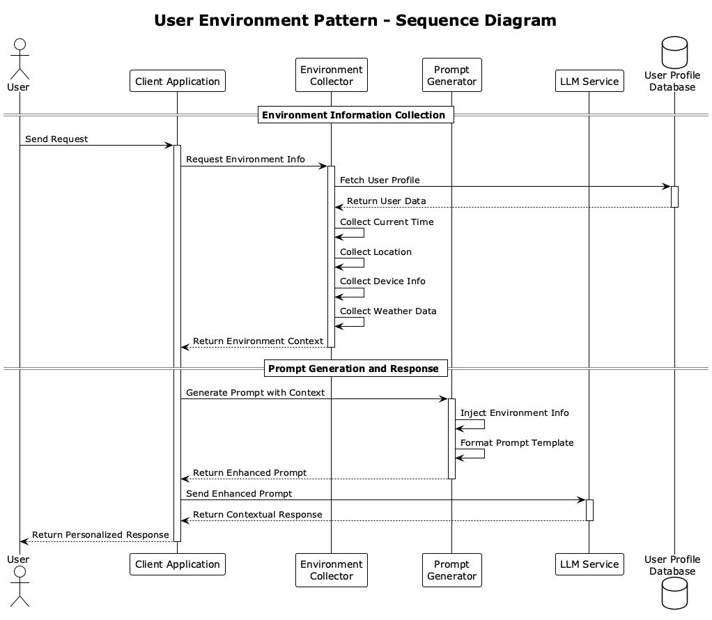

# User Environment

## Overview

User Environment is a design approach that optimizes LLM responses to user situations by explicitly incorporating "implicit context" from user requests (timezone, language, region, user attributes, device status, weather, etc.) into prompts. This practice enables more natural and accurate personalized responses.

## Problems to Solve

While LLMs excel at generating general responses to user requests, they don't always consider the user's situation or context. LLM pre-training doesn't include the latest information or news, and of course, they don't know user-specific information (name, hobbies, residence, etc.). However, considering the latest information and user situations often leads to more natural and accurate responses.

LLM responses that don't consider user situations can cause the following problems:

1. **Discomfort from Uniform Responses**
   - Responding with "Good morning!" to all users, causing discomfort for users in the middle of the night.
   - Displaying prices in the same currency unit regardless of region.

2. **Incorrect Responses Due to Lack of Context**
   - Responding to "What time is it?" with a time different from the user's local time.
   - Responding in an inappropriate language, ignoring the user's language settings.

3. **Degraded User Experience Due to Lack of Personalization**
   - Not providing device-specific guidance, suggesting desktop operations to smartphone users.
   - Repeating the same explanation every time without considering the user's past usage history.

4. **Misunderstandings Due to Environment-Inappropriate Information**
   - Responding with "It's sunny today" when it's actually raining at the user's location.
   - Recommending services or facilities that don't exist in the user's region.

## Solution

User Environment solves these challenges through the following steps:

1. **Environment Information Collection**
   - Collect user language, region, timezone, device, network status, past history, etc., from user registration information. Note that this information must be collected based on user consent.

2. **Prompt Injection**
   - Insert environment information into `system` messages or template variables to utilize in response generation. Include information like "The user is located in Japan, and the current time is 3 PM. They are accessing from a smartphone."

3. **Dynamic Adaptation**
   - Automatically switch expressions based on region, greetings based on time of day, and explanations based on device.
   - Generate appropriate greetings like "Good morning" in the morning and "Good evening" at night.

## Applicable Scenarios

This practice is effective in the following scenarios:

- Multilingual chatbots for global deployment
- Voice/text assistants for mobile/IoT devices
- Tourism information, weather, and transportation guidance services based on user location
- Operation guides and troubleshooting support tools adapted to device and OS environment
- Personalized recommendations based on user attributes and past behavior history

## Benefits

Adopting this practice provides the following benefits:

- Enables natural responses optimized for each user's context
- Allows accurate information provision while maintaining context consistency
- Increases user satisfaction and engagement through personalization
- Prevents incorrect operation instructions and unrealistic suggestions
- Enables appropriate information prioritization based on user situations

## Considerations and Trade-offs

When adopting this practice, attention to the following points is necessary:

- **Privacy Risks**: Data collection policies, user consent, and data encryption are essential when handling location information and personal attributes.
- **Data Freshness**: Information like timezone and weather is dynamic and requires constant updates.
- **Prompt Complexity**: Templates become more complex as more environment information is inserted, potentially reducing maintainability.
- **Design for Environment Retrieval Failures**: Need to implement fallback messages and default values.
- **Performance Impact**: Response time may slightly increase due to environment information retrieval and processing.

## Implementation Tips

Key points for effectively implementing this practice are as follows:

1. Start with a few impactful attributes like "language" and "timezone."
2. Separate environment information retrieval into a different module (middleware, API, etc.) and design it with loose coupling to prompt generation.
3. Template prompt snippets to create a structure that can be switched based on environment.
4. Implement privacy measures by collecting only necessary information and thoroughly implementing consent acquisition and encryption.
5. Log environment information and generation results for quality improvement and risk monitoring.

## Summary

User Environment is a powerful approach that enables more accurate and personalized LLM responses by reflecting user-specific context in prompts. By considering privacy and system design while implementing gradually, it's possible to build high-quality and user-friendly AI assistants.
