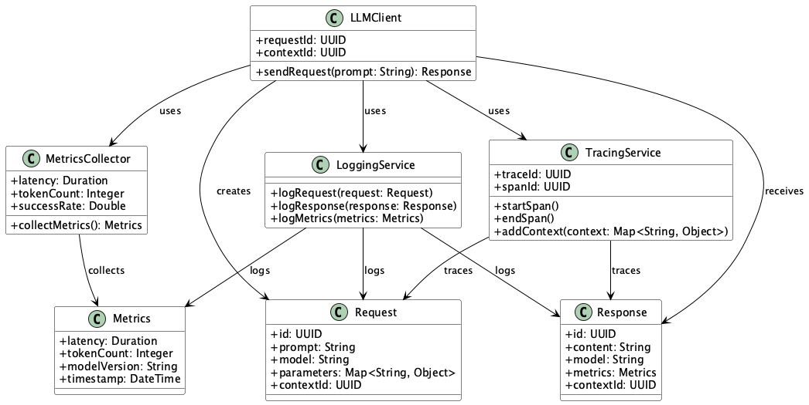
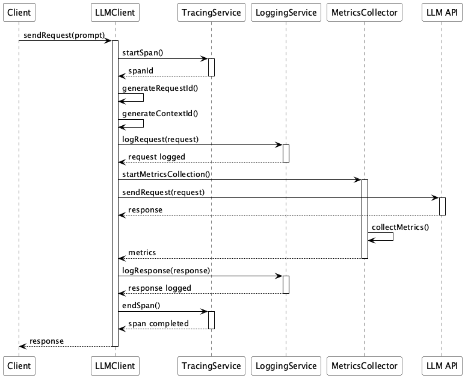

# Logging & Tracing

## Overview
Logging & Tracing is a design approach for structured recording and visualization of information such as prompts, responses, inference metrics, and context IDs in LLM communications. This practice enables consistent tracking of system behavior using LLM APIs, facilitating efficient troubleshooting, quality assessment, and performance monitoring.

## Problems to Solve

Systems utilizing LLMs often become unstable. Since LLMs are relatively new technology from recent years, handle large amounts of natural language, and exhibit probabilistic behavior, they require different engineering approaches compared to traditional systems. Additionally, systems using LLMs tend to become complex. While the part that calls the LLM API can be built as a web client, many elements are intertwined, including prompts and responses in requests, their evaluation, hallucination countermeasures, and feedback. Without proper management of these elements, the overall system's reliability and availability may be compromised.

Specifically, the following problems frequently occur:

1. **Difficulty in Identifying Bottlenecks**
   - Even when response delays occur from users, it's unclear whether the time is spent in prompt generation, LLM calls, or output formatting.

2. **Delayed Detection of Quality Degradation**
   - Even when response validity or reproducibility decreases, problem discovery is delayed as it relies on user reports.

3. **Insufficient Inference Observation Data**
   - Without recording metadata such as runtime latency, token count, and model version used, it becomes difficult to optimize performance and costs.

4. **Difficulty in Tracking Session Context**
   - In multi-step conversations, it's impossible to identify which response is based on which prompt and context.

## Solution
Logging & Tracing implements an integrated logging, metrics, and tracing strategy as follows:

1. **Assignment of Unique Request IDs (UUID)**
   - Assigns a common UUID to all prompt/response pairs to make them traceable.

2. **Structured Logging of Prompts and Responses**
   - Records prompts, outputs, and metadata (model name, temperature, token count, latency, etc.) in logs using structured formats like JSON.

3. **Metrics Export**
   - Collects and visualizes latency, success/failure rates, token usage, model selection trends, etc., quantitatively using OpenTelemetry or Prometheus.

4. **Session-level Association Using Context IDs**
   - Embeds context IDs linked to users or sessions in each request to make the entire conversation flow traceable.

## Applicable Scenarios
This practice is effective in the following situations:

- When operating commercial generative AI API services or chatbots
- Enterprise LLM systems requiring high SLA (availability, response time, accuracy)
- Environments conducting A/B testing of multiple models or prompt versions
- Industries requiring log auditing and reproducibility (healthcare, finance, legal, etc.)

## Benefits
Introducing this practice provides the following advantages:

- Enables quick identification of causes when problems occur
- Enables quantitative monitoring of performance and quality
- Visualizes the effects of model switching and parameter changes
- Establishes a foundation for tracking and improving user experiences

## Considerations and Trade-offs
This practice has the following considerations and trade-offs:

- Log expansion: Recording all token counts and response contents increases storage costs
- Handling of Personal Information (PII): Mechanisms for masking and encryption are needed as input logs and metadata may contain confidential information
- Impact on performance: Excessive log and metrics collection can affect system response
- Complexity in trace ID design: ID propagation mechanisms are needed for multi-step calls and asynchronous processing

## Implementation Tips
Key points for effectively implementing this practice are as follows:

1. Include minimum items in logs such as user ID, request ID, context ID, model name, response time, and token count
2. Use OpenTelemetry to unify logs, metrics, and traces when possible
3. Record structured logs in JSON format for easy search and visualization in log collection platforms (e.g., Elasticsearch, Datadog, Cloud Logging)
4. It's effective to establish mechanisms for propagating UUIDs using gRPC or HTTP headers for tracing

## Summary
Logging & Tracing is an essential design pattern for enhancing quality and observability in LLM-based systems. By combining logs of prompts and responses with inference metrics such as latency and token count, along with tracing information spanning entire sessions, it dramatically improves the reliability, maintainability, and transparency of LLM utilization.
