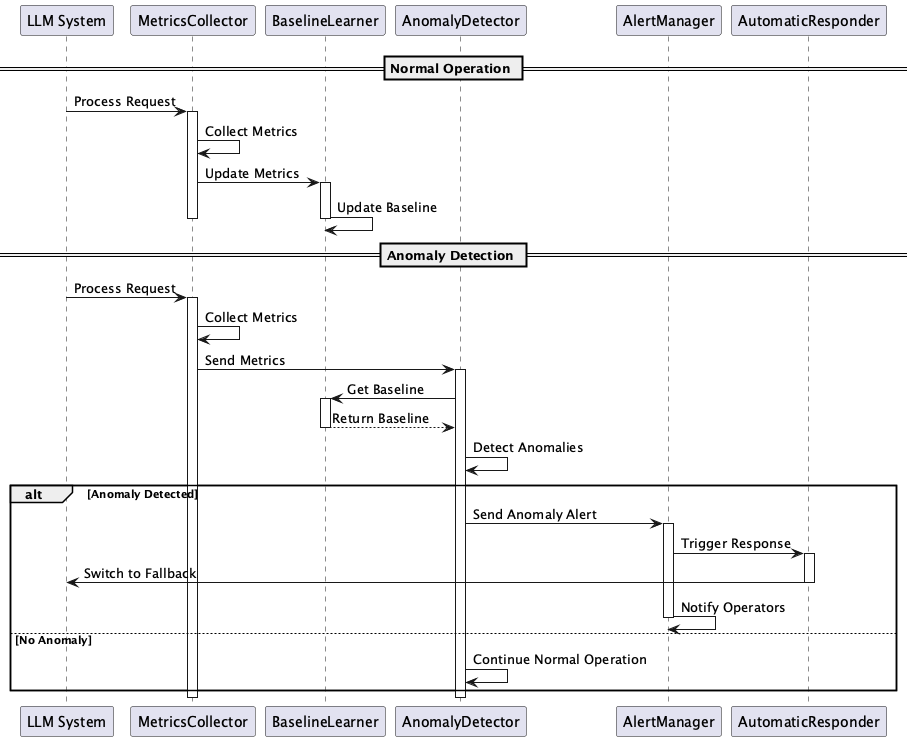

# Anomaly Detection

## Overview

Anomaly Detection is a design approach that continuously monitors operational metrics such as token consumption, latency, error rates, output quality scores, and user feedback in LLM systems, automatically detecting deviations from normal behavior. By utilizing statistical methods and machine learning models, anomaly detection enables rapid response through alert notifications and automated responses when anomalies occur.

## Problems to Solve

LLM-based systems often become unstable. Since LLMs are relatively new technology from recent years and handle large amounts of natural language while exhibiting probabilistic behavior, they require different engineering approaches compared to traditional systems. The types of errors that occur are also diverse. There are general system errors as well as LLM-specific errors like hallucinations. These errors can compromise the overall reliability and availability of the system. Manual monitoring of everything is impractical, and due to the nature of LLMs, anomalies often go unnoticed. To solve these problems, we introduce Anomaly Detection.

LLM-based systems frequently face the following issues:

1. **Silent Failures**
   - There are many cases where response quality or processing performance gradually degrades, becoming a serious issue by the time it's noticed.
   - Example: Cases where LLM response quality gradually declines and is only noticed after an increase in user complaints

2. **Increased Operational Load**
   - There are limitations to manually monitoring various metrics, and anomaly detection can be time-consuming.
   - Example: Insufficient human resources for 24/7 monitoring in global services

3. **SLA Violation Risk**
   - Missing signs of system degradation can lead to failure to meet Service Level Agreements (SLAs).
   - Example: Cases where response time gradually increases and violates the SLA requirement of 99.9% within 3 seconds

4. **Difficulty in Identifying Causes**
   - Identifying the cause of anomalies can be complex due to model changes, prompt modifications, or external system issues.
   - Example: Difficulty in identifying which component is causing anomalies in systems with multiple interconnected microservices

## Solution

By applying Anomaly Detection, we solve these problems through the following methods:

1. **Baseline Learning**
   - Calculate averages, standard deviations, moving medians, etc., of normal states and use them as reference for anomaly detection.
   - Example: Calculating normal ranges from 30 days of latency data and using them as a baseline for anomaly detection

2. **Application of Detection Algorithms**
   - Detect anomalous values using statistical or machine learning methods.
   - Example: Detecting sudden increases in token consumption using Z-scores and triggering alerts

3. **Alerts and Automated Response**
   - Issue alerts when anomalies are detected, initiate fallbacks, notify operators, or switch to automated processing.
   - Example: Automatically switching to a backup model when error rates exceed thresholds

## Applicable Scenarios

This practice is suitable for the following systems and operational environments:

- Monitoring high-frequency API calls in LLM-based Chat SaaS
- Detecting errors and cost anomalies in batch document processing pipelines
- Comprehensive monitoring of multiple services in microservice environments
- Maintaining response quality and user satisfaction in customer support chatbots

## Benefits

Introducing Anomaly Detection provides the following advantages:

- Enables early response by detecting warning signs before actual failures occur
- Reduces manual monitoring and operational costs
- Ensures compliance with SLAs and SLOs, enhancing service reliability
- Enables continuous system improvement through accumulation of anomaly patterns

## Considerations and Trade-offs

The application of this practice involves the following considerations and trade-offs:

- **Threshold Adjustment**
  - Too strict thresholds increase false positives due to noise, while too lenient thresholds may miss anomalies.
  - Example: Setting latency thresholds too strictly may trigger alerts for temporary network delays

- **Model Maintenance Costs**
  - Detection using machine learning models requires regular retraining and data updates.
  - Example: Weekly model retraining increases computational resources and operational costs

- **Real-time Constraints**
  - Batch processing may lose real-time capabilities, making immediate response difficult.
  - Example: 5-minute batch processing intervals cannot detect anomalies in real-time

- **Operational Complexity**
  - Managing thresholds, notification rules, and response procedures increases operational load.
  - Example: Complex management of thresholds and notification rules for multiple metrics

## Implementation Tips

Key points for implementing Anomaly Detection are as follows:

1. **Phased Implementation**: Start with statistical threshold monitoring for latency and error rates, gradually expanding to score and cost detection.

2. **Dashboard Setup**: Integrate real-time graphs and alerts using tools like Grafana to improve visibility.

3. **Alert Rule Adjustment**: Start with wider threshold settings to prevent false positives, optimizing based on operational conditions.

4. **Automated Recovery Integration**: Implement mechanisms to automatically trigger Circuit Breaker opening or fallback mode switching.

5. **Regular Reviews**: Periodically review detection logs and incident history to improve detection accuracy and operational procedures.

## Summary

Anomaly Detection is an essential design approach for stable operation and reliability improvement of LLM systems. Early detection of anomalies prevents incidents from becoming serious and enables continuous improvement. The key to success is selecting appropriate detection technologies, from statistical methods to machine learning, based on system scale and operational conditions, and implementing them gradually.
