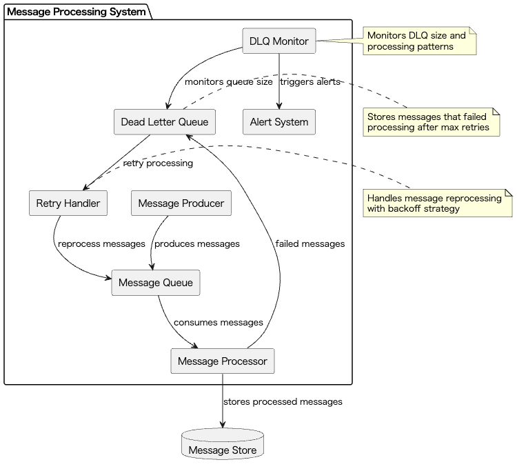
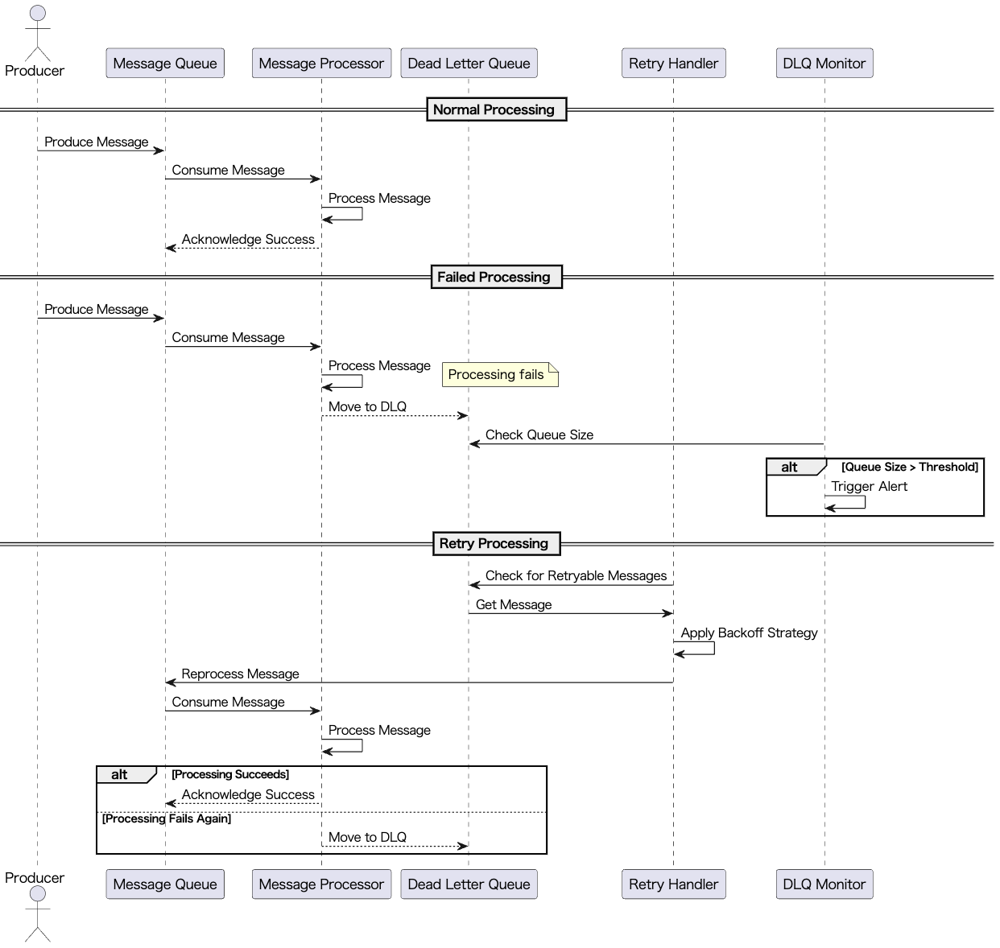

# Dead Letter Queue

## Overview

The Dead Letter Queue (DLQ) Pattern is a design approach that isolates failed requests and messages from the normal flow in LLM calls and event-driven workflows, enabling subsequent root cause analysis and reprocessing. This practice allows for efficient management of abnormal requests while maintaining overall system stability.

## Problems to Solve

One way to ensure stable application operation is to avoid repeatedly retrying failed processes. The causes of failures vary - they could be LLM provider errors, user input mistakes, format errors, or API rate limit issues. If these failures are left unaddressed, they can negatively impact the overall system performance and availability. While some issues can be avoided with **Retry with Adaptive Back-off**, there's still a possibility of repeated failures unless the root cause is resolved. Particularly in systems utilizing LLMs, since results can vary significantly based on prompt format and content, allowing abnormal requests to flow through can adversely affect LLM performance and quality.

Specifically, the following problems can occur:

1. **Process Stagnation**
   - Workers may endlessly retry due to requests with invalid formats, causing delays in other normal processes.

2. **System-wide Shutdown Risk**
   - The entire pipeline may stop due to some abnormal requests, potentially affecting the entire service.

3. **Difficulty in Failure Analysis**
   - It becomes difficult to identify the frequency and causes of failures from logs alone, making fundamental countermeasures challenging.

4. **Increased Operational Load**
   - When failures occur frequently, operational load increases, such as having to re-execute all jobs.

## Solution

By implementing a Dead Letter Queue, failed requests and messages can be isolated from the normal flow and moved to the DLQ, enabling separate analysis and reprocessing.

1. **Isolation of Abnormal Requests**
   - In LLM batch summarization processing, only documents with format errors or model errors are isolated to the DLQ.

2. **Error State Management**
   - In chat message processing, requests with invalid inputs or those that have reached API rate limits are captured in the DLQ.

3. **Event Message Management**
   - For event messaging like Kafka or Webhooks, messages are moved to the DLQ when fatal errors occur.

4. **Implementation of Phased Processing**
   - In multi-stage RAG pipelines, only messages where abnormalities are detected at each step are moved to the DLQ, allowing healthy processing to continue.

## Applicable Scenarios

This practice is effective in the following situations:

- Message failure management in asynchronous communication between microservices
- Large-scale batch processing or document summarization pipelines using LLMs
- Platforms processing high-frequency real-time chat messages
- Isolation of malformed data from IoT devices

## Benefits

Applying this practice provides the following advantages:

- System-wide stability improves by prioritizing only processable messages.
- When failures occur, limiting analysis and countermeasures to messages in the DLQ makes failure handling more efficient.
- Visualizing the number and trends of failed messages enables preventive measures and continuous improvement.
- Abnormal data can be collected as material for data cleansing and validation enhancement.

## Considerations and Trade-offs

When implementing a DLQ, the following points need attention:

- Management costs arise for DLQ storage growth, retention periods, and deletion policies.
- Without a reprocessing flow, messages accumulated in the DLQ risk being left indefinitely.
- Unclear SLAs, reprocessing procedures, and responsibility assignments can affect operational load and failure handling quality.
- Reintroducing messages from the DLQ without resolving the underlying issues may cause infinite loops of failures.

## Implementation Tips

Key points when implementing this practice are as follows:

1. Define clear retry policies, including maximum retry counts and exponential backoff.
2. Attach metadata such as error codes, retry counts, and final failure timestamps to messages to facilitate subsequent analysis.
3. Implement regular batch processing to automatically scan and reclassify messages in the DLQ, improving reprocessing and disposal efficiency.
4. Monitor DLQ length and inflow frequency, setting up alerts for threshold exceedances to detect abnormalities early.
5. Build mechanisms to enable automatic reintroduction for transient errors like rate limits and temporary failures.

## Summary

The Dead Letter Queue is an effective approach for systematically handling isolation, analysis, and reprocessing during failures in systems requiring high reliability, including those utilizing LLMs. The value of implementing this practice for stable operation and scalable error handling is very high. However, the key to success lies in developing operational flows and monitoring systems in parallel.
