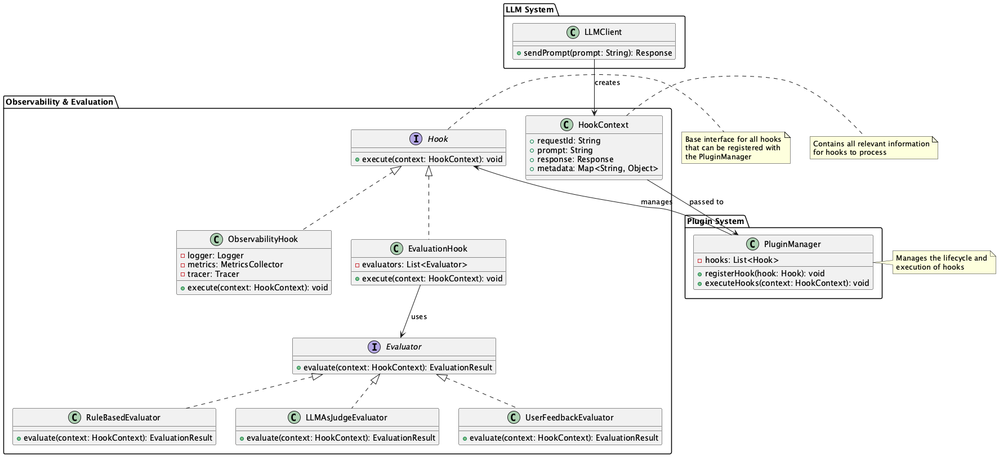
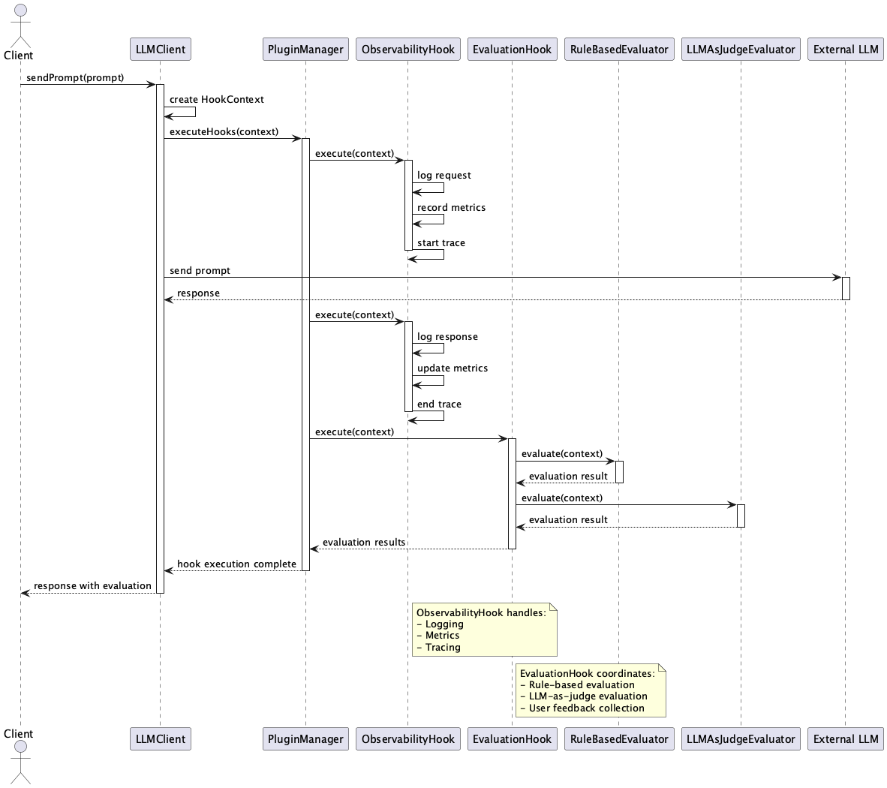

# Integrated Observability & Evaluation Hook

## Overview

The Integrated Observability & Evaluation Hook is a design approach that enables consistent observation and evaluation of each stage from prompt generation to response post-processing in systems utilizing LLMs. By incorporating observability hooks and quality evaluation hooks, it enables real-time monitoring, automatic evaluation, and continuous improvement.

## Problems to Solve

Systems utilizing LLMs often become unstable. LLMs themselves are relatively new technology from recent years, and they handle large amounts of natural language while exhibiting probabilistic behavior, requiring different engineering approaches compared to traditional systems. Additionally, systems using LLMs tend to become complex. While the part that calls the LLM API can be built as a web client, many elements are intertwined, including prompts in requests, responses, their evaluation, hallucination countermeasures, and feedback. Without proper management of these elements, the reliability and availability of the entire system may be compromised.

Due to these challenges, logging and tracing mechanisms are essential for systems utilizing LLMs. This enables consistent tracking of system behavior and efficient troubleshooting, quality evaluation, and performance monitoring. However, it's better to avoid reducing program readability and maintainability by implementing extensive logging and tracing. If there are hooks that automatically output logs or record metrics when specific functions or processes are executed, developers can write code without being conscious of these hooks, allowing them to collect necessary information without compromising readability and maintainability.

1. **Fragmented Visualization**
   - Example: When logs are output individually in each component, it becomes difficult to grasp the overall state centrally.
   - Example: When errors occur, it takes time to identify which component had the problem.

2. **Inconsistent Evaluation Criteria**
   - Example: When different evaluation methods are used by different teams or environments, quality judgments become inconsistent.
   - Example: Development and operational efficiency decrease, and quality management consistency is lost.

3. **Hook Inconsistency**
   - Example: When different hooks output logs in different formats, data integration and analysis become difficult.
   - Example: When hook implementation is insufficient, necessary information may be missing.

## Solution

In systems utilizing LLMs, common formats should be prepared for logs, metrics, and traces. By centrally managing their implementation, consistent visualization and quality evaluation of the entire system can be performed. Specifically, implement the following integrated observation and evaluation strategy:

1. **Implementation of Call Hooks**
   - Perform logging, metric recording, and tracing before and after prompt submission and when errors occur.
   - Example: Maintain consistent log formats by integrating with standard observation frameworks like OpenTelemetry.

2. **Implementation of Evaluation Hooks**
   - Automatically evaluate LLM outputs through rule-based evaluation, LLM-as-a-judge, or user feedback.
   - Example: Set rules to automatically evaluate output consistency, factual accuracy, and harmfulness.

3. **Adoption of Plugin Architecture**
   - Implement hooks as loosely coupled plugins that can be flexibly added or replaced.
   - Example: Implement a mechanism to dynamically load evaluation rules defined in JSON or YAML at runtime.

## Applicable Scenarios

This practice can be effectively utilized in the following scenarios:

- Enterprise chat systems where multiple teams develop and operate prompts
- Document processing pipelines that regularly perform summarization and classification
- API platforms where external developers utilize LLMs
- AI assistant development projects that perform code generation or conversion processing

## Benefits

Introducing this practice provides the following advantages:

- Common observation and evaluation logic can be applied to all LLM call processing, making data comparison and analysis easier.
- Quality degradation and abnormal outputs can be detected and alerted immediately.
- Continuous prompt improvement and model selection become possible based on evaluation data.
- Time and cost for root cause analysis during failures can be significantly reduced.

## Considerations and Trade-offs

The following points need attention:

- Hooks may increase latency and costs.
- Interface design and guideline preparation are necessary for flexible plugin design.
- Careful handling of personal and confidential information included in evaluation targets is required.
- Automatic evaluation by LLMs carries risks of bias and misjudgment.

## Implementation Tips

Key points for successful implementation are as follows:

1. Start with a minimal configuration of only call logs and gradually introduce evaluation hooks.
2. Define clear interfaces for each hook and design them in a reusable form within the team.
3. Reduce load by setting sampling or thresholds rather than evaluating all requests.
4. Visualize abnormal trends through integration with dashboards (Grafana, Kibana, etc.).
5. Incorporate into CI/CD to use as quality gates for automatic validation of prompts and output quality.

## Summary

The Integrated Observability & Evaluation Hook is an effective design approach for consistent visualization and quality evaluation in LLM systems. It can significantly contribute to quality maintenance and improvement, failure response, and efficient operations by allowing flexible expansion of monitoring and evaluation functions through a hook-based approach. With proper implementation and operation, it can make business utilization of LLMs more reliable.
