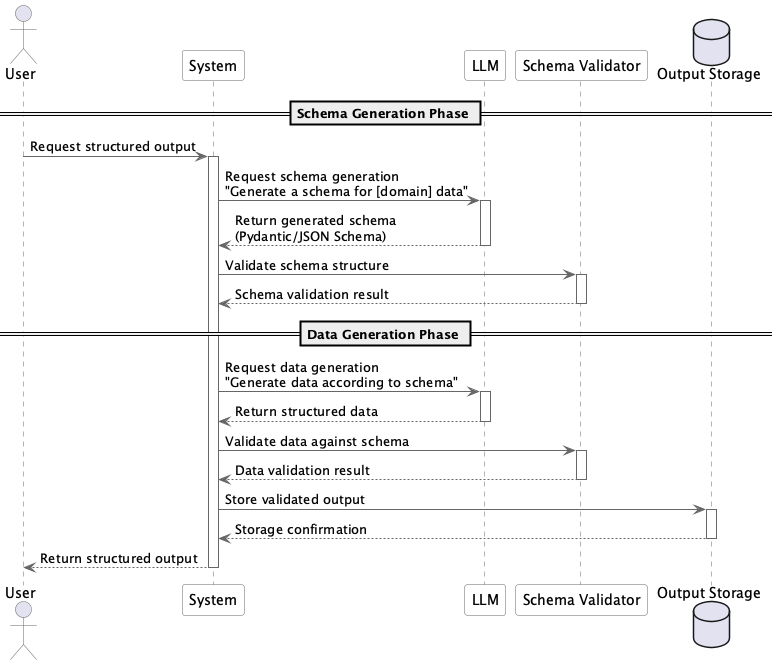

# Inverted Structured Output

## 概要

Inverted Structured Outputは、LLMに求める出力形式（スキーマ）そのものを、モデル自身に動的に生成させる設計手法です。従来のように出力形式を人間が固定的に定義するのではなく、LLMによって必要な出力構造を「逆に」記述・提案させることで、柔軟性と再利用性を高めることができます。このプラクティスにより、システムは動的に適応可能な出力構造を生成し、様々なドメインや要件に対応することが可能になります。

## 解決したい課題

LLMは自然言語を生成するだけでなく、プログラムやプロンプトを生成することが可能です。LLMのその能力を活用することで、アプリケーションの中でLLMが自動生成したプログラムと実行したり、プロンプトをリクエストする、ということが可能になり、柔軟なロジックを組むことができるようになります。

こうしたときの課題の一つが、プログラムやプロンプトの出力形式です。LLMの入出力は標準では自然言語ですが、LLMを使うアプリケーションは構造化されたオブジェクトを扱うほうが得意です（参考： **Structured Output** ）。LLMが生成したプログラムやプロンプトでも同様に、構造化されたレスポンスを受け取るほうが、後続の処理を安定して動かすことが可能になります。

- **不本意な自然言語の処理**
  - 構造化されていない自然言語を処理し続けることで、LLMの出力結果から特定の項目や情報を得ることが困難になります。

- **フォーマット設計の工数増加**
  - 複数のドメインごとに異なる出力スキーマを手動で定義しなければならず、スケーラビリティが低くなります。

- **柔軟性の欠如**
  - 業務要件や入力内容によって出力構造が変わるにもかかわらず、固定されたスキーマに縛られてしまうため、想定外のエラーが発生します。

## 解決策

このプラクティスでは、LLMに「出力スキーマを定義せよ」と指示し、たとえばPydanticモデルやJSON Schemaを自動生成させます。そのスキーマを利用して再度出力要求を行うことで、LLM自身が設計した構造に即した出力を返すことができます。

- `「顧客データを表現するPydanticモデルを出力してください」→ モデル構造出力 → 「このモデルに従って以下の文章を構造化してください」→ JSON出力 → Pydanticモデルのオブジェクトとして初期化` といったワークフローを構成します。

## 適応するシーン

このプラクティスは以下のような場面で特に有効です。

- ユーザが自由に出力形式を定義したいユースケース
- 複数ドメイン・複数業務にまたがる汎用的なデータ抽出タスク
- スキーマ自体を柔軟に生成・更新することが求められる生成系アプリケーション
- 自動ドキュメント生成や構造化レポート作成

## 利用するメリット

このプラクティスを採用することで、以下のメリットが得られます。

- 人手によるスキーマ設計の手間が削減されます。
- 出力形式の再利用性が向上し、汎用的なパイプラインを構築できます。
- 業務ごとの要件に応じて、出力構造を動的に変化させることができます。
- RAGやチャットボットの回答スキーマをその場で自動生成でき、拡張性が高まります。

## 注意点とトレードオフ

このプラクティスを採用する際は、以下の点に注意が必要です。

- LLMが生成したスキーマが意図と異なる形式になる可能性があるため、検証が必要です。
- スキーマと出力が整合しているかをチェックするロジックを別途実装する必要があります。
- 出力の安定性・再現性は固定スキーマ型に比べてやや低下します。
- LLMが出力形式を過剰に複雑化するケースがあり、制御が必要です。

## 導入のヒント

このプラクティスを効果的に導入するためのポイントは以下の通りです。

1. プロンプトにおいて「出力対象の構造的説明」と「スキーマ形式（Pydantic, JSON Schema など）」を明示することが重要です。
2. スキーマ生成とデータ生成を2ステップに分離し、出力品質を逐次検証します。
3. PydanticやJSON Schemaバリデータで、スキーマと出力の整合性を確認できる仕組みを用意します。
4. 出力構造が妥当かどうかをLLM自身にセルフチェックさせる設計も有効です。

## まとめ

Inverted Structured Outputは、スキーマをあらかじめ定義する従来型の手法に対し、LLM自身に出力構造を生成させることで高い柔軟性とスケーラビリティを実現するアプローチです。特にドメインが多様なアプリケーションや、ユーザカスタマイズ性が求められるシステムにおいて有効です。ただし、出力の品質検証とスキーマ整合性の担保は必須であり、適切な検証機構の併用が求められます。
