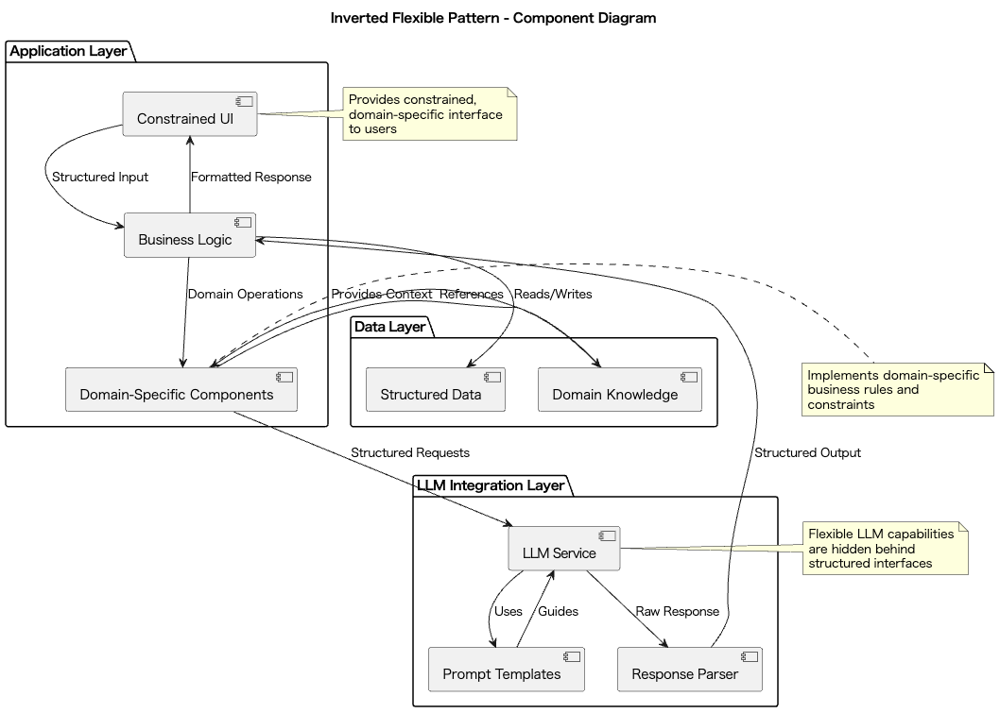

# Inverted Flexible

## 概要
Inverted Flexibleは、LLMの高い自由度をユーザインタフェースで直接扱わせるのではなく、特定タスク向けに制約されたUI/UXを通じてその力を引き出す設計手法です。このプラクティスにより、LLMの汎用性とユーザに対する操作の分かりやすさの両立を実現します。ビジネスアプリケーションや一般ユーザ向けのプロダクトで、誤動作や迷いの少ない体験を実現しつつ、LLMの恩恵を最大限に活かすことができます。

## 解決したい課題
多くのLLM APIは自然言語を入力として受け取り、レスポンスとして自然言語を出力します。LLMプロバイダーによっては自然言語に加えて画像等のコンテンツを受け取るマルチモーダルなAPIを提供していることもあります。自然言語や画像コンテンツは自由度の高いデータであり、とても多くの情報を表現することができます。こうした自由度の高いインターフェイスは汎用的な用途で使うツールであれば合理的と言えるでしょう。しかし汎用性は常に最適なソリューションではありません。ビジネスでユーザに提供するアプリケーション（BtoBにせよBtoCにせよ）の多くは、特定の領域や用途（例：EC、コンテンツ閲覧、情報整理、入退出管理、勤務記録、経理処理等々）での利用を目的としており、提供する価値は汎用的ではなく特化的と言えます。特定用途に特化し、その用途に応じたUIやAPIを提供することで、制約とともにわかりやすさを実現します。そのバックエンドでLLMを活用していたとしても、ユーザインタフェースは特化的で制約的なものになるでしょう。つまり、自由度の高いLLMを一部に活用していても、特定用途に向けたアプリケーションでは自由度を自制したユーザ体験にするのです。こうすることで、自由度が高いフィールドでユーザが迷うことを避け、適切に目的を達成できる体験を提供できます。その目的達成の一部でLLMを有効活用するのであり、LLMの自由度のためにユーザを迷わせるものであってはなりません。

1. **ユーザが自由すぎる入力に迷ってしまう**
   - 例：業務アプリに自然言語入力欄だけがあり、どのような命令を出せば目的の動作をするか分からず、ユーザが混乱する。

2. **タスクに不要な入力や曖昧な表現による誤動作が生じる**
   - 例：「この資料いい感じにしておいて」などの曖昧な指示が誤解を生み、期待と異なるアウトプットが返ってくる。

3. **プロンプト設計やユーザ教育に大きな負担がかかる**
   - 例：毎回プロンプトチューニングをユーザが行う必要があり、習熟が必要。

## 解決策
このプラクティスでは、LLMの柔軟性をそのまま前面に出すのではなく、アプリケーションのUIやAPI設計を**特化型・制約型**にします。LLMはその中で、構造化されたデータを補完したり、部分的な自然言語処理を担う形で活用します。

1. **ユーザインタフェースを特定の業務目的に合わせて構造化します。**
   - 例：EC管理アプリでは、「商品タイトル」「説明文」「SEOタグ」などのフィールドを固定して入力。

2. **LLMは内部で、特定フィールドの自動生成や変換、改善に利用されます。**
   - 例：説明文の改善ボタンを押すと、LLMが適切な語彙・表現に書き換える。

3. **自由入力欄をあえて制限し、選択肢やスイッチ、ボタンなどでユーザの迷いを軽減します。**
   - 例：テンプレート選択、トーン指定などをUIで事前に選ばせる。

## 適応するシーン
このプラクティスは以下のような場面で特に有効です。

- 業務アプリケーション（勤怠管理、経理処理、マニュアル作成など）
- 一般ユーザ向けの消費者アプリ（レビュー生成、SNS投稿補助など）
- LLMに習熟していないユーザを対象とするプロダクト
- 入力の誤りや曖昧さが業務上のリスクになる領域

## 利用するメリット
このプラクティスを採用することで、以下のメリットが得られます。

- ユーザが迷わず操作できる直感的なUIを提供できます。
- LLMの応答の予測性・品質を向上させることができます。
- 業務のドメイン知識とLLMの柔軟性を両立する構成が可能です。
- UX設計とプロンプト設計を分離することで、システム全体の保守性が向上します。

## 注意点とトレードオフ
このプラクティスを採用する際は、以下の点に注意が必要です。

- UIやAPIを特化させすぎると、汎用性や柔軟な用途拡張が難しくなります。
- ユーザが想定外の入力や用途に対応できなくなる場合があります。
- LLMの機能が裏側に隠れてしまい、ユーザがその価値を認識しにくくなることがあります。
- デザイナー・UX担当者とプロンプト設計者の密な連携が必要です。

## 導入のヒント
このプラクティスを効果的に導入するためのポイントは以下の通りです。

1. ユーザのタスクを明確にし、その達成に必要なフィールドやステップをUIに反映させます。
2. LLMは裏方として機能させ、具体的な変換・補完・リライトに使うよう設計します。
3. LLMの出力がどこに使われるのかを明示し、ユーザの期待値を制御します。
4. プロンプトはアプリケーションコードとは分離し、設定ファイルやテンプレートで管理します。

## まとめ
Inverted Flexibleは、LLMの高い自由度をユーザインタフェースで直接扱わせるのではなく、特定タスク向けに制約されたUI/UXを通じてその力を引き出す設計手法です。ビジネスアプリケーションや一般ユーザ向けのプロダクトで、誤動作や迷いの少ない体験を実現しつつ、LLMの恩恵を最大限に活かすことができます。