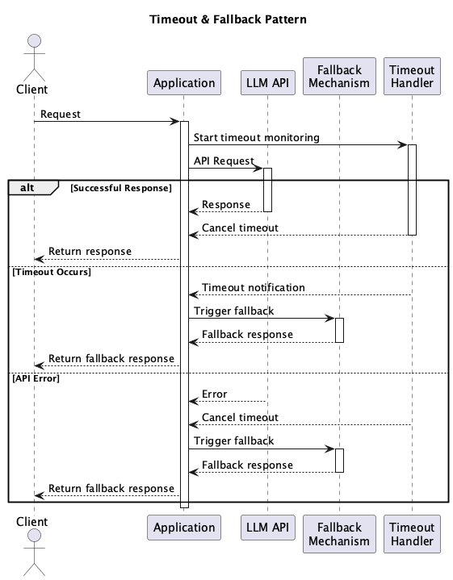

# Timeout & Fallback

## 概要

Timeout & Fallbackは、LLM APIの応答が一定時間内に得られなかった場合や、エラーが発生した場合に備え、代替手段（フォールバック）を用意することで、システム全体の信頼性と応答性を担保する設計プラクティスです。このプラクティスは、ユーザ体験の劣化や処理の停止を防ぐための安全装置として機能します。

## 解決したい課題

どんなアプリケーションでもユーザの待ち時間は極力短縮したほうが良いでしょう。多くの人は待つことが嫌いで、可能な限り早くレスポンスを欲しがります。LLM APIの利用時も同様ですが、LLMは巨大なリソース利用と複雑な処理を内包しているため、レスポンスタイムの長時間化や失敗するリスクが比較的高いシステムといえます。

1. **レスポンスの遅延**
   - OpenAI APIが一時的に混雑しており、応答までに数十秒かかることがあります。リアルタイム性が求められるチャットアプリでは致命的です。

2. **一時的な障害やネットワーク断**
   - 特定の時間帯に特定リージョンのAPIがダウンし、処理が失敗する場合があります。

3. **ユーザ側の待ち時間ストレス**
   - 画面上で「読み込み中」が長時間続くことでユーザが離脱するリスクが高まります。

## 解決策

一定時間内にLLM APIから応答が得られなかった場合、自動的にフォールバック手段を用いて処理を継続する仕組みを導入します。フォールバックの例としては、キャッシュ済みのレスポンス、簡易なテンプレート文、ルールベースの処理、または代替LLMプロバイダの利用などがあります。

1. OpenAI APIに5秒間リクエストし、応答がなければFallbackとして「定型文」または「過去に同様の質問に使ったキャッシュ」を返します。

## 適応するシーン

このプラクティスは以下のような場面で特に有効です。

- チャットボットやFAQなどリアルタイム性が求められるアプリケーション
- 業務処理フローの一部としてLLMを組み込んでいる業務システム
- LLMが失敗しても最低限の応答を返す必要がある顧客対応シナリオ
- 複数のLLMベンダーを組み合わせて冗長構成をとる構成

## 利用するメリット

このプラクティスを採用することで、以下のメリットが得られます。

- システムの応答性が向上し、ユーザ体験を維持できます。
- 外部API障害による業務停止リスクを軽減できます。
- レスポンス品質が多少低下しても、ゼロよりはましな結果を返せます。
- システム全体の可用性や堅牢性を向上させます。

## 注意点とトレードオフ

このプラクティスを採用する際は、以下の点に注意が必要です。

- フォールバックの品質は通常のLLM応答よりも低くなる可能性があります。
- フォールバック処理が複雑化すると、管理やメンテナンスコストが増加します。
- 意図しないケースでフォールバックが多発した場合、根本の品質問題が見えづらくなります。
- ユーザにとって「曖昧な応答」や「汎用的な文面」が続くと不信感を生む恐れがあります。

## 導入のヒント

このプラクティスを効果的に導入するためのポイントは以下の通りです。

1. タイムアウト時間はユースケースに応じて適切に設定します（例：チャットは3〜5秒、バッチ処理は10〜30秒など）。
2. フォールバックは段階的に構成できます（例：キャッシュ → テンプレート → 他プロバイダ）。
3. フォールバックの実行状況はログとして記録し、アラートやダッシュボードで可視化します。
4. ユーザに対して「応答は簡略化されています」などのメッセージを表示することで透明性を確保します。

## まとめ

Timeout & Fallbackは、LLM APIの不確実性に備えてユーザ体験とシステムの安定性を維持するための重要な設計プラクティスです。とくにリアルタイム性が重視されるユースケースや、業務影響が大きいシステムにおいては不可欠な構成要素となります。適切に設計・導入することで、信頼性の高いLLM統合システムを構築することが可能となります。
