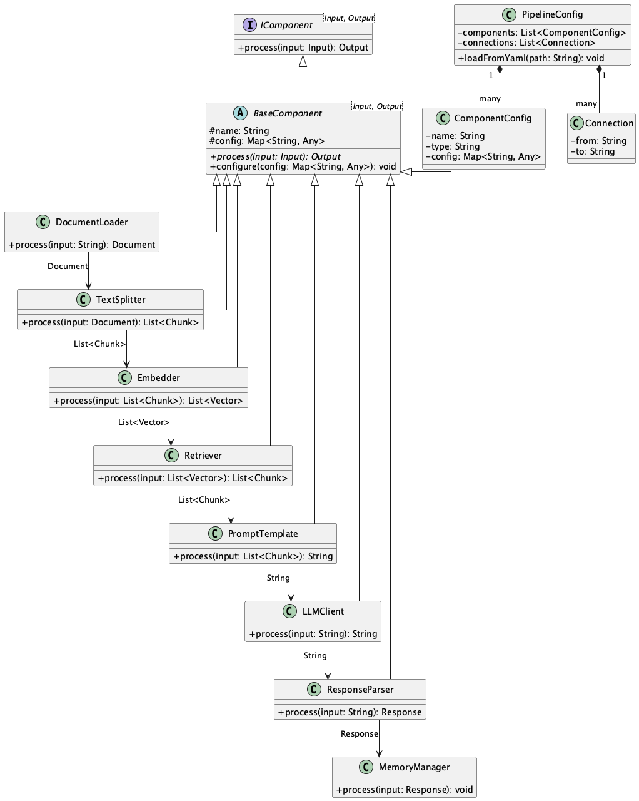

# Composable Component Framework

## 概要

Composable Component Frameworkは、LLM APIを活用するシステムにおいて処理を小さな機能単位のコンポーネントに分割し、それらを組み合わせてパイプラインやワークフローを構築する設計手法です。各コンポーネントは独立しており、明確な責務を持ち、標準化されたインターフェースを通じて相互に接続されます。このプラクティスにより、柔軟で再利用性の高いシステム構築が可能になります。

## 解決したい課題

LLMを活用して多様なドキュメント処理や高機能なチャットサービスを提供するユースケースは多々あるでしょう。RAGやAI Agentの流行により、そうした流れは加速している傾向があります。そのシステムの中ではLLM APIへのリクエストは多種多様で、個々に異なる目的や出力形式、SLA、対象ユーザが存在するでしょう。それらを同一のコンポーネントとして開発すると、以下のような課題が発生します。

1. **モノリシックな実装の肥大化**  
   - すべての処理を1つのクラスや関数に集約することで、可読性や保守性が著しく低下します。

2. **機能拡張の困難さ**  
   - 新しい機能やステップを追加するたびに既存コードを大きく変更しなければならず、開発効率が下がります。

3. **テストの難しさ**  
   - 大規模な処理が一括で実行されるため、個別のロジックをテストしにくく、統合テストに依存しがちになります。

4. **ロジックの再利用性の欠如**  
   - 類似の処理を別の場所でも必要とする場合、コードをコピーして使いまわすことになり、冗長な実装となります。

## 解決策

処理をLoader、Splitter、Embedder、Retriever、PromptTemplate、LLMClient、ResponseParser、MemoryManager、ToolInvokerなど、明確な責任を持つ小さなコンポーネントに分割します。すべてのコンポーネントは共通のインターフェース（例：`IComponent<Input, Output>`）を実装し、個別に開発・テストが可能になります。これらをチェーンまたはDAG（有向非巡回グラフ）構造で接続し、宣言的な設定（YAML/JSONなど）により構成できるようにします。

## 適応するシーン

このプラクティスは、以下のようなシステムに適しています。

- RAGパイプライン：ドキュメントロード → テキスト分割 → 埋め込み生成 → 検索 → 要約
- チャットエージェント：入力加工 → コンテキスト付加 → LLM呼び出し → 応答解析 → メモリ更新
- データ前処理：データローダー → クレンジング → トークン化 → LLM特徴抽出
- マルチモーダル処理：画像 → OCR → テキスト処理 → 翻訳や要約

## 利用するメリット

Composable Component Frameworkを導入することで、以下の利点があります。

- 各コンポーネントを独立して開発・テスト・保守できます。
- 汎用性の高いコンポーネントを再利用することで、開発効率が向上します。
- モデルやアルゴリズムの差し替えが容易になり、実験や検証が迅速に行えます。
- 宣言的な設定により、コード修正なしにパイプライン構成の変更が可能になります。

## 注意点とトレードオフ

このプラクティスを導入する際には、以下のような注意点とトレードオフがあります。

- コンポーネント粒度の設計やインターフェースの整備に初期コストがかかります。
- 各処理の間でインターフェースを呼び出すため、レイテンシが増加する場合があります。
- コンポーネント間の依存管理やバージョン互換性の維持が必要です。
- チーム内でこのプラクティスを理解し、効果的に活用できるよう教育が必要です。

## 導入のヒント

導入を円滑に進めるためのポイントは以下の通りです。

1. 最初は主要ステップのみをコンポーネント化して、動作確認を行います。
2. 共通インターフェース（例：`IComponent<I, O>`）を定義し、すべてのコンポーネントで共通化します。
3. パイプライン構成をYAMLやJSONなどの設定ファイルで管理します。
4. 各コンポーネントに対してユニットテストを用意し、全体は統合テストでカバーします。
5. セマンティックバージョニングを採用し、バージョンと依存関係の整合性を維持します。

## まとめ

Composable Component Frameworkは、LLMシステムにおける柔軟性・拡張性・再利用性を大幅に向上させる設計手法です。初期導入には設計コストがかかるものの、長期的には保守性の高い堅牢なアーキテクチャを実現できます。特に複雑なワークフローを持つLLMアプリケーションにおいては、効果的に活用することで開発・運用の生産性を向上させることができます。
