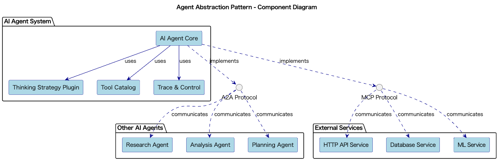

# Agent Abstraction

## 概要

Agent Abstractionは、LLMを中核とする自律型のAI Agentを高レベルなインターフェースとして抽象化する設計プラクティスです。このプラクティスでは、目標と文脈を渡すだけで、ツール呼び出し・検索・思考ステップなどの複雑な処理を一貫して実行可能なAgentを構築します。思考戦略やツールを柔軟に切り替え可能にすることで、再利用性と拡張性の高いエージェントシステムを実現します。

## 解決したい課題

LLMをラップしたAI Agentによって高度な問題を解決するトレンドがあります。AI AgentではLLMのReasoning能力を活用して定義された、また未定義の手順でリクエストされた課題の解決を目指すシステムです。AI Agentでは各種外部サービスや、他のAI Agentを組み合わせてシステムを構築します。LLMを活用してツールを組み合わせた自律的な処理を実装する際、以下のような課題が発生します。

1. **アクションロジックの散在**
   - LLMの出力処理や外部ツールとの連携がコード全体に分散し、メンテナンスが困難になります。

2. **複雑なワークフローの自動化困難**
   - 条件分岐やループ、例外処理を含むプロセスを個別に実装すると、工数が膨大になります。

3. **思考戦略の固定化**
   - ReActやChain-of-Thoughtなどの戦略をハードコードすると、最適化や差し替えが困難になります。特定の思考戦略に依存した実装により、新しい戦略の導入や既存戦略の改善が困難になります。

4. **再利用性の欠如**
   - 同様の自律処理がユースケースごとに個別実装され、コードの再利用ができません。類似した業務自動化タスクでも、それぞれ個別の実装が必要になります。

## 解決策

Agent Abstractionでは、以下の要素を組み合わせて課題を解決します。

1. **A2Aによる統一インターフェースの実装**
   - A2Aプロトコルにより統一されたインターフェースを提供します。

2. **思考戦略のプラグイン化**
   - ReAct、Chain-of-Thought、Tree-of-Thoughtなど複数の戦略をプラグインとして切り替え可能にします。各戦略を独立したモジュールとして実装し、実行時に動的に選択可能にします。

3. **ツールカタログの定義**
   - HTTP API、SQLクエリ、外部MLサービスなどのツールをPluginとして定義します。Agentが必要に応じて適切なツールを選択・呼び出します。

4. **トレース機能と制御の実装**
   - 各ステップを記録・監視し、異常終了や無限ループを検出して制御します。実行状態の可視化と制御機能を提供します。

## 適応するシーン

このプラクティスは以下のようなシステムやプロジェクトで特に有効です。

- ビジネスレポート作成やワークフロー実行を担うインテリジェントアシスタントプラットフォーム
- インフラの監視・分析・修復を自動で行うDevOps自動化エージェント
- 文献検索から実験計画立案までを支援するリサーチ支援ツール
- ノーコードで自然言語から業務フローを構築する業務自動化サービス

## 利用するメリット

このプラクティスを導入することで、以下のような利点が得られます。

- 一貫したインターフェースによる可読性の向上
- 思考戦略やツールの切り替えの柔軟性
- 異なる業務での再利用性の向上
- 実行ステップのモニタリング・制御のしやすさ
- コードの保守性と拡張性の向上

## 注意点とトレードオフ

このプラクティスを導入する際には、以下の点に注意が必要です。

- 設計と実装の複雑さ：Agentのコア設計やツール連携には高い技術的理解と工数が必要です。
- コスト管理：自律処理中に過剰なAPI呼び出しや無限ループが発生すると、コストが大きくなります。
- セキュリティリスク：外部ツールの誤使用や情報漏洩のリスクがあるため、権限管理が重要です。
- デバッグの難易度：動的に構築されたフローの不具合特定には可視化とトレース機構が必須です。

## 導入のヒント

導入時のポイントは以下のとおりです。

1. **小規模なAI Agentから始める**：Chain-of-Thoughtを使った単純なQAエージェントなどで検証します。
2. **安全なツールセットから始める**：読み取り専用APIやログ取得など、安全性の高いツールから構築します。
3. **コスト制御機能を組み込む**：実行ステップ数や呼び出し回数に上限を設定し、ループ検出機能を実装します。
4. **詳細なログとトレース機構を整備する**：ステップ単位で入出力・時間を記録し、ダッシュボードで可視化します。
5. **セキュリティレビューを定期実施する**：ツールの実行権限やAPIキーの適切な管理を徹底します。

## まとめ

Agent Abstractionは、LLMを用いた高度な自律処理を安全かつ柔軟に実現するための強力な設計手法です。統一されたインターフェースにより業務コードの簡素化を図れるとともに、ツールや戦略の拡張にも対応可能です。ただし、導入には十分な設計と制御機構の構築が求められるため、小さく始めて段階的に拡張していくアプローチが有効です。
