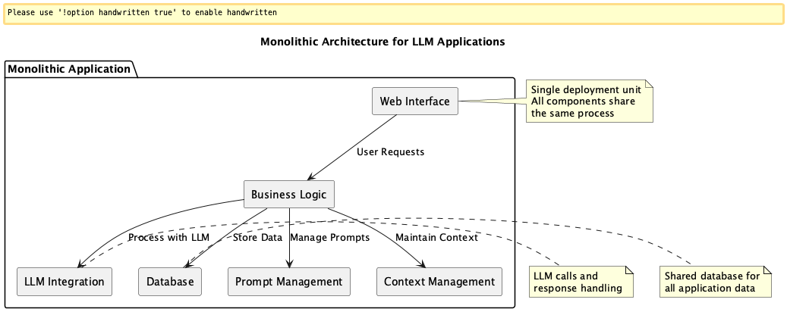
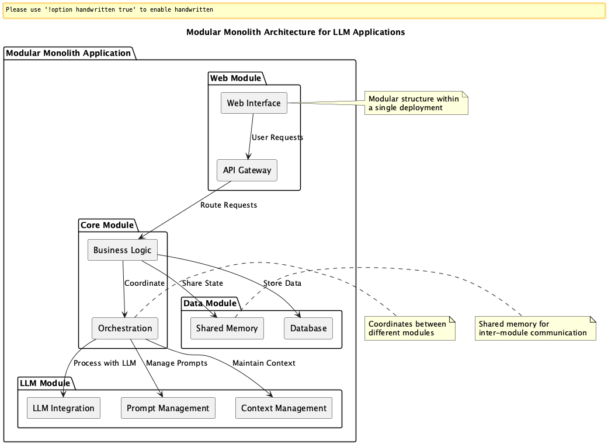
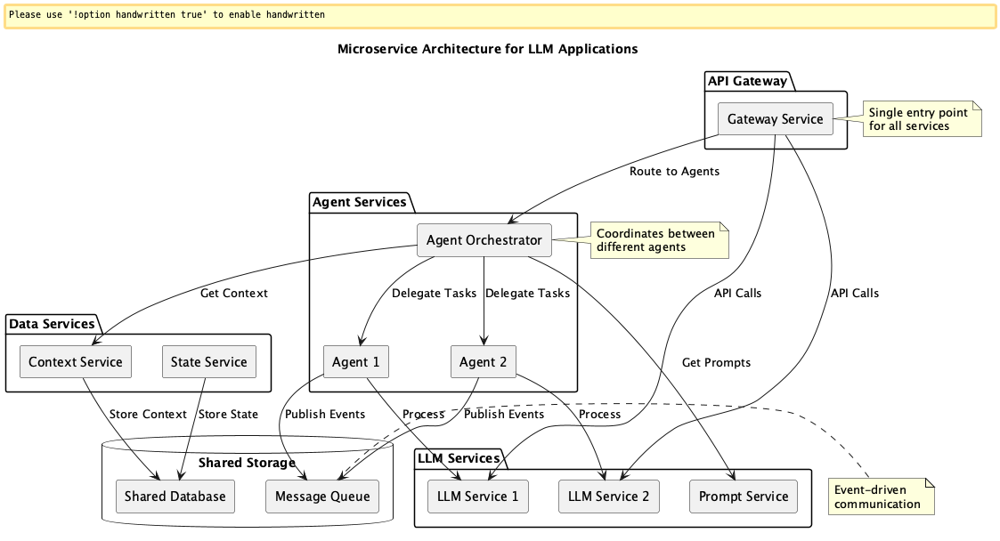

# Architecture Selection for LLM-based Systems

## 概要
LLMを活用したアプリケーションの形態は多々あります。RAG（Retrieval-Augmented Generation）やAIエージェントシステムはその代表例でしょう。LLMを活用したアプリケーション（ここではLLMアプリケーションと呼びます）が広まることに伴い、そのシステムアーキテクチャの設計は重要なエンジニアリングになります。本プラクティスでは、Monolithic、Modular Monolith、Microserviceという3つの代表的なアーキテクチャスタイルの使い分けを明確にし、それぞれの特徴に基づいた適切な適用場面を示します。

## 解決したい課題
LLMアプリケーションに限らず、ソフトウェア開発で不適切なアーキテクチャを選定することで発生するエンジニアリングやプロダクトの課題は多々あります。LLMアプリケーションにおいても同様で、特に以下のような課題が発生するでしょう。

1. **初期構築が過剰に複雑になる（過剰設計）**
- 小規模・単一タスクのLLMアプリケーションにもかかわらず、Microserviceを導入してしまう。
- 開発効率が著しく低下し、オーバーヘッドによりPoCすら進まない。

2. **拡張フェーズで構造の再設計が必要になる（スケール設計の欠如）**
- Monolithicな構成で始めたが、LLMの用途が拡張されるにつれてモジュールの依存が複雑化し、技術的負債が蓄積。
- 再設計コストが大きくなり、モジュール単位の分離やサービス化が困難になる。

3. **プロンプト・履歴・文脈の一貫性維持が難しくなる**
- Microservice間でLLMのプロンプト履歴やユーザ文脈を共有する仕組みがなく、各エージェント間の一貫性が崩れる。
- コンテキストを維持できず、AIエージェントが正確な判断を行えなくなる。

4. **複数エージェントを制御・連携させるオーケストレーションが破綻する**
- Microserviceで複数のAIエージェントを構成したが、プロンプトやステートの受け渡し設計が脆弱。
- エージェント同士が前提とする情報を共有できず、会話が断絶する、または無駄なLLMリクエストが増える。

5. **テスト・デバッグが困難になる**
- 分散システム（特にMicroservice）にしたことでE2Eテストのカバレッジが下がる。
- 失敗したプロンプトやエージェント処理のトレースが困難になり、問題の切り分けができなくなる。

## 解決策
LLMベースのシステムにおいては、以下の3つのアーキテクチャスタイルから適切なものを選定することで、構築・運用・拡張のバランスを最適化できます。

---

### Monolithicアーキテクチャ

#### 適応するシーン
- 小規模アプリケーションや単一タスクのLLM活用においては、Monolithic構成が最も効率的です。
- 初期開発が迅速かつ簡潔に行え、デプロイ・テスト・デバッグも容易です。
- LLM利用範囲を明確に限定し、構造を単純に保つことでプロンプトの不確実性に伴う影響を局所化できます。

#### 利用するメリット
- 開発とデプロイが単純
- データ構造やプロンプト状態をアプリケーション内で一貫して管理可能
- 開発コストと認知負荷が低い

#### 注意点とトレードオフ
- LLMの利用が拡大すると複雑化しやすい
- モジュール分割ができていないと再利用性が低くなる
- スケールや分散処理が困難

---

### Modular Monolithアーキテクチャ

#### 適応するシーン
- 複数のLLMユースケースや限定的なマルチエージェントを含む中規模システムには、Modular Monolithが適しています。
- Shared DB/Memoryにより履歴・コンテキスト・プロンプトの一貫性を保ちやすくなります。
- プロセス内で完結するオーケストレーションにより、複雑な分散処理を回避できます。

#### 利用するメリット
- モジュールごとの分離性により保守性と拡張性が高い
- Shared MemoryやShared DBで履歴・コンテキスト共有が容易
- オーケストレーションがプロセス内で完結するため実装が簡潔

#### 注意点とトレードオフ
- プロセス単位でスケールアウトできない（全体のスケール単位が大きい）
- モジュール設計が甘いとMonolithと同様に技術的負債が蓄積
- モジュール間の依存が強すぎると拡張性が損なわれる

---

### Microserviceアーキテクチャ

#### 適応するシーン
- 独立性の高い複数のAIエージェントやLLM機能を組み合わせた大規模・高柔軟性システムではMicroservice構成が有効です。
- 各エージェントが異なるLLM、ライブラリ、技術スタックを持てるため、最適化の自由度が高まります。
- マイクロサービス間をA2A通信で接続し、エージェントオーケストレーションや状態管理に責任を持つ中央制御を設計することで拡張性と柔軟性を両立できます。

#### 利用するメリット
- 各エージェントの技術選定・ライブラリが自由
- 個々のサービスは単機能に限定することで認知負荷が低い
- スケーラビリティが高く、フェイルオーバー設計も柔軟

#### 注意点とトレードオフ
- オーケストレーション（Agent-to-Agent通信、履歴・プロンプト一貫性、トレース）設計が複雑
- 全体のE2Eテストが難しい
- DevOpsやAPI設計、分散トレースのスキルが必須

---

## 導入のヒント
- 小規模または初期フェーズでは**Monolithic**で開発し、スコープの広がりに応じて**Modular Monolith**にリファクタリングすることを前提に設計するのが現実的です。
- 将来的に複数チームやAIエージェントが連携する必要がある場合には、早い段階で**Microservice**志向の設計（DDD、イベント駆動、OpenAPI仕様の定義など）を視野に入れると良いです。
- コンテキスト共有やログ、履歴の一貫性を保ちたい場合は、**Shared Storageの設計**（RAGのindexやログDBなど）とともにアーキテクチャを選定します。

## まとめ
LLM活用システムは、柔軟性・複雑性・一貫性のトレードオフを持ちます。目的・用途・スケールに応じて、Monolithicアーキテクチャ、Modular Monolithアーキテクチャ、Microserviceアーキテクチャの中から適切なアーキテクチャスタイルを選定することが、持続可能かつスケーラブルなLLM活用基盤の構築には不可欠です。
