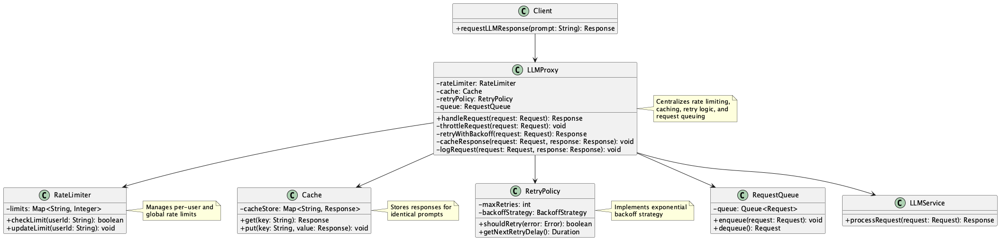

# Proxy for Rate-Limited Access

## 概要

Proxy for Rate-Limited Accessは、LLM APIの利用におけるレートリミットの制約に対処するための設計手法です。リクエストを直接APIに送信するのではなく、レート制御・再試行・キャッシュ機能を備えたプロキシサーバを経由させることで、APIの安定利用とスループットの最大化を図ります。このプラクティスにより、アプリケーションはレートリミットの詳細を意識することなく、LLM APIを安定して利用することができます。

## 解決したい課題

多くのLLM API（例：OpenAI API）には秒間リクエスト数（QPS）やトークン数の制限があります。LLM APIを組み込んだアプリケーションを提供するとき、アプリケーションまたはプロジェクトで共通のLLM API契約を利用するでしょう。LLMプロバイダーの設定するクオータ（利用制限）は契約単位で決められていることが多いです。アプリケーションの特定ユーザが高付加で利用してクオータに引っかかった場合、他のユーザ含めてLLM APIが利用できなくなります。

- **高頻度アクセス時のエラー発生**
  - 複数ユーザーが同時にアクセスした際、`429 Too Many Requests`が返却され、処理が失敗します。

- **バッチ処理の中断**
  - 夜間バッチで数千件のデータを一括処理しようとすると、途中で制限に到達してしまいます。

- **実装の重複と不整合**
  - サービスごとに異なるリトライロジックやスロットリング実装があり、保守性が低下します。各チームが独自にエラーハンドリングを実装するため、動作の一貫性が保てません。

## 解決策

LLM APIとの間にプロキシサーバを設置し、すべてのリクエストをそこを経由させる設計とします。このプロキシは以下の機能を担います。

- **リクエストのスロットリング制御**
  - ユーザごと、またはユーザグループごとに1秒あたりのリクエスト数を制御し、契約全体としてLLM APIのクオータを超えないよう調整します。
  - スライディングウィンドウ方式やトークンバケット方式を用いて、リクエスト数を制限します。
    - 例：スライディングウィンドウ方式：1秒あたり10リクエストまで許可し、超過した場合はキューに追加して順次処理します。
    - 例：トークンバケット方式：1秒あたり10トークンを補充し、各リクエストで1トークンを消費する実装です。

- **リトライとバックオフ処理**
  - 一時的なエラーが発生した場合に、指数バックオフなどのポリシーに従って再試行します。429エラー発生時、2秒、4秒、8秒と徐々に待機時間を増やしながら再試行します。LLM APIの429エラーが継続する場合は一時的にリトライを止めてアプリケーションの利用を制限し、回復を待ちます。

- **キャッシュの活用**
  - 同一プロンプトに対する結果を短時間キャッシュし、APIコール回数の削減を図ります。

- **サーキットブレーカーの採用**
  - ユーザごと、またはユーザグループごとに1秒あたりのリクエスト数を制御し、契約全体としてLLM APIのクオータを超えないよう調整します。
  1. **Closed状態（通常運用）**
     - すべてのリクエストを許可し、エラー発生時はカウンターを増加させます。
     - 例：エラー率が閾値（例：50%）を超えるまで、通常通りリクエストを処理します。

  2. **Open状態（遮断）**
     - 閾値を超えるエラーが発生した場合にリクエストを遮断し、フォールバック応答を返却します。
     - 例：連続3回のエラー発生時に、キャッシュされた応答や簡易的な代替応答を返します。

  3. **Half-Open状態（回復確認）**
     - 一定時間経過後に限定的なリクエストを許可し、回復状況を判定します。
     - 例：5分後に1リクエストを許可し、成功すればClosed状態に戻ります。

- **負荷分散とキュー管理**
  - 同時に多数のリクエストが来た場合も、キューを用いて順次処理できるようにします。

## 適応するシーン

このプラクティスは以下のような場面で特に有効です。

- ユーザー数が多く、同時リクエストが頻繁に発生するWebサービス
- バッチ処理やデータパイプラインなど、LLM APIを高頻度に呼び出すバックエンド処理
- 複数サービスでLLMを共通利用している組織内インフラ
- レート制限超過による不安定動作を回避したいミッションクリティカルなシステム

## 利用するメリット

このプラクティスを採用することで、以下のメリットが得られます。

- レートリミットエラーの発生頻度を抑え、安定稼働を実現できます。
- 再試行ロジックを一元管理でき、実装の重複や整合性問題を防止できます。
- プロキシでキャッシュ戦略やログ収集も同時に実装でき、運用性が向上します。
- 利用状況を集約的に可視化・分析でき、将来的なスケーリング判断にもつながります。

## 注意点とトレードオフ

このプラクティスを採用する際は、以下の点に注意が必要です。

- プロキシの実装自体が新たな複雑性やレイテンシー要因になります。
- 適切なリトライ制御やキュー設計がないと、遅延やリクエストロスのリスクが高まります。
- キャッシュ戦略を誤ると、情報の鮮度が失われたり、誤回答が返る可能性があります。
- プロキシの可用性がシステム全体の信頼性に直結するため、冗長構成や監視が不可欠です。

## 導入のヒント

このプラクティスを効果的に導入するためのポイントは以下の通りです。

1. 最初はシンプルなキュー + スロットリング制御だけの軽量なプロキシとして始め、徐々に機能を拡張します。
2. オープンソースのAPI Gatewayやリバースプロキシ（Envoy等）を活用すると構築が容易です。
3. リクエストごとのメタデータ（ユーザーID、プロンプト内容、リトライ回数など）を記録し、将来的な分析に活用できるようにします。
4. レートリミットの単位（秒、分、時間）に応じて、適切なバッファ・キュー設計を行います。

## まとめ

Proxy for Rate-Limited Accessは、LLM APIのレート制限に伴う不安定性を吸収し、安定したサービス提供を実現するための重要な設計手法です。再試行・キャッシュ・スロットリング・ログ管理などの責務を集中させることで、システム全体の信頼性とメンテナンス性を高めることができます。高負荷・高頻度なLLM利用が前提となるシステムでは、早期からの導入が望まれます。
