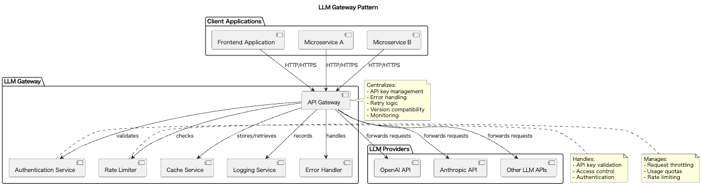

# LLM Gateway

## 概要

LLM Gatewayは、アプリケーションから直接LLM APIを呼び出すのではなく、専用のゲートウェイサービスを介してリクエストを中継・管理する設計手法です。このプラクティスにより、APIキーの一元管理、共通機能の集約、セキュリティ強化、バージョン互換性の担保などを実現します。特に、マイクロサービスアーキテクチャやエンタープライズ環境でのLLM APIの安全な活用に適しています。

## 解決したい課題

マイクロサービスアーキテクチャを採用したサービスや、多数の異なるシステムを組み合わせたエンタープライズシステムで、異なるソフトウェアからLLM APIを利用するシーンは多々あるでしょう。LLM APIの利用目的や方法は多種多様でしょうが、LLM APIの利用で共通したルールはあります。例としてAPIキーの管理やセキュリティ、モデルバージョン管理、利用量管理等が挙げられます。これらを各システムで独自に管理することは非効率と言わざるを得ません。同じルールと安全性を維持するため、共通したシステムで管理することが望ましいでしょう。

1. **APIキーの分散管理と漏洩リスク**
   - 各サービスやクライアントに直接APIキーを保持させると、漏洩のリスクが増大します。

2. **重複するエラーハンドリングやリトライ実装**
   - 各クライアントで同様の処理を実装することは非効率で、保守性が低下します。リトライロジックの実装が各所で異なり、一貫性が保てなくなります。

3. **可観測性の欠如**
   - API呼び出しのログやメトリクスが各所に散在し、全体の状況を把握しづらくなります。問題発生時の原因特定が困難になり、SLAの監視も不十分になります。

4. **プロバイダAPIの変更による広範な影響**
   - エンドポイントやSDKの変更があるたびに、すべてのシステムを修正する必要があります。

## 解決策

LLM Gatewayを導入し、すべてのLLM呼び出しをゲートウェイサービスを経由して行うようにします。このゲートウェイは以下の役割を担います。

1. **APIキーの非公開化と一元管理**
   - クライアントにはキーを渡さず、ゲートウェイ内で安全に保持します。可能であれば、アクセス制御と認証を一元管理します。

2. **共通機能の集約**
   - エラーハンドリング、リトライ、キャッシュ、ログ記録、ポリシー適用などを中央化します。共通のエラーレスポンス形式を提供します。

3. **APIバージョンの吸収**
   - LLMプロバイダ側のAPI変更はゲートウェイ内で吸収し、システムの関心から保護します。

## 適応するシーン

このプラクティスは以下のような状況で特に有効です。

- マイクロサービス間でLLMを共有利用する場合
- フロントエンドからLLM APIを利用するが、APIキーを秘匿したい場合
- 運用監視やガバナンスを強化したいエンタープライズ環境
- オンプレミスとクラウドを組み合わせたハイブリッド構成
- 複数のLLMプロバイダを統一的に管理したい場合

## 利用するメリット

LLM Gatewayを採用することで、以下のメリットが得られます。

- セキュリティの向上：APIキーの秘匿とアクセス制御が可能になります。
- 開発効率の改善：クライアント側の実装を簡素化し、変更にも強くなります。
- 統合的な監視と制御：呼び出しメトリクスやログの一元管理が可能です。
- 高い拡張性と保守性：新機能やポリシーの追加がゲートウェイだけで完結します。
- コスト最適化：使用量の監視と制御が容易になります。

## 注意点とトレードオフ

このプラクティスを導入する際には以下のような点に注意が必要です。

- 単一障害点のリスク：ゲートウェイがダウンするとすべてのLLM呼び出しが停止するため、冗長構成が求められます。
- レイテンシの増加：リクエストが中継を経由するため、若干のレスポンス遅延が発生します。
- ゲートウェイ自体の運用コスト：モニタリング、スケーリング、セキュリティパッチの対応が必要になります。
- キャッシュやポリシーによる挙動の変化：不適切なキャッシュ設定や制限ポリシーにより、意図しない応答を返すリスクがあります。

## 導入のヒント

LLM Gatewayを導入する際は、以下のような段階的なアプローチが有効です。

1. 初期フェーズ：APIキー管理と認証ログ記録のみを実装し、安全な基盤を構築します。
2. 中期フェーズ：エラーハンドリング、リトライ、タイムアウト制御などの共通処理を追加します。
3. 後期フェーズ：キャッシュ、レートリミット、利用ポリシーを導入し、全体最適を図ります。
4. ツールの活用：AWS API Gateway、Azure API Management、Kong、Envoyなどの既製ゲートウェイの活用も検討します。
5. CI/CDとの統合：設定をコード化し、GitOpsやCIパイプラインでの自動デプロイを実現します。

## まとめ

LLM Gatewayは、LLM APIの活用におけるセキュリティ、運用性、拡張性の課題を一元的に解決するための設計手法です。ゲートウェイに共通処理や管理機能を集約することで、開発の効率化と運用の安定化を実現できます。ただし、単一障害点の回避やレイテンシ増加への対応など、導入時の設計と運用には十分な配慮が必要です。適切な実装と運用により、LLMを活用したシステムの品質と信頼性を大幅に向上させることができます。
