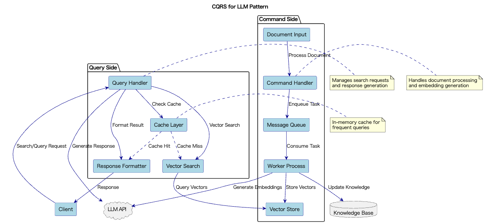

# CQRS for LLM

## 概要

CQRS for LLMは、LLMを活用するシステムにおいて「状態変更（Command）」と「結果取得（Query）」の処理を分離し、それぞれに最適化された設計を適用する手法です。Commandは非同期処理やスループットを重視し、Queryは即時性やレイテンシを重視することで、LLMシステムの性能と拡張性を両立させることができます。

## 解決したい課題

LLMを活用したシステムには同期的、即時的に処理する機構と、非同期、スループット重視で処理する機構が混在することがあります。LLM APIにリクエストする場合も、チャットのようにユーザに即時的にレスポンスすることが求められるケースもあれば、ドキュメント一括処理のようにスループット重視で処理するケースもあります。前者は同期処理、後者は非同期処理で実装するのが良いでしょう。

結果としてシステムには情報の書き込み（埋め込み生成やデータ追加）と読み取り（生成、検索、要約など）が混在するため、以下のような課題が発生します。

1. **読み込みと書き込みのパフォーマンス衝突**
   - 同一プロセス内で埋め込み生成と検索を同時に処理すると、キャッシュの競合やロック待ちが頻発し、全体のパフォーマンスが低下します。

2. **スケーラビリティの限界**
   - 大量の検索リクエストとバッチ更新処理を同じ経路で処理すると、リソースの競合が発生し、全体のスループットが低下します。

3. **整合性と応答速度のトレードオフ**
   - 新しい文書を追加した直後に検索を行う場合、整合性を保つために読み取りが遅延し、ユーザー体験が損なわれます。

4. **運用の複雑化**
   - 監視やログ収集が混在することで、トラブルシュートやパフォーマンス分析が困難になります。

## 解決策

CQRS for LLMでは、CommandとQueryを明確に分離し、それぞれに特化した処理経路を設計します。

1. **Command（状態変更）経路の実装**
   - 埋め込み生成、ナレッジ追加、ファインチューニング実行などを非同期キューやバッチ処理で対応します。文書の追加はCeleryやRabbitMQなどのメッセージキューに投入し、ワーカープロセスで非同期に処理します。個別のデータパイプラインを構築してバッチをスケジュールするのでも良いでしょう。

2. **Query（読み取り）経路の実装**
   - 要約、チャット応答、検索などの処理をインメモリキャッシュや高速ベクトル検索層で即時処理します。検索リクエストはRedisキャッシュやFAISS等の専用ベクトルDBで高速に処理します。

3. **システム構成の分離**
   - Command経路とQuery経路に異なるサービス、インフラ、ログ監視を適用し、独立したスケーリングと保守を可能にします。Command処理用の基盤とQuery処理用の基盤を分離し、それぞれに最適なリソース配分を行います。

## 適応するシーン

このプラクティスは以下のようなLLMを活用する中〜大規模システムにおいて特に有効です。

- 大量の文書を対象としたRAG型検索・要約サービス
- チャット型インタフェースとユーザ設定の同時管理が必要な対話システム
- 継続的に更新されるナレッジグラフやタグベース推薦システム
- ダッシュボードや可視化UIと連携した分析システム

## 利用するメリット

このプラクティスを採用することで、以下のメリットが得られます。

- CommandとQueryを独立してスケールできるため、ボトルネックが分離され、全体のスループットが向上します。
- 障害発生時にCommand/Queryのどちらで発生したかを即座に特定でき、運用性が向上します。
- キャッシュ、バッチ処理、並列度の最適化を個別に適用できるため、柔軟な性能チューニングが可能です。
- ログ、メトリクス、エラートラッキングを分けて集計できるため、トラブル時の分析が効率化されます。

## 注意点とトレードオフ

このプラクティスを採用する際は、以下の点に注意が必要です。

- 書き込み直後に読み取りを行うと、反映されていない可能性があるため、最終的整合性設計が前提となります。
- キュー、ストリーム処理、キャッシュ管理といった追加コンポーネントの運用が必要となり、システム構成が複雑化します。
- 非同期処理や最終的整合性に対応したテスト設計が必要となり、テストの難易度が上昇します。
- チーム全体にCQRSと非同期アーキテクチャの理解が求められ、学習コストが発生します。

## 導入のヒント

このプラクティスを効果的に導入するためのポイントは以下の通りです。

1. 最初は一部の書き込み操作（例：文書登録）のみをCommandとして切り出すことから始めるとよいです。
2. Queryの応答速度が重要な場合、インメモリキャッシュや専用ベクトル検索層の導入を検討してください。
3. PrometheusやGrafanaを用いたCommand/Query別のメトリクス監視は非常に有効です。
4. キャッシュにTTL（Time to Live）やバージョン情報を持たせることで整合性問題を緩和できます。

## まとめ

CQRS for LLMは、LLMシステムにおける「書き込み」と「読み取り」の責務を分離し、それぞれに最適なアーキテクチャを適用することにより、性能・拡張性・可観測性を大きく向上させるデザインプラクティスです。大規模なRAGシステムやナレッジベース型対話エージェントなど、LLMを基盤にしたプロダクトで特に高い効果を発揮します。ただし、システムの規模や要件に応じて、適切な分離レベルを検討することが重要です。
