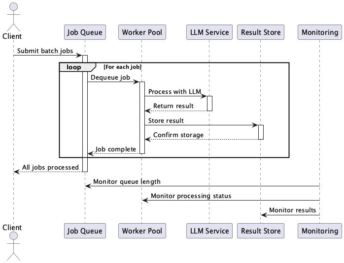

# Async Batch Processing

## 概要

Async Batch Processingは、LLMへの大量リクエストをリアルタイム同期ではなく、バッチ処理または非同期キューによって処理する設計手法です。タスクはジョブキューに登録され、ワーカーが並列に処理を実行し、最終的に結果を集約します。このプラクティスにより、大規模なLLMタスクを効率的かつ耐障害的に処理することができます。

## 解決したい課題

LLMはチャットのような同期的かつ即時的にレスポンスする用途以外でも能力を発揮します。たとえば自然言語で書かれた大量のドキュメントを一括処理する場合や、AIコーディングによりLLMでプログラムを書くケースがあります。いずれも同期的、即時的なレスポンスは必須ではありません。遅延があってもリクエストが正しく処理されることが求められます。また、大量のデータ（自然言語、プログラミング言語）を読み込むことも要件になります。そうしてシステムでLLMを利用する場合には以下のような課題が発生します。

1. **同期呼び出しのスケーラビリティ制限**
   - リアルタイムでのAPI呼び出しでは一度に処理できるリクエスト数に限界があり、大量処理に向いていません。

2. **コストの最適化**
   - 同期処理ではアイドルタイムが増えやすく、リソースを無駄に消費しやすいです。

3. **障害耐性の確保**
   - 一部のリクエスト失敗によって全体の処理が停止することを避けたいです。

4. **ピーク負荷の平準化**
   - リアルタイム処理ではピーク時のリクエスト集中に耐えるためのリソース設計が必要になります。

## 解決策

このプラクティスでは、タスクをキューに投入し、複数のワーカー（コンテナ、サーバーレス関数など）によって非同期に処理を行います。完了した結果はデータストアやメッセージングシステムに保存または通知されます。具体例は以下の通りです。

1. **SNS投稿のセンチメント分析**
   - バルクでセンチメント分析を実行し、非同期で結果を保存します。

2. **パーソナライズドマーケティング**
   - 顧客セグメントごとにパーソナライズしたマーケティングメールを非同期で生成します。

3. **GitHubレポジトリ分析**
   - 開発中のレポジトリやPRを分析し、バグや非効率な処理を発見してIssueを作成します。

## 適応するシーン

このプラクティスは以下のような場面に適しています。

- 数千〜数万のドキュメントをまとめて要約・分類したい場合
- 一括でセンチメント分析や自然言語処理を行いたいデータパイプライン
- マーケティングなど、大量のアウトプットをオフピークでまとめて生成したい業務
- データ整形から生成・保存までのETLの一部としてLLMを活用するユースケース
- 開発中プログラムの補助やAIコーディング

## 利用するメリット

このプラクティスを活用することで、次のような利点が得られます。

- 水平スケーリングにより、大量の処理を短時間で完了できます。
- オンデマンドでスケーリング可能なリソースによりコスト効率を最適化できます。
- 失敗タスクのみを再試行することで、システム全体の堅牢性が高まります。
- 夜間やオフピーク時間帯に処理を集中させ、ピーク負荷を避けることができます。

## 注意点とトレードオフ

導入には以下のような注意点とトレードオフが存在します。

- 非同期処理のため、リアルタイム応答が求められるユースケースには不向きです。
- キュー管理やワーカープールの構築・運用が必要となり、システムの複雑度が増加します。
- タスクの冪等性を確保しないと重複処理のリスクがあります。
- キュー長や遅延、失敗率のモニタリングが不可欠であり、監視設計が重要です。

## 導入のヒント

このプラクティスを導入する際には、以下の点に留意すると良いでしょう。

1. **バッチ粒度の検証**：チャンク単位やドキュメント単位など、適切なタスクサイズをPoCで評価します。

2. **マネージドサービスの活用**：AWS SQS + Lambda、GCP Pub/Sub + Cloud Functionsなどを利用すると構築が容易です。

3. **冪等性の設計**：同一タスクの再処理を防ぐため、ユニークなタスクIDを設計します。

4. **DLQの設定と再試行戦略**：失敗タスクのリトライ回数と、DLQへの振り分けを設計します。

5. **メトリクスとアラートの整備**：キュー長、処理遅延、失敗率などを可視化し、アラート閾値を設定します。

## まとめ

Async Batch Processingは、LLMを活用した大規模非同期処理において、スケーラビリティ・コスト効率・障害耐性を同時に実現するための強力なアーキテクチャです。ただし、リアルタイム性が求められるシーンには適していないため、用途と要件に応じて適切に使い分けることが重要です。
