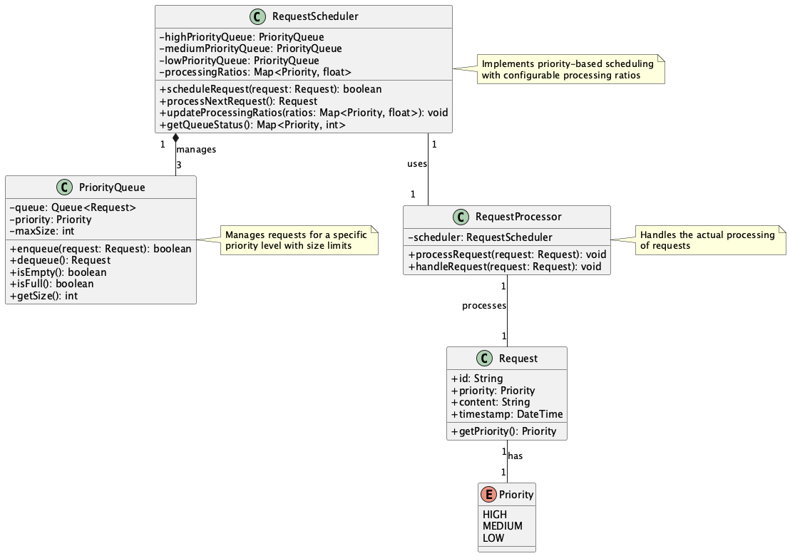

# Priority-Based Throttling

## 概要

Priority-Based Throttlingは、LLM APIや外部サービスへのリクエスト処理において、リクエストの優先度に応じてスループットを制御する設計手法です。高優先度のリクエストを優先的に処理しつつ、中・低優先度のリクエストも適切に処理されるようバランスを取ります。これにより、重要なユーザや処理のサービス品質を保証しながら、全体の公平性と効率を維持することができます。

## 解決したい課題

LLM APIを利用するすべてのサービスやシステムが同じ重要性を持っているとは限りません。たとえばフリーミアム戦略でサービスを提供している場合、有償ユーザと無償ユーザのリクエストでは明確に重要性に差があります。または同期的、即時的に処理することが求められるユースケースと、時間を要しても確実に処理されることが求められるユースケースがあれば、前者を優先して処理する必要があるでしょう。こうしたケースを考慮せず、すべてのLLMリクエストを同じ重要性で処理する場合、以下のような課題が発生します。

1. **リソース競合による飢餓状態の発生**
   - 単一のリクエストキューでは高頻度の高優先度リクエストが低優先度を継続的にブロックし、低優先度処理が実行されない事態が発生します。

2. **重要リクエストのレイテンシ遅延**
   - 全てのリクエストを一律に処理すると、エンタープライズ契約やSLAが求める応答時間を満たせなくなるリスクがあります。

3. **サービス品質のばらつき**
   - リアルタイム処理とバッチ処理が混在するシステムでは、利用者によって大きな性能差が生じる可能性があります。

4. **ピークトラフィック時の運用負荷増加**
   - 一律処理ではシステムの負荷が急増し、リソースの過剰使用や障害発生につながります。

## 解決策

リクエストを「高・中・低」などの優先度に分類し、それぞれ専用のキューに分けて管理します。ワーカープロセスは高→中→低の順でリクエストをポーリングし、処理を実行します。また、すべてのリクエストが実行機会を得られるように、各優先度に対する処理割合（例：高70%、中20%、低10%）を設定し、動的にチューニングできる仕組みを設けます。

例えば、マルチテナントSaaSでは、有料ユーザのリクエストは高優先度、無料ユーザは低優先度として扱い、処理順やレイテンシに差をつけることができます。

## 適応するシーン

このプラクティスは以下のようなユースケースで有効です。

- マルチテナント型のAPIプラットフォームにおける有料／無料ユーザのリクエスト差別化
- チャットボットや対話型AIシステムにおける緊急問い合わせの優先処理
- バッチとリアルタイム処理の共存するシステム基盤
- カスタマーサポート基盤におけるプレミアムサポートの優先応答

## 利用するメリット

このプラクティスを活用することで、以下のような利点が得られます。

- SLAの遵守：高優先度リクエストの応答時間を保証できます。
- 公平性の担保：低優先度リクエストにも一定の処理機会を提供し、飢餓状態を回避できます。
- 運用の最適化：優先度別のリソース割り当てにより、全体のコストとスケーラビリティのバランスを取ることができます。
- 可視化と制御：キューごとの深度や処理レートの可視化により、運用の見通しが立てやすくなります。

## 注意点とトレードオフ

このプラクティスを採用する際は、以下の点に注意が必要です。

- 設計と実装の複雑性：複数の優先度キューの設計、動的スケジューリングの実装が必要となり、開発コストが増加します。
- UXへの影響：負荷の高い状況では中・低優先度リクエストのレイテンシが増大し、ユーザ体験を損なう可能性があります。
- 監視負荷の増大：優先度ごとのキュー監視やアラート設定が必要となり、運用負荷が高まる傾向があります。
- チューニング難易度：処理比率の設定を誤ると、高優先度に偏りすぎたり、低優先度が過剰実行されるなどの不具合が発生します。

## 導入のヒント

このプラクティスを効果的に導入するためのポイントは以下の通りです。

1. 優先度ポリシーの明確化：ビジネス要件に基づき、「高・中・低」の基準を定義してください。
2. 段階的導入：まずは高優先度キューのみを導入し、その後中・低優先度のキューを追加して検証することで、安全に展開できます。
3. メトリクスの可視化：GrafanaやPrometheus、DataDog等を用いて、各キューの処理状況をリアルタイムで可視化してください。
4. 初期設定の簡略化：最初は固定比率（例：70:20:10）で始め、実際のトラフィック状況を元に調整してください。
5. フェールセーフの設計：低優先度のキューが飽和した際の処理（ドロップや遅延キューへの退避）を明確に定義してください。

## まとめ

Priority-Based Throttlingは、優先度に基づくリクエスト制御を可能にし、重要な処理を確実に実行しながらシステム全体の公平性と安定性を維持するための有効な設計手法です。特にマルチテナント環境や多様なリクエスト要求が混在するシステムにおいて、その効果は顕著です。導入には一定の設計コストと運用体制が求められますが、適切に活用することで高品質なサービス提供が可能になります。
