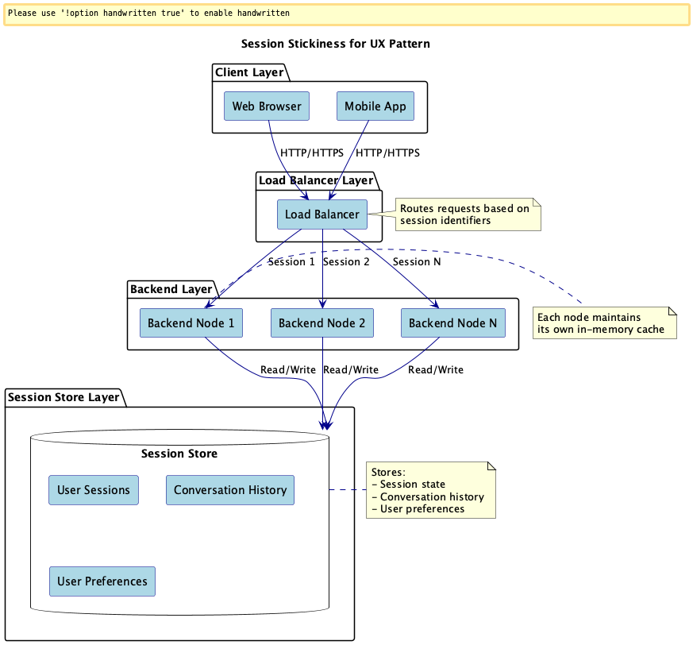

# Session Stickiness for UX

## 概要

Session Stickiness for UXは、ユーザのセッション（対話IDやユーザID、ブラウザセッションなど）ごとに、常に同じモデルコンテキストまたはバックエンドノードにリクエストをルーティングすることで、一貫した対話体験を提供する設計手法です。このプラクティスにより、会話の文脈保持やパーソナライズの強化、レイテンシ低減を実現することができます。

## 解決したい課題

コンピュータには一時的、永続的含めて多様なデータ記録領域が用意されていますが、プログラムから簡単に使えて低レイテンシな領域はインメモリです。LLMを活用するときも一時的なデータはインメモリに保持して利用することが遅延を回避する有効な手段です。

そのため、LLMを活用したシステム（マルチターンの対話型システム等）では、セッション中にユーザのリクエストが異なるノードにルーティングされると、以下のような問題が発生します。

1. **文脈の消失**
   - インメモリキャッシュに依存する会話履歴がノード間で共有されず、文脈が途切れてしまいます。

2. **応答の不整合**
   - ノードごとにキャッシュやモデル設定が異なる場合、同じ質問でも異なる応答が返ってきてしまいます。

3. **パーソナライズが維持されない**
   - ユーザの嗜好や履歴に基づく個別調整が、セッション中に引き継がれなくなります。

4. **UXの断絶**
   - タイプ中の接続切替やセッションの再接続で、プロンプトの重複表示や遅延が発生してしまいます。

## 解決策

セッション識別子（Cookie、JWT、カスタムヘッダなど）を利用し、同一セッション内のリクエストを常に同じバックエンドノードに誘導する「スティッキーセッション」方式を導入します。

1. **セッションごとのアフィニティ設定**
   - ロードバランサやAPIゲートウェイにて、セッション識別子に基づくルーティングルールを設定します。

2. **状態保持の工夫**
   - インメモリキャッシュやセッションストア（例：Redis）を活用し、会話履歴やユーザ設定を保持します。

3. **ノード障害時のリカバリ**
   - セッションストアから状態を復元するリカバリ機構を組み込みます。

## 適応するシーン

このプラクティスは以下のようなシステムに適しています。

- 会話の一貫性が求められるマルチターンチャットボット
- ユーザの履歴や好みに基づいた応答を行うパーソナライズドアシスタント
- セッション継続性が重要なカスタマーサポートBOT
- 教育系や医療系など、ユーザのプロファイルを継続的に保持したい専門対話アプリケーション

## 利用するメリット

このプラクティスを採用することで、以下のメリットが得られます。

- 会話の文脈を維持でき、自然で継続的なやり取りを実現できます。
- 高速な応答が可能となり、UXが大幅に向上します。
- ユーザごとのチューニング結果や履歴情報の再利用により、高品質なパーソナライズが可能です。
- 状態同期が不要なため、分散環境の設計と運用がシンプルになります。

## 注意点とトレードオフ

このプラクティスを採用する際は、以下の点に注意が必要です。

- 負荷分散の効率が低下する可能性があり、特定のノードにリクエストが集中することがあります。
- 単一ノード障害時のリスクが増加し、セッションがリセットされる恐れがあります。
- ノードの動的追加・削除により、セッションの再アフィニティ設計が必要になります。
- セッションストアの運用負荷（容量、整合性、TTLなど）が発生します。

## 導入のヒント

このプラクティスを効果的に導入するためのポイントは以下の通りです。

1. セッション識別子の設計にはセキュアなトークン（JWTなど）を用いると安全性と一貫性が保たれます。
2. 小規模システムではインメモリキャッシュ、大規模システムではRedisやGCP Memorystoreなどの分散キャッシュが有効です。
3. フェイルオーバー設計として、セッション状態をストアから再構築できるようにしておくと安心です。
4. ロードバランサのスティッキーセッション機能（例：IPハッシュ、クッキーアフィニティなど）を活用してください。
5. 監視指標として、スティッキーセッション率、ノードごとのセッション集中度、エラー再接続率を可視化することが重要です。

## まとめ

Session Stickiness for UXは、ユーザごとの一貫した対話体験を提供するための重要な設計手法です。文脈保持や高速応答、パーソナライズ対応といったUXの質を向上させる一方で、スケーラビリティや耐障害性の確保には注意が必要です。セッション設計とキャッシュ戦略を適切に行うことで、安定かつ快適なLLMベースの対話システムを実現できます。
