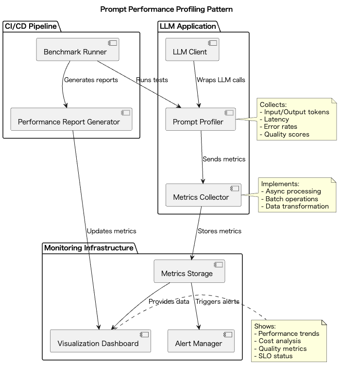

# Prompt Performance Profiling

## 概要

Prompt Performance Profilingは、LLMに対するプロンプトのパフォーマンスを定量的に測定・可視化し、継続的な最適化を支援する設計プラクティスです。メトリクス収集、プロファイラの組み込み、ダッシュボードによる可視化を通じて、ボトルネックの発見や最適なプロンプト構成の選定が可能になります。このプラクティスにより、プロンプト設計の「見える化」と「継続的改善」を実現することができます。

## 解決したい課題

LLMを活用するために書かれたプロンプトのすべてが水準以上の品質の結果を得られるとは限りません。プロンプトの内容が粗末で結果品質が低い場合があれば、丁寧すぎるほど長文で複雑なプロンプトを書いてしまい、レスポンスの遅延とHallucinationsを引き起こすこともあるでしょう。プロンプトの内容によってトークン消費量も変わってきます。プロンプトエンジニアリングがLLM活用の1領域になるくらい、適切にプロンプトを書くことは難しいことです。

1. **ブラックボックス運用**
   - プロンプト変更後にレイテンシやトークン使用量が悪化しても気づけないことがあります。
   - 例：新しいプロンプトを導入した後、応答時間が2倍になったにもかかわらず、1週間後にユーザーからの苦情で初めて気づくケース。

2. **非体系的な最適化**
   - 経験や直感に頼ったプロンプト調整では、再現性が低く継続的な改善が困難です。
   - 例：開発者が「このプロンプトの方が良さそう」という感覚で変更を加え、結果が悪化した場合に元の状態に戻せないケース。

3. **コストの予実管理の欠如**
   - トークン使用量の増加がどのプロンプトに起因しているか特定できず、不要なコストが発生します。
   - 例：月間のAPIコストが予算を超過したが、どのプロンプトが原因か特定できないケース。

4. **性能劣化の見逃し**
   - モデルバージョン変更やパラメータ調整により品質やパフォーマンスが劣化しても検知できません。
   - 例：GPT-4からGPT-4-turboに移行した際、特定のユースケースで品質が低下したが、定量的な比較ができず気づけなかったケース。

## 解決策

Prompt Performance Profilingを適用することで、プロンプト呼び出しに対して自動的にメトリクスを収集・可視化できるプロファイリング基盤を構築します。

1. **メトリクス収集**
   - 各呼び出しの入力・出力トークン数、レイテンシ、エラー率、品質スコアなどをログに記録します。
   - 例：OpenTelemetryを使用して、各プロンプト呼び出しの詳細なメトリクスを収集します。

2. **プロファイラの設計**
   - API呼び出しをラップするコンポーネントを導入し、非同期またはバッチ処理でデータを収集・転送します。
   - 例：LLMクライアントをラップするデコレータを実装し、非同期でメトリクスを収集します。

3. **可視化とレポート**
   - GrafanaやBIツールを活用し、トレンド分析、品質対コストの散布図、アラートなどを表示します。
   - 例：Grafanaダッシュボードで、プロンプトごとの平均レイテンシとトークン使用量の推移を可視化します。

4. **CIとの統合**
   - プロンプト変更時に自動プロファイル比較レポートを生成し、差分を定量的に評価します。
   - 例：GitHub Actionsでプロンプト変更時に自動的にベンチマークを実行し、レポートを生成します。

## 適応するシーン

このプラクティスは以下のような場面に適しています。

- 月間数百万回の呼び出しを行う大規模LLM活用SaaSサービス。
- ドキュメント分類や要約などをLLMで行うバッチ処理基盤。
- チーム横断でプロンプトを共用するエンタープライズ向けAPI基盤。
- PoCや実験段階におけるプロンプトの改善と本番投入判断。

## 利用するメリット

このプラクティスを導入することで、以下のようなメリットがあります。

- プロンプト変更による影響を定量的に可視化でき、意思決定が科学的になります。
- CI/CDに統合することで、プロンプトの品質低下を自動的に検出し防止できます。
- コストやレイテンシの主要因を把握し、効率的な改善が可能になります。
- SLO達成状況をメトリクスで確認し、信頼性のある運用が実現できます。

## 注意点とトレードオフ

このプラクティスの導入においては以下の点に注意が必要です。

- **パフォーマンスへの影響**
  - プロファイラの導入により、呼び出しレイテンシがわずかに増加する可能性があります。
  - 例：メトリクス収集により、各呼び出しのレイテンシが5-10ms程度増加する可能性があります。

- **データ保存のコスト**
  - メトリクスを長期保存する場合、ストレージやクエリコストが増加します。
  - 例：1日100万回の呼び出しで、1年間のメトリクス保存に月額数万円のコストが発生する可能性があります。

- **品質スコアの定義**
  - BLEUやROUGEなどの指標は評価内容によって最適でない場合があり、適切なスコア設計が必要です。
  - 例：要約タスクではROUGEスコアが有効だが、コード生成タスクでは別の評価指標が必要になるケース。

- **運用負荷**
  - ダッシュボードの作成・管理、アラート設定には専門知識やリソースが必要になります。
  - 例：Grafanaダッシュボードの設計とメンテナンスに、月間数時間の工数が必要になるケース。

## 導入のヒント

このプラクティスを導入する際には、以下のような手順を踏むことを推奨します。

1. まずはトークン数とレイテンシなど基本的なメトリクスから計測を開始します。
2. 非同期送信やバッチ処理により、計測によるパフォーマンス低下を最小限に抑えます。
3. Grafanaなどのテンプレートを活用して、迅速に可視化基盤を整備します。
4. CIに組み込み、プロンプト変更時に差分レポートを出力して品質の劣化を検出します。
5. 定期的に可視化内容やアラート条件を見直し、継続的に改善します。

## まとめ

Prompt Performance Profilingは、LLMのプロンプト設計と運用において「見える化」と「継続的改善」を実現する重要な設計手法です。品質、コスト、レイテンシなど複数の観点を同時に管理することで、より信頼性の高いLLMシステムを構築することができます。ただし、システムの規模や要件に応じて、計測項目や可視化方法を適切に選択することが重要です。
