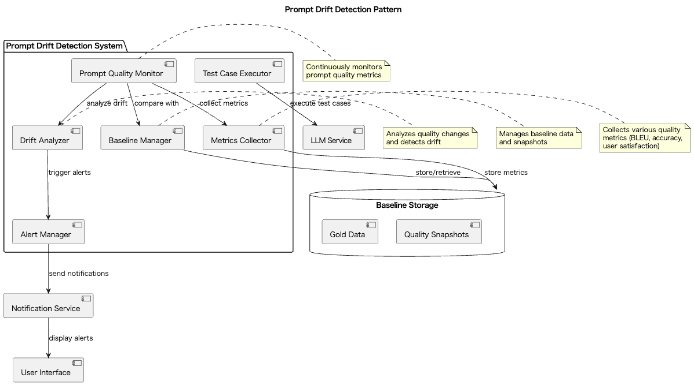

# Prompt Drift Detection

## 概要

Prompt Drift Detectionは、運用中のプロンプトが時間の経過やモデルのバージョンアップ、ユーザ利用状況の変化によって品質を劣化させる"ドリフト"を自動的に検知する設計手法です。定量的な評価指標を用いて継続的に品質をモニタリングし、劣化が発生した際にアラートやロールバックを行います。このプラクティスにより、LLMを活用するシステムの品質を安定的に維持することができます。

## 解決したい課題

プロンプトは適宜修正していくものです。プロンプトの変更によってLLMリクエスト結果の品質や内容が変わることは当然です。運用中に発生する他の変化として、LLMプロバイダーが提供するモデルの更新や、アプリケーション利用者の状況変化が挙げられます。プロンプトの変更は開発者がコントロール可能な領域ですが、LLMモデルやアプリケーション利用者はコントロールできるものではなく、どのタイミングで変化するのか事前に知ることが難しい場合が多いでしょう。こうした変化を”ドリフト”と呼びます。

1. **静かなる品質劣化**
   - プロンプトの品質が徐々に劣化してもユーザからの報告がない限り気づけず、深刻な影響が出てから大規模な修正が必要になることがあります。
   - 例：チャットボットの応答が徐々に不適切になり、ユーザ満足度が低下していることに気づかないケース。

2. **回帰テストの欠如**
   - モデルのバージョンアップやプロンプトの改変後に十分な品質確認が行われず、品質低下に気づかずリリースしてしまうことがあります。
   - 例：プロンプトを変更した後、テストカバレッジが不十分で、リリース後にユーザからのクレームが発生するケース。

3. **データ分布の変化**
   - 時事トピックやトレンドの変化により、過去にチューニングしたプロンプトが想定外の入力に対応できなくなります。
   - 例：新型コロナウイルス関連の質問に対して、古いプロンプトが適切な回答を生成できないケース。

4. **運用コストの増大**
   - 手動による品質チェックに多大な工数がかかり、継続的な運用が困難になります。
   - 例：毎週の手動テストに2人日かかり、他の開発タスクに影響が出ているケース。

## 解決策

Prompt Drift Detectionでは、以下のような手法を組み合わせてドリフトを検知し、品質劣化を早期に発見して対応します。

1. **品質メトリクスの継続的測定**
   - 精度、再現率、BLEUスコア、ユーザ満足度スコアなどの定量指標を定期的に測定します。
   - 例：毎日100件のテストケースを実行し、応答の品質スコアを記録します。

2. **ベースラインとの比較**
   - プロンプトのリリース直後に記録したゴールドデータや、品質の高い状態のスナップショットを基準とし、現在の出力と比較します。
   - 例：リリース時の応答と現在の応答の類似度を計算し、閾値を下回った場合にアラートを発報します。

3. **アラートおよび自動通知**
   - 品質スコアが設定した閾値を下回った場合、自動で通知を行い、調査や再チューニングのトリガーとします。
   - 例：品質スコアが前週比で10%以上低下した場合、Slackチャンネルに通知を送信します。

## 適応するシーン

このプラクティスは以下のような場面で有効に機能します。

- モデル更新が頻繁に行われるエンタープライズチャットボットの運用
- 長期にわたり自動実行されるドキュメント処理パイプライン（要約や分類など）
- 複数テナント向けに個別プロンプトを運用するAPIプラットフォーム
- SLA担保が求められるAI対話サービスの運用

## 利用するメリット

このプラクティスを導入することで、以下の利点が得られます。

- 品質劣化を早期に発見できるため、大規模障害を未然に防げます。
- 品質の安定性が向上し、ユーザ信頼を維持できます。
- モデルやプロンプトの変更時に自動で品質検査を行う回帰テストパイプラインを構築できます。
- 手動テストの負担が軽減され、運用コストを削減できます。

## 注意点とトレードオフ

導入にあたっては以下の点に注意が必要です。

- 品質評価のために追加のAPI呼び出しや処理が必要となり、計算コストとレイテンシが増加します。
- 適切なドリフト検出の閾値設計が難しく、誤検知や検出漏れのリスクがあります。
- ゴールドデータやベースラインの長期保存・管理に手間がかかります。
- 評価指標が自動化可能なものに偏ると、実際のユーザ体験とのギャップが生じる恐れがあります。

## 導入のヒント

Prompt Drift Detectionを効果的に導入するには、以下のポイントを参考にしてください。

1. 最初に代表的なユースケース（要約、分類、対話など）を選定し、品質メトリクスを整備します。
2. プロンプト改良後の出力をベースラインとして記録し、定期的に比較可能なスナップショットを蓄積します。
3. CI/CDパイプラインにドリフト検出機構を統合し、変更時に自動で品質チェックを行います。
4. レイテンシやトークン数などのメタ情報も含めて、多角的な監視を行うことが有効です。
5. ドリフト検出時には自動でアラートを発報し、担当者への通知やエスカレーションフローを整備します。

## まとめ

Prompt Drift Detectionは、LLMを活用するプロダクトの品質を持続的に保証するための有力な手法です。導入によってプロンプト品質の劣化を早期に検知し、信頼性の高いシステム運用を実現することができます。特に長期運用が前提のサービスやモデル更新が頻繁な環境において、その価値は非常に大きいです。
