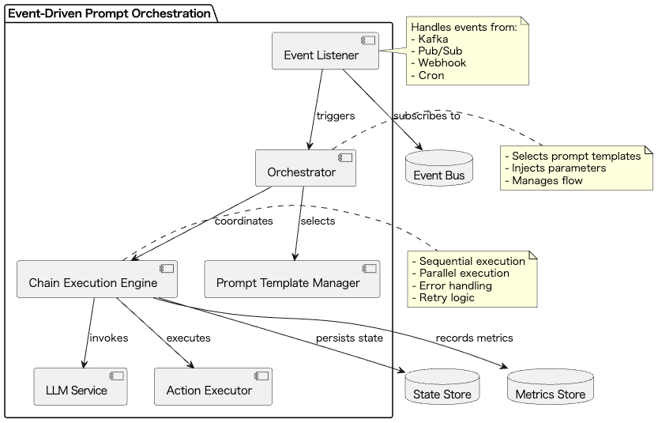
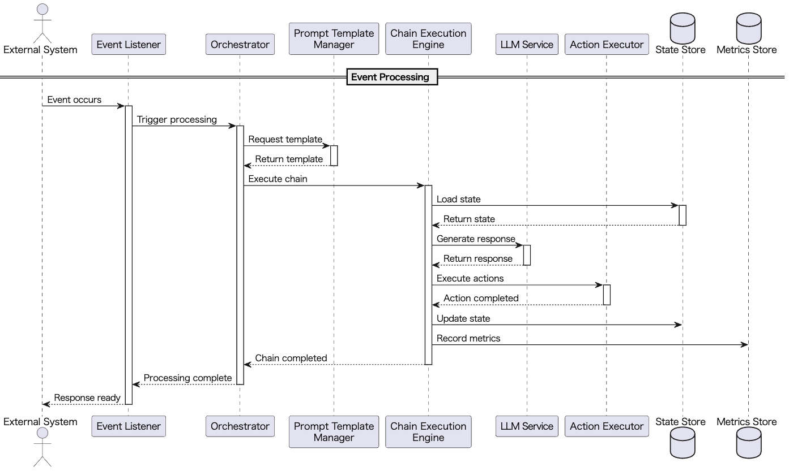

# Event-Driven Prompt Orchestration

## 概要

Event-Driven Prompt Orchestrationは、アプリケーション内で発生するイベントをトリガとして、プロンプト生成からLLM呼び出し、さらにその後続処理までを自動的に連鎖実行する設計プラクティスです。このプラクティスにより、リアクティブで柔軟なLLM連携処理が実現できます。イベントの発生から処理の完了までを一貫して管理することで、システム全体の自動化と効率化を図ることができます。

## 解決したい課題

LLMのブレークスルーの一つにReasoning能力の向上によって論理的思考力が強化されている点が挙げられます。これにより、LLMは単なる質問応答や要約生成だけでなく、複雑なビジネスロジックやデータ処理を自動化する能力を持つようになりました。しかし、これを実現するためには、イベントドリブンなアーキテクチャが必要です。イベントを契機とした処理をLLMで自動化しようとする際、以下のような問題が発生します。

1. **手動連携の工数増大**
   - 各イベントに対して個別のスクリプトやcronジョブを作成する必要があり、保守性が低下します。
   - 例：カスタマーサポートの問い合わせが来るたびに、手動でプロンプトを生成し、LLMに問い合わせる必要があります。

2. **状態管理の煩雑さ**
   - イベント間でのデータ受け渡しや失敗時のリカバリ処理を手作業で実装すると、エラーやバグのリスクが高まります。
   - 例：複数のLLM呼び出しを連鎖させる場合、各ステップの結果を手動で管理する必要があります。

3. **レスポンス遅延**
   - 同期的な処理構成では、イベント発生からの応答時間が長くなり、リアルタイム性が損なわれます。
   - 例：ユーザーの質問に対して、手動でプロンプトを作成してからLLMに問い合わせるため、応答が遅くなります。

4. **可観測性の欠如**
   - 処理ステップごとのログやメトリクスを統一的に収集する仕組みがなく、障害調査が困難になります。
   - 例：LLMの応答が期待通りでない場合、どの段階で問題が発生したのか特定が困難です。

## 解決策

本プラクティスでは以下の3つの主要コンポーネントを用いて、イベントベースのLLM処理を自動化します。

1. **イベントリスナー**
   - Kafka、Pub/Sub、Webhook、Cronなどでイベントを検知します。
   - 例：SlackのメッセージイベントをWebhookで受け取り、自動応答を生成します。

2. **オーケストレーター**
   - イベント内容に応じてプロンプトテンプレートを選択し、パラメータを動的に注入します。
   - 例：問い合わせの種類に応じて、最適なプロンプトテンプレートを選択します。

3. **チェイン実行エンジン**
   - LLMの応答結果を使って次のアクション（通知、更新処理、さらなるLLM呼び出しなど）を逐次または並列に実行します。
   - 例：LLMの応答を基に、自動的にメール通知を送信したり、データベースを更新したりします。

## 適応するシーン

このプラクティスは以下のような場面で有効です。

- カスタマーサポートにおける自動応答や応対支援
- コードやドキュメントの更新通知の自動生成
- 定期的なバッチ処理レポート生成やダッシュボード更新の自動化
- DevOpsやCI/CDパイプラインでのログ要約と障害分析レポート作成

## 利用するメリット

このプラクティスを活用することで、以下のようなメリットが得られます。

- イベント発生直後に自動で処理が行われ、リアクティブな体験が実現できます。
- 各処理ステップが疎結合となり、保守性が高くなります。
- イベントドリブンアーキテクチャの特性により、スケーラブルで高トラフィックにも強くなります。
- 一連の処理がトレース可能となり、ログ分析や障害対応が容易になります。

## 注意点とトレードオフ

本プラクティスを採用する際には以下の点に注意が必要です。

- **リアルタイム性とコストのトレードオフ**
  - 即時応答を優先すると処理コストが上昇します。
  - バッチ処理にするとコストは抑えられますが遅延が発生します。

- **イベント順序の保証**
  - 並列処理によって順序が前後するリスクがあるため、IdempotencyやOrderingの設計が必要です。

- **エラーハンドリングの複雑さ**
  - 処理ステップが多段化すると、各段階での失敗処理（リトライ、フォールバック、DLQなど）の設計が不可欠です。

- **運用負荷の増加**
  - イベントバスやモニタリング、オーケストレーションレイヤの運用・監視体制を整備する必要があります。

## 導入のヒント

本プラクティスを導入する際は、以下のようなステップでのPoCから始めることを推奨します。

1. 単一イベント → 単一プロンプト → 単一アクションという最小構成でまず試行します。
2. イベントの重複処理を防ぐために、Idempotencyキーを設計に取り入れます。
3. 処理ステップごとのメトリクス（処理時間、成功率）を収集・可視化できるようにします。
4. 失敗イベントはDead Letter Queue（DLQ）に退避し、通知によって運用者が対応可能な体制を整えます。
5. フロー定義はYAMLやJSON形式で記述し、ノーコード・ローコードでの保守も視野に入れます。

## まとめ

Event-Driven Prompt Orchestrationは、LLMを組み込んだ業務処理をイベント駆動で自動化し、リアクティブでスケーラブルなシステム構築を可能にする設計手法です。保守性と運用性を両立させるためには、順序制御やエラーハンドリング、観測性の確保などの設計を慎重に行うことが重要です。適切に実装することで、システム全体の自動化と効率化を実現できます。
