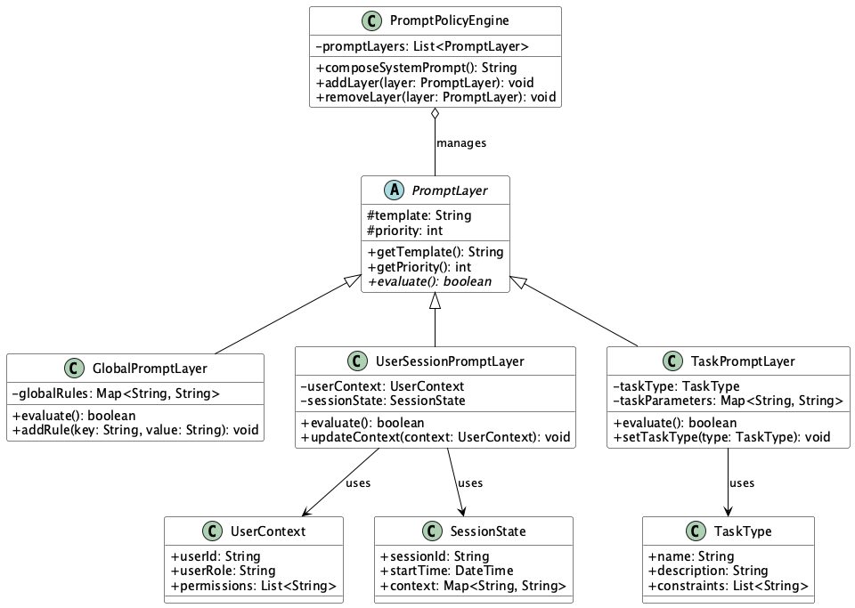

# System Prompt Control

## 概要

System Prompt Controlは、LLMに渡す「system」メッセージ（システム指示文）を動的に管理・切り替えることで、モデルの初期状態や応答のスタイル、制約条件を柔軟に制御する設計手法です。プロンプトを複数のレイヤ（グローバル、ユーザ属性、機能別など）に分けて管理し、ポリシーエンジンにより動的に合成します。

## 解決したい課題

LLMを有効活用するプロンプトテクニックの一つに、プロンプトメッセージのロールを適切に設定することがあります。systemメッセージは、LLMに対して「あなたは何をするべきか」を指示する重要な役割を果たします。これにより、モデルの振る舞いや応答スタイルが大きく変わります。

LLMを利用するソフトウェアにおいて、systemメッセージを固定的に定義していると、以下のような問題が発生します。

1. **プロンプト管理の分散化**
   - 各エンドポイントや関数ごとにsystemプロンプトが個別に記述され、変更時に漏れや不整合が起こります。
   - 例：チャット機能と要約機能で異なるsystemプロンプトを定義していた場合、一方の修正が他方に反映されない可能性があります。

2. **一貫性欠如**
   - 同一セッション内でもsystemメッセージが統一されず、モデルの振る舞いが不安定になります。
   - 例：ユーザーとの会話中に、異なるsystemプロンプトが適用され、応答のトーンが突然変化する問題が発生します。

3. **ポリシー適用の複雑化**
   - ユーザの権限や契約プランによって異なる応答が必要な場合、ロジックが複雑化しメンテナンスが困難になります。
   - 例：プレミアムユーザーと一般ユーザーで異なる応答制限を設ける場合、条件分岐が増加します。

4. **実験切り替えの非効率性**
   - A/Bテストなどでプロンプトを変更するたびにコードの再デプロイが必要になります。
   - 例：新しいプロンプトの効果を検証するために、毎回アプリケーションを再デプロイする必要があります。

## 解決策

System Prompt Controlでは、以下のような仕組みによってsystemメッセージを動的に合成・適用します。

1. **レイヤード構成**
   - systemプロンプトを次の3階層で分けて管理します。
     - グローバル指示（全体共通）
     - ユーザ・セッション指示（属性・コンテキストに応じて変化）
     - 機能・タスク別指示（翻訳や要約など目的別）

2. **プロンプトポリシーエンジン**
   - 上記レイヤのテンプレートを条件に応じて合成し、最終的なsystemメッセージを構築します。
   - 例：ユーザーの権限レベルと現在の機能に基づいて、適切な指示を組み合わせます。

3. **動的切り替え機構**
   - ユーザ権限や実験フラグなどに応じて、systemメッセージを動的に切り替えます。
   - 例：A/Bテストのフラグに基づいて、異なるプロンプトバージョンを適用します。

## 適応するシーン

このプラクティスは以下のような場面で有効です。

- エンタープライズチャットシステムにおいて、機密情報や社内ルールに基づいた制御が必要な場合
- 顧客サポートBOTで、サポートプランに応じて応答スタイルや制限を変更する場合
- マルチテナントのAPI基盤で、テナントごとのガイドラインを適用する場合
- 実験環境において、異なるsystemメッセージの効果を比較したい場合

## 利用するメリット

このプラクティスを導入することで、以下のメリットが得られます。

- 一元的なプロンプト管理が可能となり、変更やロールバックが容易になります。
- 柔軟なカスタマイズができ、ユーザごとに適したLLMの振る舞いを制御できます。
- A/Bテストや実験の迅速な実施が可能になり、開発スピードが向上します。
- 出力の可観測性が向上し、systemメッセージごとの応答品質を比較可能になります。

## 注意点とトレードオフ

このプラクティスには以下のような注意点があります。

- 抽象化のオーバーヘッド
  - レイヤの合成やルール適用によって処理コストやシステムの複雑度が増します。
- ルールの衝突リスク
  - 異なるレイヤ間で指示が矛盾した場合、想定外の応答を生成する可能性があります。
- 運用負荷の増加
  - systemメッセージのバージョン管理やテストプラクティスが多岐にわたり、保守工数が増えます。
- 創造性の抑制
  - 制約が強すぎると、LLMの自由な応答生成力が損なわれることがあります。

## 導入のヒント

System Prompt Controlを導入する際のポイントは以下の通りです。

1. レイヤ設計を明確に分離し、それぞれの責任範囲をドキュメント化します。
2. systemプロンプトのテンプレートをYAMLやJSONで定義し、宣言的に管理します。
3. 合成されたsystemメッセージのテストケースを主要シナリオごとに用意します。
4. systemメッセージIDやバージョンをログに記録し、出力との相関を分析可能にします。
5. 常時適用される基本的な制約（禁止語句や最大トークン長）を設計し、安全性を担保します。

## まとめ

System Prompt Controlは、LLMの出力品質と制御性を両立するための強力な設計手法です。プロンプト管理をレイヤ化・動的制御することで、システム全体の柔軟性と運用効率を大幅に向上させることができます。一方で、設計と運用には注意が必要であり、レイヤ間の整合性や抽象化コストに留意しながら導入することが重要です。
