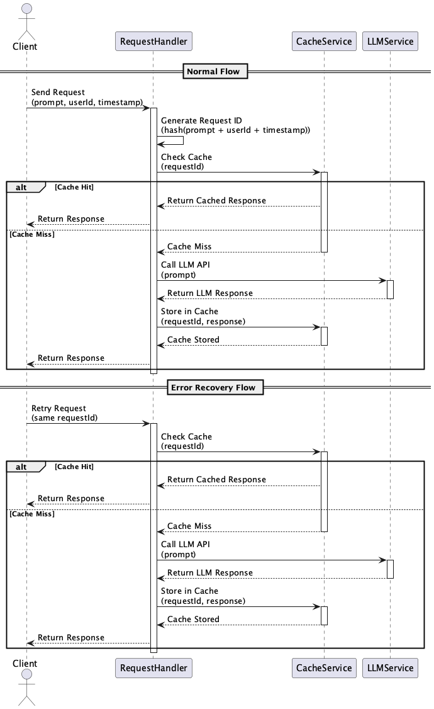

# Idempotent Inference Request

## 概要

Idempotent Inference Requestは、LLMへの同一プロンプトリクエストが複数回送信された場合でも、システムの状態や応答に副作用が生じないように設計する手法です。ネットワークの再試行やUI上の誤操作による重複リクエストに対して、安全かつ一貫した応答を提供することを目的としています。

## 解決したい課題

インタラクティブなアプリケーションを提供する場合に発生する課題の一つに、同じリクエストを複数回送ることがあります。もちろん同じリクエストなので、すべてを処理してレスポンスする必要はありませんし、避けたほうが良いでしょう。LLM APIへのリクエストも同様に、LLM APIを利用するアプリケーションのUI/UXやロジックによって、同じリクエストを複数回送信してしまうケースがあるでしょう。たとえばチャットUIでレスポンスが遅いときに、ユーザが再送信ボタンを押してしまったりすることがあります。これらのケースでは、同じプロンプトが複数回送信されることになります。これにより、以下のような問題が発生します。

1. **不確実な再試行コスト**
   - ネットワーク障害時やUIの再送信により、同一リクエストで再度トークンが消費され、不要なコストが発生します。
   - 例：モバイルアプリでの接続切断時に自動再送信が発生し、同じプロンプトに対して複数回課金されるケース

2. **一貫性の欠如**
   - 同じプロンプトでも、LLMが非決定的な出力をする場合、毎回異なる結果が返ることがあり、上流システムの整合性が損なわれます。
   - 例：バッチ処理で同じドキュメントに対して異なる結果が生成され、後続の処理で不整合が発生するケース

3. **重複処理による副作用**
   - ログの重複記録や外部APIの多重呼び出しにより、データの不整合や処理の冗長化が生じます。
   - 例：チャットボットの会話履歴が重複して記録され、データベースの整合性が崩れるケース

4. **運用上のトラブル**
   - システム障害後のジョブ再実行時に、同一データが複数回処理されることで、不要なリソース消費や不整合が発生します。
   - 例：バッチ処理の再実行時に同じドキュメントが複数回処理され、処理時間が延長されるケース

## 解決策

Idempotent Inference Requestでは、リクエストの冪等性を保証するために、以下のような設計を行います。

1. **リクエスト識別子の生成**
   - プロンプト文字列やユーザーID、タイムスタンプなどを組み合わせて一意のキーを生成します。
   - 例：`hash(prompt + userId + timestamp)`のような形式で一意キーを生成

2. **キャッシュ／重複排除層の導入**
   - 一意キーに基づいて、最初の応答結果をキャッシュし、同一リクエストに対しては再利用します。
   - 例：Redisを使用して応答を一時保存し、同一キーでの再リクエスト時にはキャッシュから応答を返す

3. **副作用の排除**
   - ログ記録や外部APIの呼び出しは、キャッシュミス時にのみ実行されるように設計します。
   - 例：キャッシュヒット時はログ記録をスキップし、新規リクエスト時のみ記録する

4. **再試行の安全化**
   - 障害復旧後のリトライでも、同じリクエストにはキャッシュされた応答を返すことで、コストと整合性の両立を図ります。
   - 例：ネットワークエラー発生時に、キャッシュされた応答を返すことで、再試行時の一貫性を保証

## 適応するシーン

このプラクティスは、以下のような場面で有効に機能します。

- 通信切断後に再接続するセルフサービス型チャットボット
- バッチ処理におけるドキュメント単位のRAGパイプライン
- 再送信される可能性のあるイベント駆動マイクロサービス
- モバイルアプリでの接続リトライ時の再送信対策

## 利用するメリット

Idempotent Inference Requestを導入することで、以下のような利点が得られます。

- ネットワークやUIの操作ミスによる重複呼び出しの影響を抑制できます。
- トークンの無駄な消費やリクエストコストを削減できます。
- LLM出力の一貫性を保ち、上流処理の安定性を向上させます。
- 副作用の発生を抑制し、データの整合性を保てます。

## 注意点とトレードオフ

このプラクティスを採用する際には、以下の点に留意する必要があります。

- **キャッシュ管理コスト**
  - 応答キャッシュの保存や期限管理により、ストレージ負荷が増加します。
  - 例：大量のリクエストを処理する場合、キャッシュストレージの容量設計が重要

- **非決定性モデルとの相性**
  - モデルの温度やランダムシード設定により、キャッシュが効かない場合があります。
  - 例：temperature=1.0の設定では、同じプロンプトでも異なる結果が生成される

- **TTL（有効期限）の調整**
  - キャッシュ結果の有効期限を長く設定すると古い応答が返され、短くするとリトライが許容されなくなるため、バランスが求められます。
  - 例：1時間のTTL設定では、その期間中の同一リクエストはキャッシュから応答

- **システム設計の複雑化**
  - キー生成ロジックやキャッシュ制御を含むアーキテクチャが必要となり、設計・実装が複雑になります。
  - 例：キャッシュ層の導入により、システムアーキテクチャが複雑化

## 導入のヒント

このプラクティスをスムーズに導入するためのポイントは以下の通りです。

1. プロンプト文字列のハッシュ値＋ユーザーIDやタイムスタンプで一意キーを生成します。
2. RedisやMemcachedなどの高速キャッシュを用いてTTLや容量制限を設定します。
3. モデルの温度やシード値を固定し、出力の一貫性を高めます。
4. キャッシュミス時のみ新規呼び出しを行い、障害時には控えめなフォールバック応答を返します。
5. キャッシュヒット率や重複リクエスト数をモニタリングし、運用上の異常を即時検知します。

## まとめ

Idempotent Inference Requestは、LLMの再試行や重複処理に対して一貫性と安全性を保証する設計プラクティスです。キャッシュや副作用制御を取り入れることで、コスト効率とユーザ体験の向上を実現できます。ただし、キャッシュ管理やシステム設計の複雑化を伴うため、導入時には要件や制約に応じた調整が必要です。
