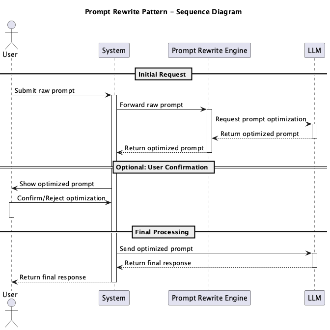

# Prompt Rewrite

## 概要
Prompt Rewriteは、ユーザが入力したプロンプトをそのままLLMにリクエストするのではなく、事前にLLMによって意図を解釈し、適切かつ効果的なプロンプトに修正したうえでリクエストを行う設計手法です。このパターンにより、ユーザの入力が曖昧、不完全、または誤った形式であっても、LLMの出力品質を維持・向上させることができます。

## 解決したい課題

プロンプトを適切かつ効果的に設計してリクエストすることは、LLMを活用する上での重要な要素です。しかし、すべてのユーザがプロンプトエンジニアリングに精通しているとは限りませんし、プロンプトエンジニアリングに詳しくても常に効果的なプロンプトを設計できるとも限りません。そのため、LLMを用いることでプロンプトを適切に修正し、ユーザの意図を正確に反映させることが求められます。

1. **曖昧または非論理的なプロンプトによる誤回答**
   - 例：「資料をまとめてください」という曖昧な指示に対し、要約の粒度が合わない、意図と異なる内容が出力される。

2. **誤字脱字や文法ミスによる誤解**
   - 例：「翻訳して→ほんやくして」と入力され、誤った意味で処理される。

3. **プロンプトの構文が不適切なため、モデルが期待通り動作しない**
   - 例：JSON形式での出力が必要なのに、その指定がないため、通常のテキストとして出力される。

## 解決策
Prompt Rewriteでは、ユーザの入力をそのままLLMに送信するのではなく、まずLLMを用いて以下のような変換を行います。

1. **意図の明確化と具体化**
   - 例：「資料をまとめてください」→「この資料の主要なポイントを3つに絞って箇条書きで要約してください」

2. **構文の最適化**
   - 例：「ほんやくして」→「以下の文章を英語から日本語に翻訳してください：」

3. **テンプレートへの準拠**：Structured outputやInverted structured outputで説明しているとおり、LLMの出力をプログラムで扱うためにはJSON形式等の構造化データで出力するほうが望ましいです。Prompt Rewriteでは、ユーザの入力をLLMに適した形式に変換することで、出力の一貫性と信頼性を向上させます。
   - 例：JSON形式の構造化データでレスポンスするため、期待されるレスポンスのキーと値のペアを明示的に指定します。

## 適応するシーン
このパターンは以下のような場面で特に有効です。

- チャットボットやAIアシスタントなど、ユーザが自由な自然言語で入力するプロダクト
- ノーコードツールなど、LLMを非技術者が利用するシステム
- 入力の多様性が大きいユースケース（カスタマーサポート、FAQ、自動応答など）
- フォーマットの厳格性が求められる業務用途（契約書要約、プログラム生成、分類タスクなど）

## 利用するメリット
このパターンを採用することで、以下のメリットが得られます。

- ユーザがプロンプト設計の専門知識を持っていなくても、質の高い応答を得られます
- LLMの出力の一貫性と信頼性が向上し、ユーザ体験が改善されます
- タスク失敗率の低下や、リトライ回数の削減につながります
- 他のプロンプト最適化パターン（例：Prompt Evaluation and Reuse）との連携が容易になります

## 注意点とトレードオフ
このパターンを採用する際は、以下の点に注意が必要です。

- Rewrite自体が誤ってユーザの意図を変質させるリスクがあります
- 書き換えプロンプトに対するフィードバックループがないと、ブラックボックス的な挙動になります
- プロンプト修正のための追加のLLMリクエストにより、コストやレイテンシが増加します
- ユーザに元の入力と修正結果を明示しないと、混乱や不信感を招くことがあります

## 導入のヒント
このパターンを効果的に導入するためのポイントは以下の通りです。

1. ユーザプロンプトの入力直後に、内部で「リライト専用のプロンプトエンジン」を用意し、修正を試みます
2. 修正結果をロギング・トレーシングし、成功・失敗パターンを記録します
3. 書き換え結果をユーザに表示・選択させることで、明示的なフィードバックを取り入れることも有効です
4. 特定のタスクやドメインに特化したテンプレートを事前に学習・導入することで精度を上げることができます

## まとめ
Prompt Rewriteは、ユーザの曖昧または不完全な入力を、LLMにとって最適な形に書き換えることにより、出力品質を大幅に向上させる設計手法です。特に非専門家向けのプロダクトにおいて、LLMの操作性を劇的に向上させることが可能です。ただし、意図の変質や追加コストといったトレードオフを理解し、適切な設計と監視を行うことが重要です。
