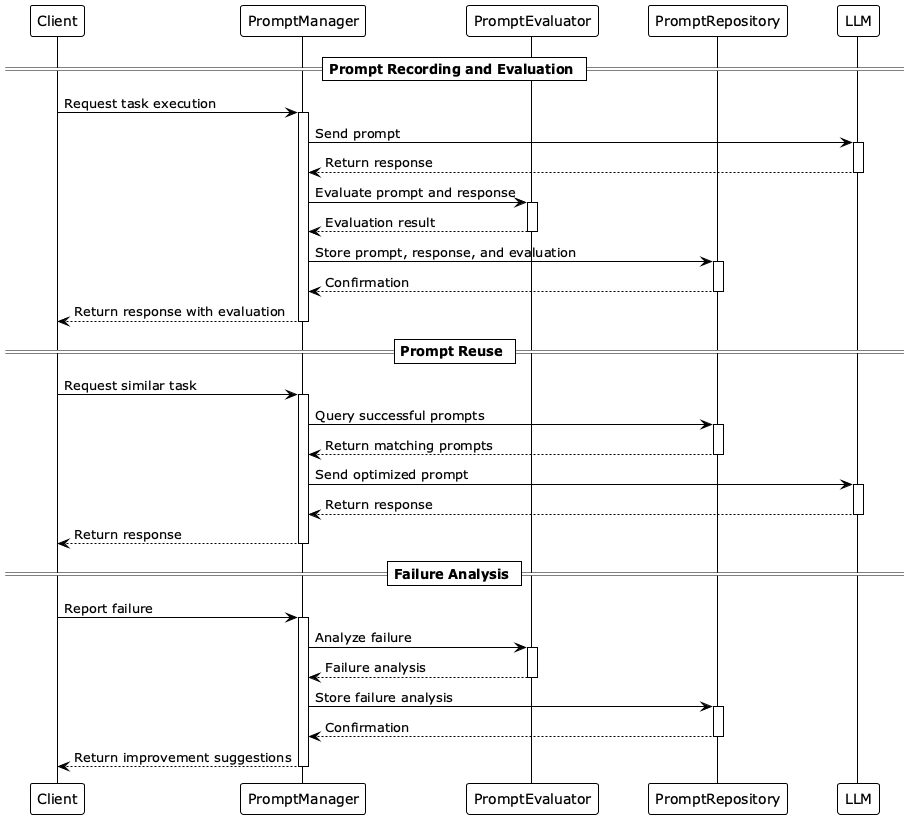

# Analysis to reuse

## 概要
Analysis to reuseは、LLMによって使用されたプロンプトとその結果を記録・評価し、有効なプロンプトを再利用可能な知見として蓄積する設計手法です。また、逆に効果的でないプロンプトも記録し、アンチパターンとして活用します。このパターンにより、特定のユースケースやドメインにおいて成果を上げるプロンプトを継続的に活用・改善することが可能になります。また、プロンプトの品質を定量的・定性的に評価し、システム全体の性能向上に貢献します。

## 解決したい課題

DevOpsでは、ソフトウェアの開発と運用を統合し、継続的な改善を目指す手法が広く採用されています。LLMの活用においても、プロンプトエンジニアリングは重要な要素ですが、プロンプトの設計や評価は依然として手間とコストがかかる作業です。Analysis to reuseではDevOpsやMLOpsの手法を取り入れ、LLMにリクエストされたプロンプトとレスポンス、そしてその評価を記録・分析することで、プロンプトの品質を継続的に改善し、再利用可能な知見として蓄積します。これにより、プロンプトエンジニアリングの効率化と品質向上を図ります。多くの場合、知見はその学びが発生したときにしか発見されません。知見を得るためには知見のもとになるソースをデータとして記録し、以降に活用できるようにすることが重要です。

1. **有効なプロンプトの試行錯誤が手間とコストを伴う**
   - プロンプトの最適化（人手にせよ自動化するにせよ）に多くの時間を費やし、開発の遅延やユーザ体験の悪化、コストの増加を招くことがあります。
   - 例：AIエージェントがタスクを完了するために複数のプロンプトを自動生成して試行するが、失敗も多く非効率になります。

2. **一度成功したプロンプトが再利用されず、ナレッジが失われる**
   - 特定の状況やドメインで成功したプロンプトが記録されず、次回以降に再利用されずにまた同じ試行錯誤を繰り返してしまいます。
   - 例：個人が発見した知見が共有されず、チームの生産性が低下します。

3. **失敗プロンプトの原因が分析されず、品質改善に活かされない**
   - 出力が不適切だったにもかかわらず、その原因や文脈が記録されず、改善につながりません。

## 解決策
Analysis to reuseでは、以下のステップに基づいてプロンプトの管理と活用を行います。

1. **プロンプトの記録と評価**
   - すべてのプロンプトとその出力、成功/失敗判定、加えて状況等のメタデータを記録します。
   - 精度、タスク完了率、ユーザ満足度などの評価メトリクスを設定し、定量的に評価します。

2. **成功プロンプトの再利用**
   - 成功したプロンプトをテンプレート化し、再利用可能な形式で保存します。
   - ドメインやユースケースごとに分類し、検索可能なカタログを作成します。
   - 成功要因となるプロンプトの書き方を分析し、他のプロンプトに応用します。

3. **失敗分析と改善**
   - 失敗したプロンプトの原因を分析し、改善ポイントを記録します。
   - 失敗パターンを特定し、将来的なリライトやフィルタリングに活用します。

## 適応するシーン
このパターンは以下のような場面で特に有効です。

- LLMが自己回帰的に複数のプロンプトを用いて推論するシステム（AIエージェント、Chain of Thoughtなど）
- ドメイン特化型のユースケースで、成果の出るプロンプトパターンが徐々に明確になるタスク
- 検索、分類、要約、QAなどの繰り返し利用されるタスク
- Prompt Engineeringの効果検証やA/Bテストを行う研究・運用環境

## 利用するメリット
このパターンを採用することで、以下のメリットが得られます。

- 開発・運用コストの削減：一度成果を上げたプロンプトの再利用が可能になります。
- 応答品質の向上：LLMの応答品質や成功率を継続的に改善できます。
- 自己最適化：Prompt Rewriteなどの他パターンと連携し、自己最適化ループを構築できます。
- ナレッジ共有：評価データの蓄積により、プロンプト評価の自動化や知見共有が促進されます。

## 注意点とトレードオフ
このパターンを採用する際は、以下の点に注意が必要です。

- 評価指標の設計が不十分だと、誤ったプロンプトが成功と判定され、逆効果になる可能性があります。
- 収集・記録するデータの量が増えるため、ストレージやプライバシーへの配慮が必要です。
- 再利用プロンプトが過剰に固定化され、創造性や柔軟性が損なわれるリスクがあります。
- ドメインやユースケースごとの分類・整理のためのメタデータ設計が求められます。

## 導入のヒント
このパターンを効果的に導入するためのポイントは以下の通りです。

1. 成功／失敗判定のルールをタスクごとに定義し、明示的に記録します。
2. 評価結果をDBやバージョン管理システムで蓄積し、プロンプトの検索性・可視性を確保します。
3. プロンプトのテンプレート化と、動的なフィードバックループを導入します。
4. チームでのナレッジ共有を想定したプロンプトカタログを作成します。

## まとめ
Analysis to reuseは、LLM活用におけるプロンプトの品質を継続的に評価・改善・再利用するための強力な設計手法です。ナレッジの蓄積と活用を通じて、LLMの応答精度・一貫性を高めることができ、Prompt RewriteやAIエージェントとの連携によって、自己最適化型のシステム構築が可能になります。ただし、評価指標の適切な設計と、データ管理のバランスを考慮することが重要です。