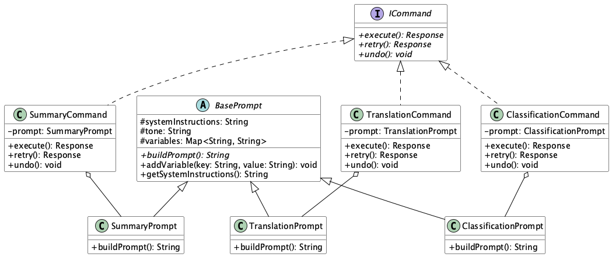

# Prompt Inheritance Command

## 概要

Prompt Inheritance Commandは、LLMを活用したシステムにおいて、プロンプトの構築と実行制御を分離する設計手法です。共通のベースプロンプトを継承・拡張しつつ、プロンプト操作（要約、翻訳、分類など）をコマンドオブジェクトとして実装することで、一貫性のある指示体系と柔軟な実行制御を実現します。

## 解決したい課題

プロンプトの管理は複雑です。LLMを用いたアプリケーションでは、プロンプトの設計と実行制御が密接に結びついています。プロンプトはそのままだと自然言語として文字列型（String型）で扱われますが、実際には多くの要素（トーン、指示、変数など）が含まれています。あるアプリケーションで使われる多くのプロンプトは、自然と書き方や形式が共通になるでしょう。こうした共通項をそれぞれ異なった文字列として管理することは効率的と言えません。

1. **重複したプロンプト定義**
   - 各ユースケースで同じシステム指示文や前処理コードをコピペしてしまい、変更時に修正漏れが発生します。

2. **実行ロジックの分散**
   - プロンプト送信、リトライ、ログ記録などの処理が各所に分散しており、変更のたびに複数箇所を更新する必要があります。

3. **テストの困難さ**
   - プロンプト生成と実行制御が結合しているため、ユニットテストが困難になります。

4. **設定変更時の修正負荷**
   - 共通の指示やポリシーを修正する際、すべてのテンプレートを個別に修正しなければならないという保守コストが発生します。

## 解決策

Prompt Inheritance Commandでは、プロンプト生成の構造を継承ベースで整理し、実行処理をコマンドとして独立させます。

オブジェクト指向プログラミングで抽象クラスを作って構造化するように、プロンプトも同じように構造化することが求められます。

加えて、オブジェクト指向プログラミングではインタフェースによって実行可能な関数を定義することで、実行時に異なるクラスを切り替えたり、依存性の注入（DI）を行ったりします。プロンプトの管理にも同様に、そのプロンプトが用いられるコマンドをインタフェースとして定義することで、処理の共通化を図ります。

1. **ベースプロンプトの定義**
   - トーンや指示、変数挿入などの共通処理をBasePromptクラスに集約します。

2. **用途別の継承クラス**
   - 要約、翻訳、分類、質問応答などのユースケースはBasePromptを継承したサブクラスとして実装します。

3. **コマンドオブジェクトの導入**
   - 各種プロンプト実行処理を`ICommand`インターフェースに基づいて実装し、送信・リトライ・ログ出力などの制御を統一します。

## 適応するシーン

このプラクティスは以下のような場面で有効です。

- コンプライアンスや用語集などの共通指示を多機能なチャットボットで統一管理したい場合
- 要約・翻訳・質問応答など複数の文章生成モードを同じフレームワークで管理したい場合
- RAGや生成ステップが複数にわたるワークフローの中で、各操作をコマンドチェーンとして管理したい場合
- 外部向けSDKやプラグイン開発で、新たなプロンプトロジックを追加しやすくしたい場合

## 利用するメリット

このプラクティスの活用により、以下の利点があります。

- 再利用性の向上：BasePromptの変更が即座にすべての継承クラスに反映されます。
- 責務分離による保守性向上：プロンプト構築と実行制御の分離により、それぞれ独立して管理・拡張が可能です。
- テスト容易性の向上：各プロンプトクラスとコマンド処理を個別にモック化でき、単体テストの実装がしやすくなります。
- 新機能の追加が簡単：新しいプロンプトタイプを追加する際、BasePromptの継承とICommandの実装だけで済みます。

## 注意点とトレードオフ

導入に際しては以下の点に注意が必要です。

- 継承階層の肥大化：プロンプトの種類が増えると、クラス数が多くなり設計が複雑化します。
- オーバーヘッド：抽象化レイヤーの追加により、若干の実行性能低下が発生する可能性があります。
- 理解の前提：継承とコマンドを理解していない開発者には運用が難しくなることがあります。
- 共通設定の影響範囲：BasePromptの変更が広範囲に影響するため、変更前に十分なテストが求められます。

## 導入のヒント

導入をスムーズに進めるためには、以下の点に留意してください。

1. BasePromptは最小限から始め、必須項目（トーンや共通指示）だけを含め、後から拡張可能に設計します。
2. ICommandインターフェースの標準化（`execute()`、`retry()`、`undo()`など）を行い、実装者の混乱を防ぎます。
3. DIコンテナを使って、PromptとCommandを柔軟に切り替えられる設計にします。
4. 継承構造とコマンド処理をCIパイプラインでカバーし、変更時のリスクを抑えます。
5. 継承構造図やコマンドのフローをドキュメント化し、開発チームで共有します。

## まとめ

Prompt Inheritance Commandは、LLMを利用したアプリケーション開発において、プロンプトの構築と実行制御を分離し、保守性・拡張性・再利用性を向上させるための有効な設計手法です。複雑な指示体系や多様なユースケースを一元的に管理しやすくなる一方で、継承や抽象化の設計には注意が必要です。プラクティスを正しく理解し、シンプルな構成から段階的に導入することが成功の鍵となります。
