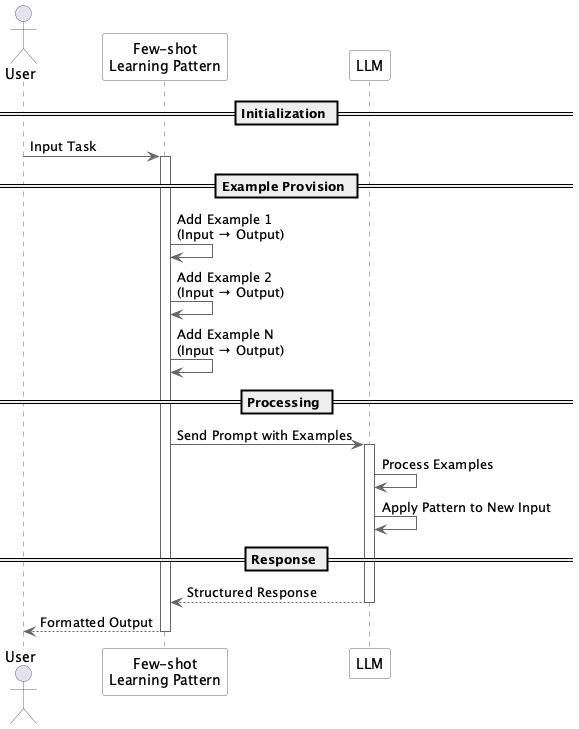

# Few-shot Learning

## 概要

Few-shot Learningは、LLMに対して少数の具体例をプロンプト内に含めることで、タスクの出力精度や一貫性を向上させる設計プラクティスです。明示的な命令に加えて「こうすればよい」という例を提示することで、モデルの理解と適応を補助します。学習を伴わないため、PoCや高速開発にも適しています。

## 解決したい課題

人間がただ指示されるよりも具体例とともに指示されるほうが理解しやすいのと同様に、LLMも具体的な事例を与えることで意図した出力を得やすくなります。特に、以下のような課題に対して効果的です。

1. **プロンプト設計の難しさ**
   - 指示だけでは「出力をJSON形式で返すこと」や「敬語で要約すること」などが守られないケースがあります。

2. **再現性の低さ**
   - 同じ命令文であっても毎回異なる出力形式やレベルで応答されるため、システムとして安定しません。

3. **ファインチューニング不要の適応**
   - カスタムモデルの学習はコストが高いため、例示でドメイン特化の応答を誘導したい。

4. **ドメイン固有の適応**
   - 金融業務で使われる専門用語や定型文をLLMが理解しない場合に、事例提示で補います。

## 解決策

Few-shot Learningでは、プロンプトの冒頭に「入力例 → 出力例」を数個提示した後に、本番の入力文を与える構成にします。このとき、事例は以下の観点で設計します。

1. **フォーマットの統一**
   - すべての例示で、入力・出力の形式を揃えます。

2. **順序と構造**
   - 典型例からエッジケースまでを順序よく提示します。

3. **本番入力との類似性**
   - 例示は本番タスクに近いものを使い、モデルの理解を促します。

## 適応するシーン

Few-shot Learningは以下のような場面で特に有効です。

- チャットボットやFAQの応答精度向上が必要な場合
- RAGによる検索結果のフォーマット整形が必要な場合
- 自然文からの構造化データ抽出（CSV/JSON形式）が必要な場合
- 文体変換、敬語変換、要約指示などの自然言語スタイル操作が必要な場合

## 利用するメリット

このプラクティスの導入により、以下の利点が得られます。

- モデルに期待する出力を具体例で伝えることで、品質が安定します。
- ファインチューニングを必要とせず、新しい業務に迅速に対応できます。
- 数例の提示で複雑なタスクも処理可能になり、開発・運用コストを削減できます。
- 仕様変更時にも、例示の入れ替えだけで調整可能です。

## 注意点とトレードオフ

Few-shot Learningにはいくつかの制約があります。

- **コンテキスト長の制限**
  - 例示が多すぎると、LLMのトークン制限を超えやすくなり、本番入力が削られる危険があります。

- **例示の選定バイアス**
  - 不適切な事例を含めると、モデルが誤学習し、ミスを誘発する可能性があります。

- **リクエストコストの上昇**
  - 例示部分にもトークン課金が発生するため、1回あたりのリクエストコストが増加します。

- **例示のメンテナンスが必要**
  - タスクの仕様やフォーマットが変更された際には、例示も見直す必要があります。

## 導入のヒント

導入を円滑に進めるためには、以下の点を意識すると効果的です。

1. 代表性のある例示を厳選します。典型的な入力だけでなく、誤解されやすい例や例外的な入力も含めます。
2. まずは1-shot/2-shotから開始します。過剰に多くの例を使うよりも、少数の精緻な例のほうが効果的です。
3. 例示の構造を明確に統一します。例ごとに書き方が異なると、モデルが混乱します。
4. 自動テストを導入します。本番環境での挙動を検証するCIプロセスにFew-shotプロンプトを含めます。

## まとめ

Few-shot Learningは、LLMに対して少数の事例を提示することで、出力精度と安定性を高める非常に強力な手法です。特に、ファインチューニング不要で素早く業務適応したい場面で効果を発揮します。トークン制限やメンテナンスの課題を考慮しながら、代表的な事例を丁寧に設計することが成功の鍵となります。
