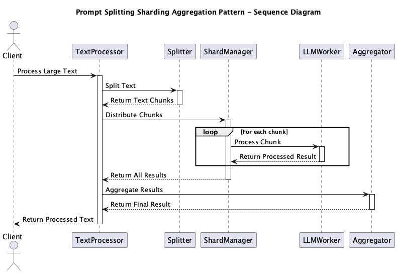

# Prompt Splitting Sharding Aggregation

## 概要

Prompt Splitting Sharding Aggregationは、大規模なテキストや長文データを効率的に処理するための設計手法です。入力を分割（Splitting）し、分散処理（Sharding）しながら並列に処理し、最後に統合（Aggregation）することで、LLMのトークン制限や処理速度の制約を克服しつつ、全体としての品質と効率を両立することができます。

## 解決したい課題

LLM APIにはトークン数の制限があり、長文や大量のテキストを一度に処理することができないケースが多々あります。他方で、ある処理を完了するためには大量のドキュメントを扱う必要がある場合もあります。例えば、企業内のナレッジベースや学術論文、ユーザーマニュアルなどは、数万トークンに及ぶことがあるでしょう。これらの長文をそのままLLMに投げると、以下のような問題が発生します。

1. **コンテキスト長の制限**
   - 技術文書やレポートが10,000トークン以上あり、モデルの最大長に収まらないため、全体を一度に処理できません。

2. **処理スループットの不足**
   - 一件ごとのリクエストが重く、複数ユーザの同時処理や大量ドキュメント処理でレイテンシが増加します。

3. **精度の低下**
   - 非常に長い文章をまとめて入力した場合、モデルが要点をつかみきれず、曖昧な応答になってしまいます。

4. **処理コストの最適化**
   - 大規模な入力をそのまま投げるよりも、重要部分に絞って処理することでコストを削減したいという要望があります。

## 解決策

Prompt Splitting Sharding Aggregationでは、Splitting、Sharding、Aggregationの3つのステップを組み合わせて、長文や大量のテキストを効率的に処理します。これにより、LLMのトークン制限や処理速度の制約を克服しつつ、全体としての品質と効率を両立することができます。

1. **Splitting（分割）**
   - 入力テキストをセクション、段落、意味単位など自然な境界で分割します。

2. **Sharding（分散処理）**
   - 分割されたチャンクを複数のLLMワーカー（あるいは異なるモデル）に並列送信し、それぞれ個別に処理します。

3. **Aggregation（集約）**
   - 各チャンクの応答を集めて統合し、重複排除や順序調整を行い、ユーザに対して整った最終出力を提供します。

## 適応するシーン

このプラクティスは以下のようなシーンで有効です。

- 企業内ナレッジベースや学術論文のような大規模ドキュメントの要約やQA
- ユーザマニュアルやFAQを対象にした長文からの情報抽出
- レビューやSNSポストなど大量短文を一括分類・分析するパイプライン
- Kubernetesやサーバーレス環境でLLM処理をスケールさせるマルチワーカ構成

## 利用するメリット

このプラクティスを活用することで、以下のような利点があります。

- シャーディングによる**水平スケーリング**で高スループット処理が可能になります。
- 分割処理によって**応答の品質が向上**し、重要な情報にフォーカスした応答が得られます。
- 並列化により**全体処理のレイテンシが短縮**され、リアルタイム性が向上します。
- アグリゲーションの柔軟性により、用途に応じて最適な統合手法（再要約、重み付き投票など）を選択できます。

## 注意点とトレードオフ

導入にあたっては以下のような注意点があります。

- **集約ロジックの設計が複雑**になることがあります。一貫性や文脈のつながり、重複排除などの制御が必要です。
- **状態管理のコスト**が発生します。チャンクごとの文脈や位置情報などをメタデータとして持つ必要があります。
- **APIリクエスト数が増加**するため、通信オーバーヘッドとコストが膨らむ可能性があります。
- **エラー耐性設計**が求められます。並列処理中の失敗やタイムアウトに対する再試行や代替処理の方針を設けておく必要があります。

## 導入のヒント

スムーズな導入には以下のポイントが有効です。

1. **意味単位での分割**を行うために、セクション検出や文章境界抽出アルゴリズムを導入します。
2. **シャード数をチューニング**し、環境リソースやコストとバランスを取りながら並列処理数を決定します。
3. **二段階要約や再要約**を活用して精度の高い最終出力を生成します。
4. 各チャンクに対して**IDや位置情報などのメタデータ**を付与し、集約時の文脈理解に役立てます。
5. **フォールバック処理**（失敗時の再要約や簡易結合）を用意しておくことで、信頼性を向上させます。

## まとめ

Prompt Splitting Sharding Aggregationは、長文や大量のテキスト処理において、LLMの制約を克服しつつ処理効率と品質を両立させるための重要な設計プラクティスです。特にエンタープライズ向けのナレッジ処理や大規模文書検索において、その価値を最大限に発揮します。導入に際しては、分割・集約の戦略と並列実行基盤の設計を丁寧に進めることが成功の鍵となります。
