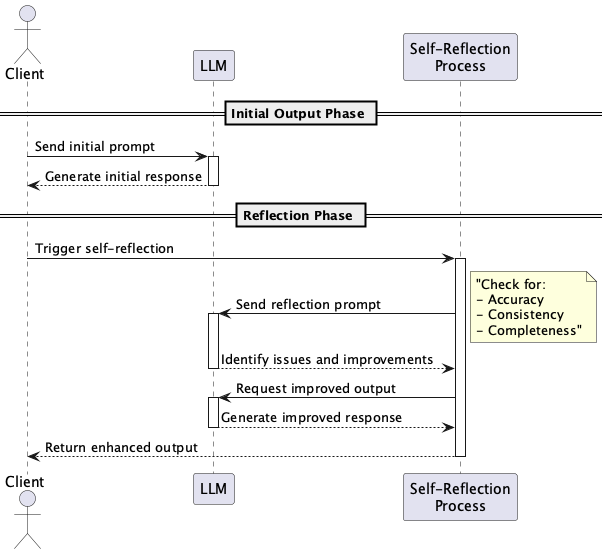

# Self-Reflection Prompt

## 概要

Self-Reflection Promptは、LLMに自身の出力を評価・検証させることで、出力の品質と信頼性を向上させる設計手法です。初回出力後に自己評価プロンプトを用いることで、誤りや抜けを修正・補完し、より高品質な再出力を得ることを目的とします。複数段階にわたる自己検証やメタ認知的な思考を促すことで、出力の正確性と一貫性を高めることが可能になります。

## 解決したい課題

LLMにはHallucinations（幻覚）や誤情報の生成といった問題があります。Hallucinationsの回避方法は多々研究され、LLMプロバイダーも様々な対策を講じていますが、依然として完全な解決には至っていません。現代のLLMではHallucinationsを完璧に回避することは不可能ですが、LLM APIを利用する側で何の対策も講じないのはリスクが高いです。

Hallucinationsを放置すると、LLMによる出力には以下のような問題が発生することがあります。

1. **出力精度のばらつき**
   - 医療レポートや契約書の初回出力に事実誤認や矛盾が含まれる場合があります。

2. **信頼性不足**
   - 生成されたFAQがユーザに誤った情報を伝えることで誤解を招き、クレームにつながるリスクがあります。

3. **手動レビューの工数**
   - ドキュメントの出力後に人間が一つ一つ確認して修正を加える作業に時間とコストがかかります。

## 解決策

Self-Reflection Promptでは、出力後にLLM自身に自己評価を行わせる「自己反省プロンプト（Self-Reflection Prompt）」を用います。具体的には、以下のようなステップを設計に組み込みます。

1. **初回出力**
   - 通常通りのプロンプトを与えて出力を得ます。

2. **リフレクション用プロンプトの適用**
   - 「この回答には誤りや抜けがありますか？改善点を挙げて修正後の回答を出力してください。」

3. **ステップ分離（Chain of Reflection）**
   - 誤り検出、改善提案、改善後出力の各ステップを明確に区別することで、LLMの思考過程を構造化します。

4. **評価軸の明文化**
   - 「正確性」「一貫性」「網羅性」などの観点を明示的にプロンプトで示します。

## 適応するシーン

以下のような高信頼性や高精度が求められる場面で特に有効です。

- 金融や医療など誤りが致命的になるドメインのテキスト生成
- 契約書や規約文などの初期ドラフトとレビュー工程の自動化
- LLMによるコード生成と自動的なコードレビューや静的解析
- 研究論文や学術要約などの内容検証プロセス

## 利用するメリット

Self-Reflection Promptを導入することで、以下の利点があります。

- 出力の精度と信頼性が向上します。
- 手動レビューのコストや時間を削減できます。
- 回答の品質が一貫しやすくなります。
- 反復的な自己検証により、プロンプトの学習的効果を促進できます。

## 注意点とトレードオフ

本プラクティスを導入する際には以下の点に注意が必要です。

- APIコールが複数回になるため、コストが増加します。
- 出力完了までのレイテンシが長くなる傾向があります。
- LLMの自己評価が過信やバイアスを含むことがあるため、完全に鵜呑みにはできません。
- リフレクション用のプロンプト設計に一定の試行錯誤とチューニングが求められます。

## 導入のヒント

効果的にこのプラクティスを導入するためには、以下の点を参考にしてください。

1. 小規模なPoCから開始し、精度向上効果を定量的に測定します。
2. リフレクション時の評価観点をテンプレート化して明文化します。
3. ドキュメント全体ではなく、一部の重要セクションのみ部分適用することで負荷を抑えます。
4. 出力前後の品質や誤り率、ユーザ評価などの指標を収集して継続的改善に役立てます。
5. 最初は1回の反省ステップから開始し、必要に応じて2段階以上のリフレクションへと拡張します。

## まとめ

Self-Reflection Promptは、LLMに自己評価と修正を行わせることで、出力の品質と信頼性を高めるための効果的な設計手法です。医療や金融、法務など高精度が求められる分野において特に有効であり、人的なレビュー工程を削減しつつ、継続的に出力精度を向上させることが可能です。トレードオフを理解したうえで、段階的に導入することをおすすめします。
