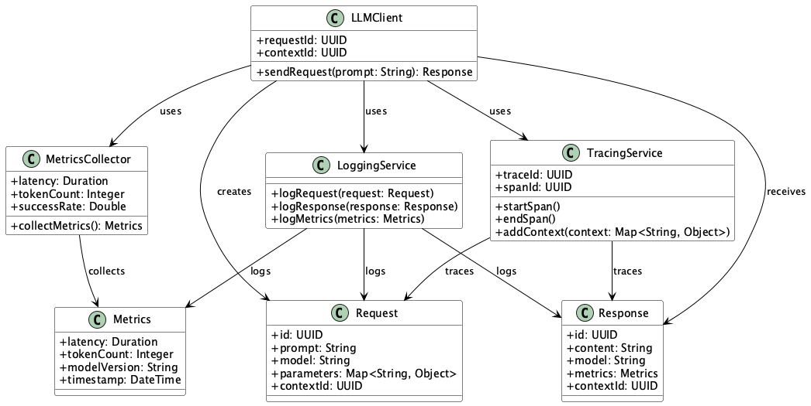
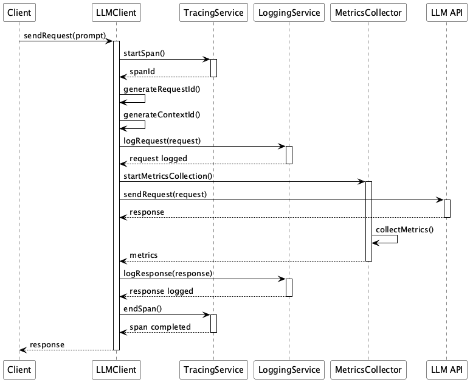

# Logging & Tracing

## 概要

Logging & Tracingは、LLMとの通信におけるプロンプト、レスポンス、推論メトリクス、コンテキストIDなどの情報を構造化して記録・可視化するための設計手法です。このプラクティスにより、LLM APIを用いたシステムの動作を一貫して追跡可能にし、トラブルシューティングや品質評価、パフォーマンス監視を効率的に行うことができます。

## 解決したい課題

LLMを活用したシステムは不安定になることが多いです。LLM自体がここ数年の新しい技術であると同時に、大量の自然言語を扱い、かつ確率的な挙動を示すため、従来のシステムとは異なるエンジニアリングが必要になります。加えて、LLMを用いたシステムは複雑になりがちです。LLM APIを呼び出す部分はWebクライアントとして作ることができても、リクエストに含めるプロンプトやレスポンス、その評価やHallucinations対策、フィードバック等、多くの要素が絡み合います。これらの要素を適切に管理しないと、システム全体の信頼性や可用性が損なわれる可能性があります。

具体的には以下のような問題が頻繁に発するでしょう。

1. **ボトルネックの特定が困難**
   - ユーザーからのレスポンス遅延が発生しても、プロンプト生成・LLM呼び出し・出力整形のどこで時間がかかっているかが不明確です。

2. **品質劣化の検知が遅延する**
   - 応答の妥当性や再現性が落ちていても、ユーザーの報告に頼るため問題の発見が遅れます。

3. **推論の観測データが不足している**
   - 実行時のレイテンシやトークン数、使用モデルのバージョンといったメタ情報が記録されていないと、性能やコストの最適化が困難になります。

4. **セッションの文脈追跡が困難**
   - 複数ステップにまたがる対話の中で、ある応答がどのプロンプトとどのコンテキストに基づくかを特定できません。

## 解決策

Logging & Tracingでは、以下のような統合的なログ・メトリクス・トレーシング戦略を実装します。

1. **一意のリクエストID（UUID）の付与**
   - すべてのプロンプト／レスポンスペアに共通のUUIDを割り当て、トレーシング可能にします。

2. **プロンプトおよびレスポンスの構造化ログ**
   - JSONなどの構造化形式で、プロンプト・出力・メタ情報（モデル名、温度、トークン数、レイテンシなど）をログに記録します。

3. **メトリクスエクスポート**
   - OpenTelemetryやPrometheusを用いて、レイテンシ、成功／失敗率、トークン使用量、モデル選択の傾向などを定量的に収集・可視化します。

4. **コンテキストIDによるセッション単位の関連づけ**
   - ユーザーやセッションに紐づくコンテキストIDを各リクエストに埋め込み、対話の流れ全体を追跡可能にします。

## 適応するシーン

このプラクティスは以下のような状況で有効です。

- 商用の生成AI APIサービスやチャットボットの運用時
- 高SLA（可用性、応答時間、精度）が求められるエンタープライズ向けLLMシステム
- 複数のモデルやプロンプトバージョンをA/Bテスト中の環境
- ログ監査や再現性が必要な業界（医療、金融、法務等）

## 利用するメリット

このプラクティスを導入することで、以下の利点があります。

- 問題発生時に迅速に原因を特定できます。
- パフォーマンスや品質の定量的な監視が可能になります。
- モデル切り替えやパラメータ変更の効果を可視化できます。
- ユーザーごとの体験を追跡・改善するための基盤が整備されます。

## 注意点とトレードオフ

このプラクティスには以下のような注意点とトレードオフがあります。

- ログの肥大化：トークン数や応答内容を全て記録するとストレージコストが増加します。
- 個人情報（PII）の扱い：入力ログやメタ情報に機密情報が含まれる可能性があるため、マスキングや暗号化の仕組みが必要です。
- パフォーマンスへの影響：ログ・メトリクス収集が多すぎるとシステムのレスポンスに影響を与えることがあります。
- トレースID設計の複雑化：マルチステップの呼び出しや非同期処理がある場合は、ID伝播の仕組みが必要になります。

## 導入のヒント

このプラクティスを効果的に導入するためのポイントは以下の通りです。

1. ログには、ユーザーID、リクエストID、コンテキストID、モデル名、レスポンスタイム、トークン数などの最低限の項目を含めましょう。
2. 可能であればOpenTelemetryを使って、ログ、メトリクス、トレースを一元化しましょう。
3. 構造化ログはJSON形式で記録し、ログ収集基盤（例：Elasticsearch, Datadog, Cloud Logging等）で検索・可視化しやすくします。
4. トレーシングのためにgRPCやHTTPヘッダを用いてUUIDを伝播させる仕組みを整備すると効果的です。

## まとめ

Logging & Tracingは、LLMベースのシステムにおいて品質と可観測性を高めるために不可欠な設計パターンです。プロンプトやレスポンスのログだけでなく、レイテンシやトークン数といった推論メトリクス、そしてセッション全体を貫くトレーシング情報を組み合わせることで、LLM活用の信頼性・保守性・透明性を飛躍的に高めることができます。
