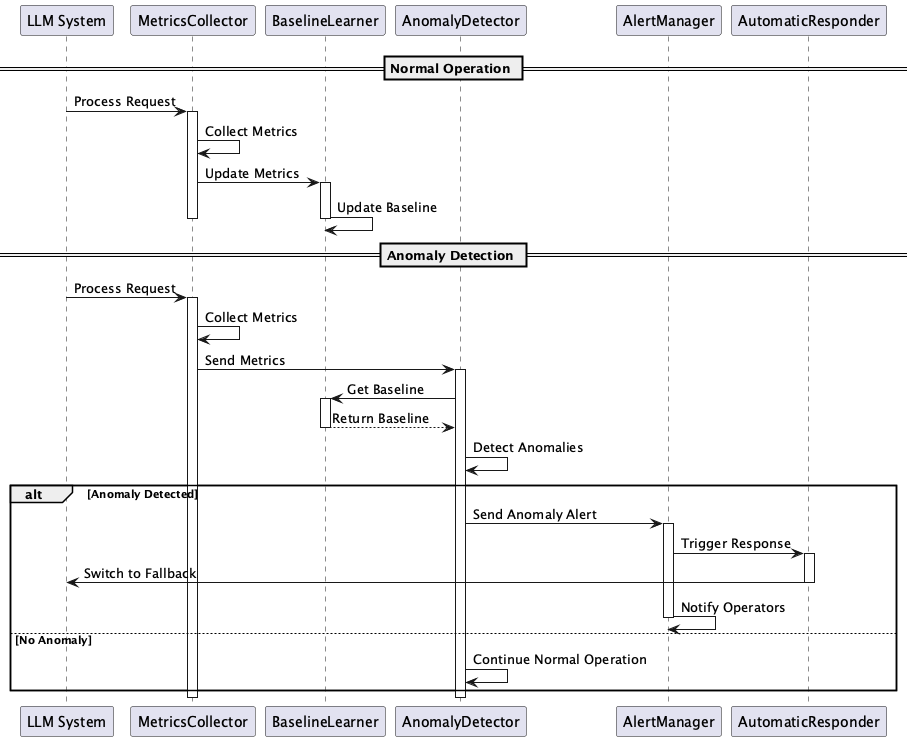

# Anomaly Detection

## 概要

Anomaly Detectionは、LLMシステムにおけるトークン消費量、レイテンシ、エラー率、出力品質スコア、ユーザフィードバックなどの運用メトリクスを常時監視し、通常時の挙動から逸脱する異常を自動的に検出する設計手法です。異常検出は統計手法や機械学習モデルを活用し、異常時にはアラート通知や自動応答を実施することで、迅速な対応を可能にします。

## 解決したい課題

LLMを活用したシステムは不安定になることが多いです。LLM自体がここ数年の新しい技術であると同時に、大量の自然言語を扱い、かつ確率的な挙動を示すため、従来のシステムとは異なるエンジニアリングが必要になります。発生するエラーの種類も様々でしょう。一般的なシステムエラーもあれば、HallucinationsのようなLLM特有のエラーもあります。これらのエラーは、システム全体の信頼性や可用性を損なう可能性があります。すべてを手動で監視するのは現実的ではなく、また、LLMの特性上、異常が発生してもすぐに気付かないことが多いです。これらの問題を解決するために、Anomaly Detectionを導入します。

LLMベースのシステムでは、以下のような問題が頻発します。

1. **サイレント障害**
   - 応答品質や処理性能の劣化が徐々に進行し、気付いたときには重大な障害となっているケースが多くあります。
   - 例：LLMの応答品質が徐々に低下し、ユーザーからのクレームが増加してから気付くケース

2. **運用負荷の増加**
   - 各種メトリクスを人手で監視するには限界があり、異常検知に時間がかかる場合があります。
   - 例：24時間体制での監視が必要なグローバルサービスでの人的リソースの不足

3. **SLA違反リスク**
   - システム劣化の兆候を見逃すと、サービスレベル契約（SLA）を満たせなくなるリスクがあります。
   - 例：応答時間のSLAが99.9%で3秒以内と定められている場合、徐々に遅延が増加し違反となるケース

4. **原因の特定が困難**
   - モデルの変更、プロンプト改修、外部システムの不具合など、異常の原因特定が複雑になることがあります。
   - 例：複数のマイクロサービスが連携するシステムで、どのコンポーネントが異常の原因か特定が難しいケース

## 解決策

Anomaly Detectionを適用することで、以下のような方法で問題を解決します。

1. **ベースラインの学習**
   - 正常な状態の平均値や標準偏差、移動中央値などを算出し、それを基準として異常を判断します。
   - 例：過去30日間のレイテンシデータから正常範囲を計算し、それを基準に異常を検出

2. **検知アルゴリズムの適用**
   - 統計的手法や機械学習手法を用いて異常値を検出します。
   - 例：トークン消費量の急激な増加をZスコアで検出し、アラートを発報

3. **アラートと自動対応**
   - 異常を検知した際にアラートを出し、フォールバックの起動やオペレーターへの通知、自動処理の切替を行います。
   - 例：エラー率が閾値を超えた場合、自動的にバックアップモデルに切り替え

## 適応するシーン

このプラクティスは以下のようなシステムや運用環境に適しています。

- LLMを活用したChat SaaSでの高頻度なAPI呼び出しの監視
- バッチ処理型ドキュメント処理パイプラインでのエラーやコスト異常の検出
- マイクロサービス環境で複数サービスの挙動を統合的にモニタリングする場合
- カスタマーサポート用のチャットボットで応答品質やユーザ満足度を維持する必要がある場合

## 利用するメリット

Anomaly Detectionを導入することで、以下のような利点があります。

- 実際の障害が発生する前に前兆を捉え、早期に対応が可能です。
- 人手による監視を減らし、オペレーションコストを削減できます。
- SLAやSLOを順守し、サービスの信頼性を高めることができます。
- 異常パターンの蓄積により、継続的なシステム改善が可能になります。

## 注意点とトレードオフ

このプラクティスの適用には、以下のような注意点やトレードオフが存在します。

- **閾値の調整**
  - 閾値が厳しすぎるとノイズによる誤検知が増え、緩すぎると異常を見逃す可能性があります。
  - 例：レイテンシの閾値を厳しく設定しすぎると、一時的なネットワーク遅延でもアラートが発生

- **モデルの維持コスト**
  - 機械学習モデルを用いた検知では、定期的な再学習やデータ更新が必要です。
  - 例：週次でのモデル再学習が必要となり、計算リソースと運用コストが増加

- **リアルタイム性の制約**
  - バッチ処理ではリアルタイム性が失われるため、即時対応が難しくなる可能性があります。
  - 例：5分間隔のバッチ処理では、その間の異常をリアルタイムで検知できない

- **運用の複雑性**
  - 閾値管理、通知ルール、対応手順などの整備が必要となり、運用負荷が増すこともあります。
  - 例：複数のメトリクスに対する閾値管理と通知ルールの設定が複雑化

## 導入のヒント

Anomaly Detectionを導入する際のポイントは以下の通りです。

1. **段階的導入**：最初はレイテンシやエラー率に対する統計的な閾値監視から始め、徐々にスコアやコスト検知に拡張します。

2. **ダッシュボードの整備**：Grafanaなどのツールでリアルタイムグラフとアラートを統合的に表示し、視認性を高めます。

3. **アラートルールの調整**：初期は広めの閾値設定で誤検知を防ぎ、運用状況に応じて最適化します。

4. **自動復旧連携**：検知トリガにより、Circuit Breakerの開放やフォールバックモードへの切替を自動化する仕組みを導入します。

5. **定期レビューの実施**：検知ログやインシデント履歴を定期的に見直し、検知精度と運用手順の改善を図ります。

## まとめ

Anomaly Detectionは、LLMシステムの安定運用と信頼性向上に欠かせない重要な設計手法です。異常の早期検知によってインシデントの深刻化を防ぎ、継続的な改善につなげることができます。システム規模や運用状況に応じて、統計的な手法から機械学習まで適切な検知技術を選択し、段階的に導入していくことが成功の鍵です。
