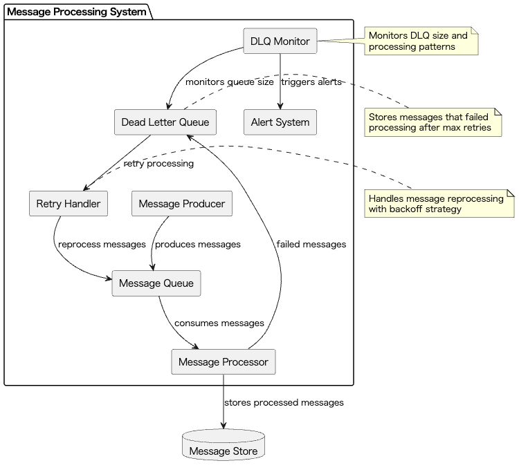
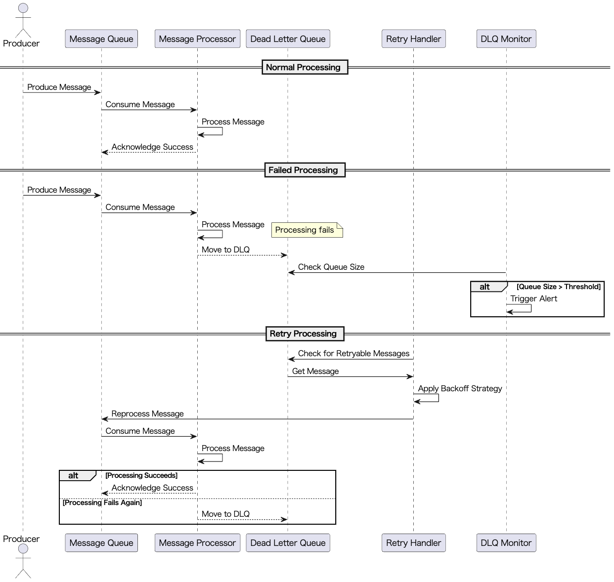

# Dead Letter Queue

## 概要

Dead Letter Queue（DLQ）Patternは、LLMの呼び出しやイベント駆動型ワークフローにおいて、処理に失敗したリクエストやメッセージを通常フローから隔離し、後続の原因分析や再処理を可能にする設計手法です。このプラクティスにより、システム全体の安定性を保ちながら、異常なリクエストを効率的に管理することができます。

## 解決したい課題

アプリケーションを安定稼働させる工夫の一つに、失敗した処理を何度もリトライさせないことがあります。失敗の原因は様々で、LLMプロバイダーのエラーであることがあれば、ユーザーの入力ミスやフォーマット不正、APIレート制限に達した場合などもあります。これらの失敗をそのまま放置すると、システム全体のパフォーマンスや可用性に悪影響を及ぼす可能性があります。**Retry with Adaptive Back-off**で回避できるときもありますが、根本的な原因を解決しない限り、同じ失敗が繰り返される可能性も否めません。特にLLMを活用するシステムでは、プロンプトのフォーマットや内容によって結果が大きく変わるため、異常なリクエストをそのまま流してしまうと、LLMの性能や品質に悪影響を及ぼすことがあります。

具体的には、以下のような問題が発生します。

1. **処理の停滞**
   - 不正なフォーマットのリクエストが原因で、ワーカーが延々と再試行し、他の正常な処理が滞ってしまいます。

2. **システム全体の停止リスク**
   - 一部の異常リクエストが原因でパイプライン全体が停止し、サービス全体に影響が及ぶ可能性があります。

3. **障害分析の困難さ**
   - ログだけでは失敗の発生頻度や原因を特定しづらく、根本的な対処が困難になります。

4. **運用負荷の増大**
   - 失敗が多発すると、すべてのジョブを再実行するなど、運用上の負荷が増大します。

## 解決策

Dead Letter Queueを採用することで、失敗したリクエストやメッセージを通常のフローから切り離してDLQへ退避させ、後続の分析や再処理を別途行えるようにします。

1. **異常リクエストの隔離**
   - LLMによるバッチ要約処理で、フォーマット不正やモデルエラーのあったドキュメントだけをDLQに隔離します。

2. **エラー状態の管理**
   - チャットメッセージ処理で、不正入力やAPIレート制限に達したリクエストをDLQで捕捉します。

3. **イベントメッセージの管理**
   - KafkaやWebhookなどのイベントメッセージングでも、致命的なエラー発生時には該当メッセージをDLQに移動します。

4. **段階的な処理の実現**
   - 多段階のRAGパイプラインにおいて、各ステップで異常が検出されたメッセージのみをDLQに移動することで、健全な処理を継続可能にします。

## 適応するシーン

このプラクティスは以下のような場面で有効です。

- マイクロサービス間での非同期通信におけるメッセージ障害管理
- LLMを利用した大規模バッチ処理や文書要約パイプライン
- 高頻度でリアルタイムなチャットメッセージを処理するプラットフォーム
- IoTデバイスなどから流入するフォーマット不正データの分離

## 利用するメリット

このプラクティスを適用することで、以下の利点が得られます。

- 処理可能なメッセージだけを優先的に処理することで、システム全体の安定性が向上します。
- 障害発生時も、DLQに退避されたメッセージに限定して原因を分析・対処することで、障害対応が効率化されます。
- 失敗メッセージの件数や傾向を可視化することで、予防的対策や継続的改善が可能になります。
- データクレンジングやバリデーション強化の材料として、異常データを収集できます。

## 注意点とトレードオフ

DLQを導入する際には、以下の点に注意が必要です。

- DLQ自体のストレージ増大や、保存期間・削除ポリシーなどの管理コストが発生します。
- 再処理のフローを用意しないと、DLQに溜まったメッセージが永遠に放置されるリスクがあります。
- SLAや再処理手順、責任分担が曖昧なままだと、運用負荷や障害対応の品質に影響します。
- 問題が未解決のままDLQからメッセージを再投入すると、再び失敗が起きて無限ループになる恐れがあります。

## 導入のヒント

このプラクティスを導入する際のポイントは以下の通りです。

1. 最大リトライ回数や指数バックオフなど、明確なリトライポリシーを定義してください。
2. メッセージにエラーコード、リトライ回数、最終失敗時刻などのメタデータを付与し、後続分析を容易にしてください。
3. 定期バッチ処理により、DLQ内のメッセージを自動スキャン・再分類し、再処理や廃棄を効率化してください。
4. DLQの長さや流入頻度を監視し、閾値超過時にはアラートを出すことで異常を早期検知してください。
5. レート制限や一時的障害など一過性のエラーについては、自動再投入を可能とする仕組みを構築してください。

## まとめ

Dead Letter Queueは、LLM活用を含む高信頼性が求められるシステムにおいて、障害時の隔離・分析・再処理を体系的に行うための有効なアプローチです。安定した運用とスケーラブルなエラー処理のために、本プラクティスの導入を検討する価値は非常に高いです。ただし、運用フローと監視体制の整備を並行して進めることが成功の鍵となります。
