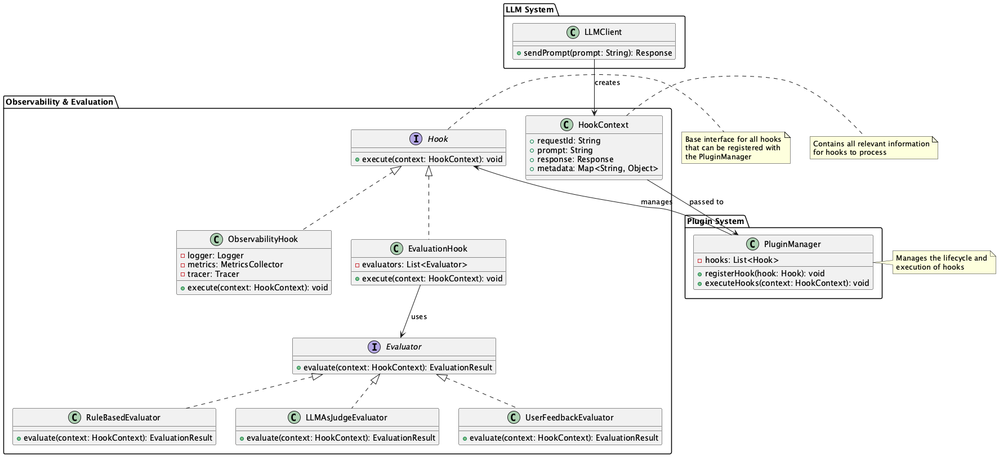
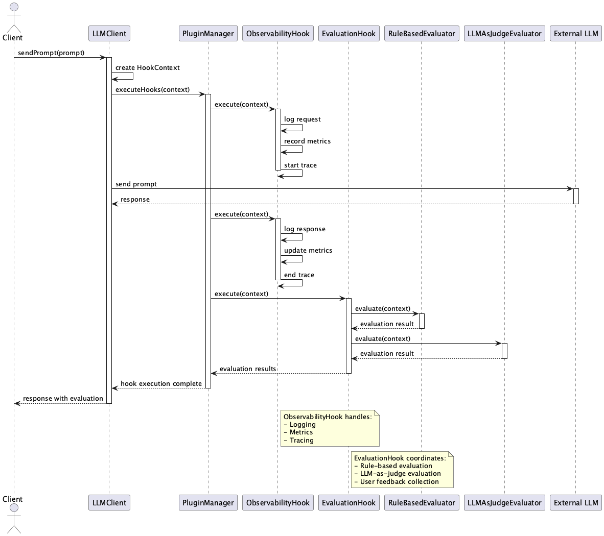

# Integrated Observability & Evaluation Hook

## 概要

Integrated Observability & Evaluation Hookは、LLMを活用するシステムにおいて、プロンプトの生成からレスポンスの後処理までの各段階に対して一貫した観測と評価を行うための設計手法です。オブザーバビリティのフックと品質評価のフックを組み込み、リアルタイムの監視・自動評価・継続的改善を実現します。

## 解決したい課題

LLMを活用したシステムは不安定になることが多いです。LLM自体がここ数年の新しい技術であると同時に、大量の自然言語を扱い、かつ確率的な挙動を示すため、従来のシステムとは異なるエンジニアリングが必要になります。加えて、LLMを用いたシステムは複雑になりがちです。LLM APIを呼び出す部分はWebクライアントとして作ることができても、リクエストに含めるプロンプトやレスポンス、その評価やHallucinations対策、フィードバック等、多くの要素が絡み合います。これらの要素を適切に管理しないと、システム全体の信頼性や可用性が損なわれる可能性があります。

こうした課題があるため、LLMを活用したシステムにはロギングやトレーシングの仕組みが必須です。これにより、システムの動作を一貫して追跡可能にし、トラブルシューティングや品質評価、パフォーマンス監視を効率的に行うことができます。しかし、ログ出力やトレーシングを豊富に実装することで、プログラムの可読性や保守性を低下させることは避けたほうが良いでしょう。特定の関数や処理が実行されたときに自動でログを出力したり、メトリクスを記録したりするフックがあれば、開発者はそのフックを意識せずにコードを書くことができ、可読性や保守性を損なうことなく、必要な情報を収集することができます。

1. **可視化の断片化**
   - 例：各コンポーネントで個別にログを出力していると、全体の状態を一元的に把握することが困難になります。
   - 例：エラー発生時に、どのコンポーネントで問題が起きたのか特定に時間がかかります。

2. **評価基準のばらつき**
   - 例：チームや環境ごとに異なる評価手法を用いていると、品質判断が統一されません。
   - 例：開発・運用効率が低下し、品質管理の一貫性が失われます。

3. **フックの不整合**
   - 例：異なるフックが異なる形式でログを出力していると、データの統合や分析が難しくなります。
   - 例：フックの実装が不十分な場合、必要な情報が欠落することがあります。

## 解決策

LLMを活用するシステムではログ、メトリクス、トレースそれぞれに共通のフォーマットを用意すべきです。そしてそれらの実装を一元管理することで、システム全体の可視化と品質評価を一貫して行うことができます。具体的には、以下のような統合的な観測・評価戦略を実装します。

1. **呼び出しフックの実装**
   - プロンプト送信前後やエラー発生時に、ログ出力・メトリクス記録・トレースを行います。
   - 例：OpenTelemetryなどの標準的な観測フレームワークと連携し、一貫したログ形式を維持します。

2. **評価フックの実装**
   - LLMの出力に対し、ルールベース評価やLLM-as-a-judge、あるいはユーザからのフィードバックを通じて自動的に品質評価を実施します。
   - 例：出力の一貫性、事実性、有害性などを自動的に評価するルールを設定します。

3. **プラグイン構成の採用**
   - フックを疎結合なプラグインとして実装し、柔軟に追加・入れ替えできる構成とします。
   - 例：評価ルールをJSONやYAMLで定義し、実行時に動的に読み込む仕組みを実装します。

## 適応するシーン

このプラクティスは以下のような場面で効果的に活用できます。

- 複数チームがプロンプトを開発・運用するエンタープライズ向けチャットシステム
- 定期的に要約や分類を行うドキュメント処理パイプライン
- 外部開発者がLLMを利用するAPIプラットフォーム
- コード生成や変換処理を行うAIアシスタント開発プロジェクト

## 利用するメリット

このプラクティスを導入することで、以下の利点があります。

- すべてのLLM呼び出し処理に共通の観測・評価ロジックを適用でき、データの比較や分析が容易になります。
- 品質劣化や異常出力を即時に検知・アラート可能です。
- 評価データに基づいた継続的なプロンプト改善やモデル選定が可能になります。
- 障害発生時の原因分析にかかる時間とコストを大幅に削減できます。

## 注意点とトレードオフ

以下のような点に注意する必要があります。

- フックにより、レイテンシやコストが増加する可能性があります。
- 柔軟なプラグイン設計を行うにはインターフェース設計やガイドライン整備が必要です。
- 評価対象に含まれる個人情報や機密情報の取り扱いに十分注意する必要があります。
- LLMによる自動評価にはバイアスや誤判定のリスクが伴います。

## 導入のヒント

導入を成功させるためのポイントは以下のとおりです。

1. はじめは呼び出しログのみの最小構成から始めて、段階的に評価フックを導入します。
2. 各フックは明確なインターフェースを定義し、チーム内で再利用可能な形で設計します。
3. すべてのリクエストを評価するのではなく、サンプリングや閾値を設定することで負荷を軽減します。
4. ダッシュボード（Grafana、Kibanaなど）との連携により、異常傾向を可視化します。
5. CI/CDに組み込み、プロンプトや出力品質の自動検証を行うことで品質ゲートとして活用します。

## まとめ

Integrated Observability & Evaluation Hookは、LLMシステムにおける可視化と品質評価を一貫して行うための有効な設計手法です。フックベースで柔軟に監視・評価機能を拡張できるため、品質維持・改善、障害対応、効率的な運用において大きな効果を発揮します。適切に導入・運用することで、LLMの業務活用をより信頼性の高いものにすることができます。
