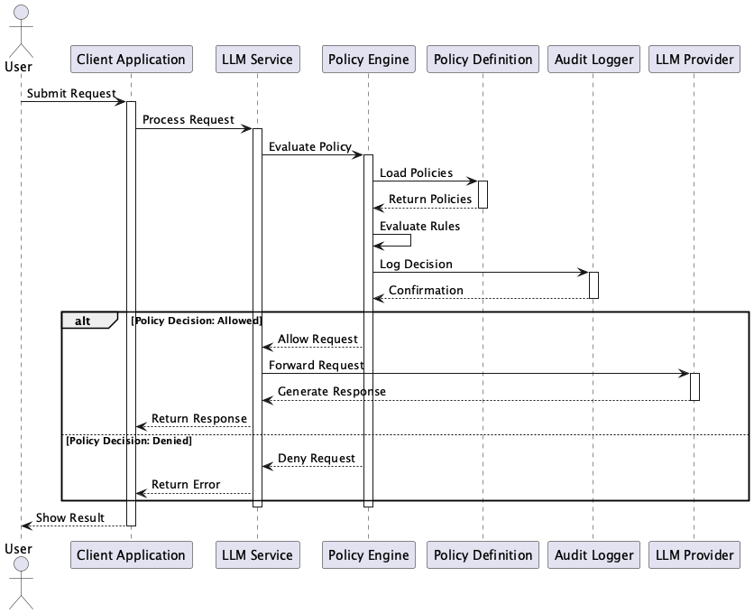

# Policy-Based LLM Access Control

## 概要
Policy-Based LLM Access Controlは、LLMの利用においてアクセス制御やセキュリティを柔軟かつ明確に管理するための設計プラクティスです。ポリシーベースのアプローチにより、権限制御のロジックを明示的に定義・管理でき、スケーラブルかつガバナンス性の高いLLM活用を実現することができます。

## 解決したい課題

ChatGPTやGemini UIのような広く使われているLLMのチャットUIはすべてのユーザに同じ体験と機能を提供します。しかし、企業や組織での利用においては、ユーザーごとに異なるアクセス制御や機能制限が必要になることがあります。特に、セキュリティやプライバシーの観点から、LLMへのアクセスを厳密に管理する必要があります。

企業では経営者や社員によってアクセス可能なシステムやデータが分けられていることは一般的です。多くの場合、経営者は機密情報や重要なシステムおよびデータにアクセスできる一方で、一般社員はそのような情報にアクセスできないよう制限されています。一般社員の中でも、ITチームは社内システムの管理者権限を持つ一方で、他部署のメンバーはユーザ権限しか持たないことが多いでしょう。このようなアクセス制御は、LLMを利用する際にも同様に適用されるべきです。

企業の組織構造に則したアクセス制御以外にも、LLMを用いたアプリケーションのビジネスモデルとしてユーザロールやアクセス制御を実現したいケースがあります。たとえばフリーミアムモデルを採用している場合、無料ユーザと有料ユーザでLLMの機能を分ける必要があります。

いずれにせよ、LLMが

1. **ユーザーによって使える機能を制限したい場合**
   - 例：社内の一般社員と経営層で異なる情報を生成・参照できるようにしたい。

2. **データ漏洩のリスク**
   - 例：機密情報を含む入力を誤ってLLMに送信してしまうケースを防ぎたい。

3. **料金の階層別制御**
   - 例：無料ユーザーにはLLMを使わせず、有料ユーザーのみアクセス可能にしたい。

4. **リクエストごとの動的な条件適用**
   - 例：時間帯やロール、緊急性に応じて使用可否を柔軟に変更したい。

## 解決策
このプラクティスでは、LLMへのアクセスを統一的な「ポリシー評価ロジック」によって判定し、柔軟に制御可能な仕組みを導入します。以下のような構成で実装します。

1. **ポリシー定義**
   - YAMLやJSONなどで、利用者のロール・属性・リクエスト内容などに基づいたルールを定義します。

2. **ポリシーエンジンの導入**
   - Open Policy Agent（OPA）などのポリシー評価ツール、または独自の評価モジュールを使用して、定義されたルールに基づき許可・拒否を判定します。

3. **実行前の評価フック**
   - LLMへの推論実行前に、リクエスト内容とユーザーコンテキストを基にアクセス可否をチェックします。

4. **ログと監査**
   - ポリシー評価の結果を記録し、アクセスのトレーサビリティを確保します。

## 適応するシーン
このプラクティスは以下のような場面で有効です。

- 組織内でのロールベースなLLMアクセス管理が必要な場合。
- マルチテナント環境で、ユーザーごとに異なるLLM機能制限を行いたい場合。
- セキュリティやプライバシーリスクを最小化したいLLMサービス。
- アプリケーション開発者とセキュリティ運用者の役割を分離したい場合。

## 利用するメリット
このプラクティスを導入することで、以下のような利点があります。

- セキュリティと機能制御を分離でき、コードの保守性が向上します。
- アクセスルールの追加・変更を柔軟に行えるため、運用性が高まります。
- ガバナンスと監査対応に必要なロギングが行えます。
- 利用者の階層や条件に応じたLLM機能提供が可能となります。

## 注意点とトレードオフ
導入に際しては以下の点に注意する必要があります。

- ポリシーが複雑化しすぎると、メンテナンス負荷が高まります。
- パフォーマンスの観点から、評価処理を低レイテンシに保つ必要があります。
- ポリシーが過度に制限的になると、ユーザー体験が損なわれる可能性があります。
- LLM自体の応答と関係ない部分でアクセスがブロックされるため、UX上の説明が必要です。

## 導入のヒント
スムーズに導入するためのヒントは以下の通りです。

1. 最初は重要なロールや条件に絞ってポリシーを設計し、徐々に拡張します。
2. ポリシー定義はコード外のファイルや管理UIで運用できるようにします。
3. テストケースを整備し、ポリシーの変更が意図通り動作していることを確認します。
4. システム上の監査ログと結合することで、透明性を確保します。

## まとめ
Policy-Based LLM Access Controlは、LLMの利用においてアクセス制御やセキュリティを柔軟かつ明確に管理するための設計プラクティスです。ポリシーベースのアプローチにより、権限制御のロジックを明示的に定義・管理でき、スケーラブルかつガバナンス性の高いLLM活用を実現することができます。
