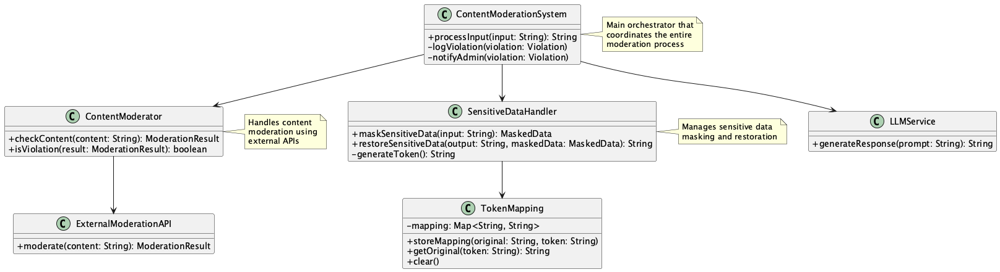
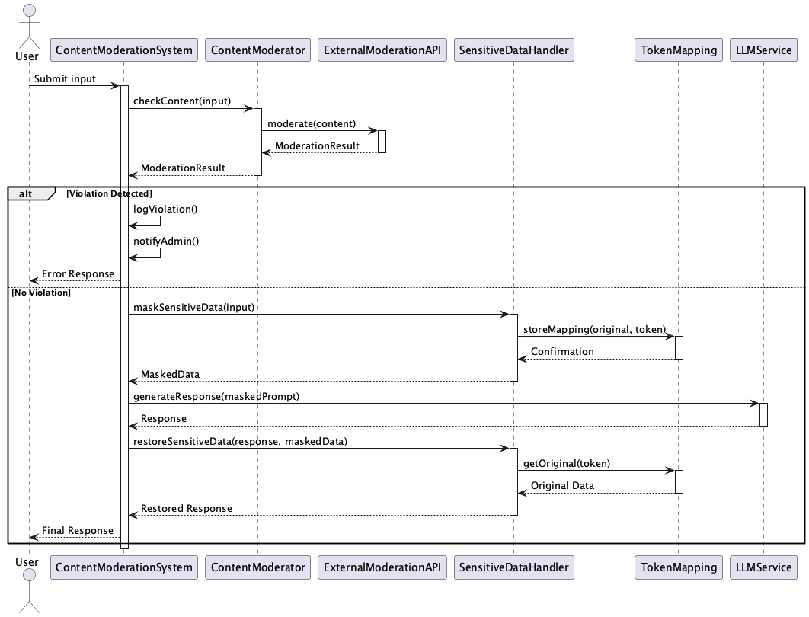

# LLM Security and Governance

## 概要
LLM Security and Governanceは、LLMを活用したシステムにおいて、コンテンツの安全性と機密情報の保護を実現するための包括的な設計手法です。このプラクティスは、不適切なコンテンツの生成を防止し、機密情報の漏洩リスクを最小化することで、サービスの安全性と信頼性を確保します。

## 解決したい課題

LLM APIを活用したアプリケーションでは、チャットUIのようにユーザに自由入力を許可する場合が多々あります。自由度が高いことによって得られるメリットがある一方で、デメリットやリスクももちろん存在します（参照：**Inverted Flexibility**）。以下のようなリスクを考慮する必要があります。

1. **不適切なコンテンツの生成**
   - 例：ユーザーが意図的に不適切なプロンプトを入力し、ヘイトスピーチや暴力的表現を含む出力を生成してしまう
   - 例：プロンプト攻撃（jailbreak等）により、LLMの安全制限を回避して意図しない出力を生成してしまう
   - 例：APIプロバイダーの利用規約に違反するコンテンツが生成され、サービスの利用停止に繋がる

2. **情報漏洩リスク**
   - 例：ユーザーが入力した個人情報（メールアドレス、電話番号など）がLLMの出力に含まれてしまう
   - 例：社内の機密情報を含むプロンプトがLLMに送信され、情報が漏洩する
   - 例：GDPRやHIPAAなどの規制に違反する形で個人情報が処理される

3. **サービスの停止リスク**
   - 例：不適切なコンテンツの生成により、APIプロバイダーから警告や利用停止処分を受ける
   - 例：情報漏洩により法的責任が発生し、サービスを停止せざるを得なくなる
   - 例：ユーザーの信頼を失い、サービスの継続が困難になる

## 解決策
このプラクティスでは、以下の2つの主要な対策を実装します。

1. **コンテンツモデレーション処理**
   - 入力プロンプトを段階的にフィルタリングし、不適切なコンテンツを検出します
   - 外部モデレーションAPI（OpenAI `/moderations`、Hugging Face等）を活用して、プロンプトの健全性を確認します
   - 違反プロンプトを検出した場合は、ログを記録し管理者に通知します

2. **機密情報保護処理**
   - 入力データに含まれる機密情報（個人情報など）を一意なトークンに置換します
   - 置換済みのプロンプトをLLMに送信し、出力をポストプロセスで元の情報に復元します
   - マッピングテーブルは一時的に保持し、処理完了後は即時破棄します

## 適応するシーン
このプラクティスは以下のような場面で特に有効です。

- 不特定多数のユーザーが利用する対話型アプリケーション
- エンタープライズ向けのLLM活用システム
- マルチテナント型のサービス
- 個人情報や機密情報を扱う業務システム
- 医療、金融、法務などの規制業界でのLLM活用

## 利用するメリット
このプラクティスを採用することで、以下のメリットが得られます。

- LLMによる意図しない出力のリスクを軽減できます
- 機密情報の漏洩リスクを最小化できます
- サービス提供者の責任範囲を明確化できます
- APIベンダーとの契約違反を防止できます
- コンテンツの品質向上とユーザー信頼の維持が可能です
- プライバシーや法規制への対応が容易になります
- セキュリティ監査やコンプライアンスチェックの効率化が図れます

## 注意点とトレードオフ
このプラクティスの実装には以下の留意点があります。

- モデレーション処理によるレイテンシが増加します
- 表現の自由と検閲のバランスを考慮する必要があります
- 誤検知・過検知の可能性があります
- 多言語対応や文化的背景への配慮が必要です
- トークン化・復元処理の精度管理が重要です
- 実装・運用コストが発生します
- マスキング処理によるレイテンシが増加します

## 導入のヒント
このプラクティスを効果的に導入するためのポイントは以下の通りです。

1. まずは外部モデレーションAPIを利用して迅速に実装し、段階的に機能を拡張します
2. 正規表現やNER（固有表現抽出）を活用した高精度なマスキングロジックを実装します
3. 一時的なトークンとマッピングの安全な管理と即時消去の仕組みを実装します
4. ユーザー体験を考慮し、適切な警告表示やエラーメッセージを設計します

## まとめ
LLM Security and Governanceは、LLMの出力品質とサービスの健全性を守るために不可欠な設計プラクティスです。コンテンツモデレーションと機密情報保護の両面から、安全性を担保しつつユーザーとの信頼関係を維持することが可能となります。リスク管理とユーザー体験の両立を図るために、自動化と柔軟性を持つ設計が重要です。
