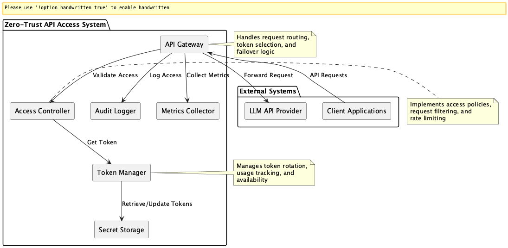
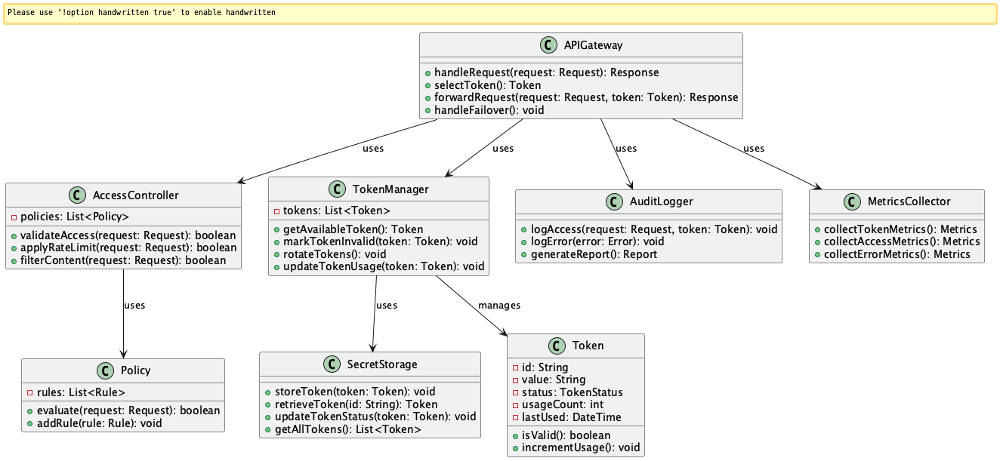
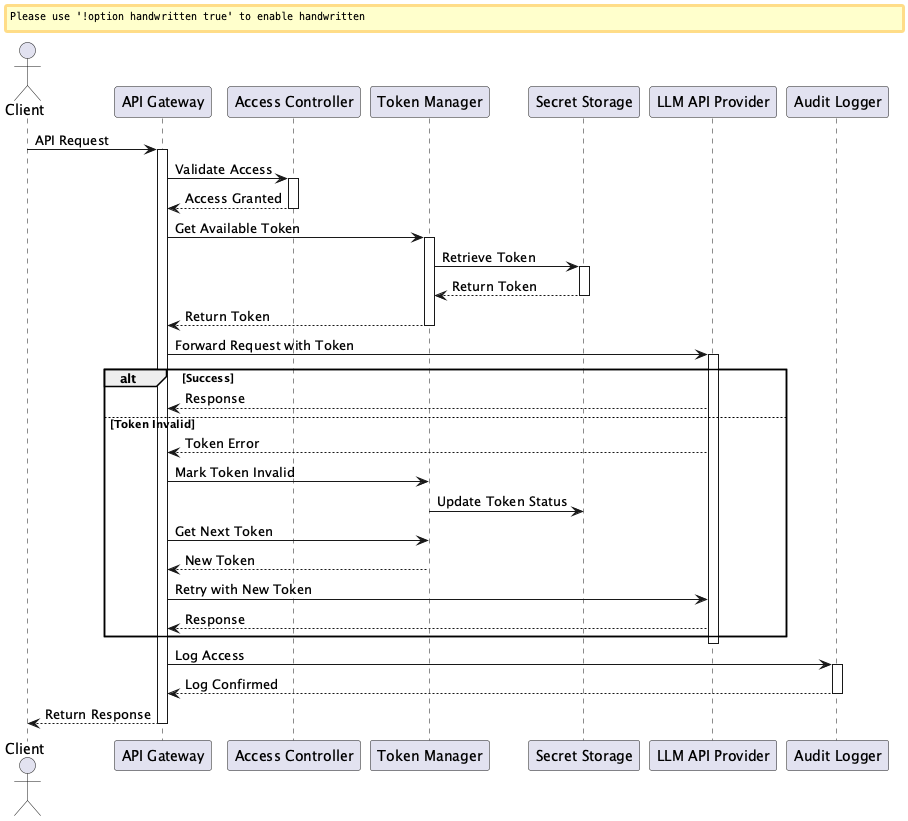

# Zero-Trust API Access for LLM

## 概要
Zero-Trust API Access for LLMは、LLM APIへのアクセスにおいて「信頼しない」原則に基づき、各リクエストごとに厳格な認証・認可・検証を行う設計手法です。APIキーの漏洩や不正利用を防ぎ、最小権限の原則に基づいてアクセスを制御します。また、APIトークンの動的な管理・切り替え機能も含み、使用制限や期限切れへの対応も自動化します。このプラクティスにより、LLM APIの利用におけるセキュリティを大幅に向上させ、コストの不正利用や機密情報の漏洩リスクを最小限に抑えることができます。

## 解決したい課題

LLMはとても自由度高く利用できるツールである反面、簡単にリスクのある使い方をしてしまう可能性があります。たとえばプロンプトを書いてLLM APIにリクエストを送信する用途においても、プロンプトに機密情報が含まれるリスクや、APIキーの漏洩リスクなどが考えられます。これらのリスクを軽減するために、Zero-Trust API Access for LLMを導入することが重要です。

1. **APIキーの漏洩リスク**
   - 例：APIキーがソースコードにハードコードされ、GitHubなどに公開されてしまうケースがあります。

2. **不正利用のリスク**
   - 例：漏洩したAPIキーで大量のリクエストが発生し、予期せぬコストが発生する可能性があります。

3. **APIトークンの使用制限**
   - 例：OpenAIのAPIキーが1分あたりのリクエスト数に制限されており、複数ユーザーのアクセスで制限を超えるとエラーになります。

4. **トークンの期限切れ**
   - 例：組織内で配布された一部のトークンが利用不可になり、システム全体が停止する可能性があります。

5. **機密情報の漏洩**
   - 例：LLM APIに送信された機密情報が、意図せずモデルの学習データに含まれてしまう可能性があります。

6. **コンプライアンス違反**
   - 例：アクセス制御の不備により、規制対象のデータがLLM APIに送信されてしまう可能性があります。

7. **手動更新の運用負荷**
   - 例：新しいトークンを発行するたびにシステム構成や環境変数を再設定する必要があり、運用ミスのリスクが高まります。

## 解決策
Zero-Trust API Access for LLMでは、以下の方法で課題を解決します。

1. **APIキーの安全な管理**
   - 環境変数やシークレット管理サービスを使用してAPIキーを管理します。
   - APIキーの定期的なローテーションを実施します。
   - 複数の有効なトークンを安全に保持するストレージ（例：KMS + DB）を用意します。

2. **アクセス制御の実装**
   - リクエスト元のIPアドレスやユーザー認証情報に基づくアクセス制御を行います。
   - リクエストの内容に基づくフィルタリングを実施します。
   - ゲートウェイはリクエスト単位で利用可能なトークンを選択し、トークン使用状況に応じてラウンドロビンや使用回数ベースでローテーションします。

3. **監査ログの実装**
   - すべてのAPIリクエストをログに記録し、異常な利用プラクティスを検知します。
   - 定期的な監査を実施し、アクセスプラクティスを分析します。
   - トークン状態を記録・監視するメトリクス機構を設けて可視化します。

4. **障害時の自動フェイルオーバー**
   - トークンが無効である場合やリクエストエラーが続く場合、他の有効なトークンに切り替えてリトライします。
   - フェイルオーバー機構により高可用性を担保します。

## 適応するシーン
このプラクティスは以下のような場面で特に有効です。

- 複数のLLM APIを利用する大規模システム
- 機密情報を扱う業務システム
- コンプライアンス要件の厳しい業界（金融、医療など）
- マルチテナント環境でのLLM API利用
- 大量のユーザーがLLMを利用するアプリケーション
- SaaS形式でLLM APIをプロキシ的に提供するサービス

## 利用するメリット
このプラクティスを採用することで、以下のメリットが得られます。

- APIキーの漏洩リスクを最小化できます。
- 不正利用による予期せぬコストの発生を防ぐことができます。
- 機密情報の漏洩リスクを低減できます。
- コンプライアンス要件を満たすことができます。
- トークン制限によるリクエスト障害の軽減が可能になります。
- トークンの追加・更新・削除がサービスを停止することなく実施できます。
- フェイルオーバー機構により高可用性を担保できます。

## 注意点とトレードオフ
このプラクティスを採用する際は、以下の点に注意が必要です。

- 実装の複雑さが増加し、開発工数が増大します。
- アクセス制御によるレイテンシの増加が発生する可能性があります。
- 監査ログの保存・分析に追加のリソースが必要です。
- ゲートウェイ層の導入によりシステム構成が複雑化します。
- 適切なトークン選定ロジック（優先順位・使用回数管理・障害検出）が必要になります。
- トークン管理システムやストレージのセキュリティが重要となるため、インフラ側の設計も慎重に行う必要があります。
- キャッシュやレートリミットの整合性管理に工夫が求められます。

## 導入のヒント
このプラクティスを効果的に導入するためのポイントは以下の通りです。

1. 段階的な導入：まずはAPIキーの安全な管理から始め、徐々に制御を強化します。
2. 自動化：APIキーのローテーションや監査ログの分析を自動化します。
3. モニタリング：異常なアクセスプラクティスをリアルタイムで検知する仕組みを構築します。
4. トークン状態を記録・監視するメトリクス機構を設けて可視化すること。
5. リクエスト数に応じてトークン使用状況を分散させる戦略を設計すること。
6. ゲートウェイ層は軽量でステートレスに設計し、水平スケール可能にすること。
7. 秘匿情報管理のベストプラクティス（KMS、Vaultなど）を併用すること。

## まとめ
Zero-Trust API Access for LLMは、LLM APIの利用におけるセキュリティを確保するための重要な設計手法です。APIキーの安全な管理と動的なローテーション機能を組み合わせることで、セキュリティと可用性の両立を実現します。適切に実装することで、APIキーの漏洩や不正利用のリスクを大幅に低減し、安定したサービス提供が可能になります。ただし、システムの規模や要件に応じて、適切なレベルの制御を実装することが重要です。
