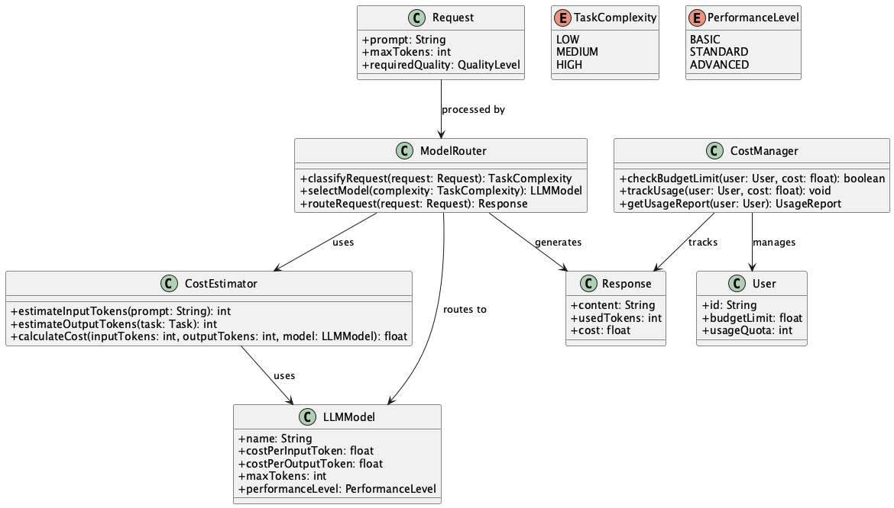
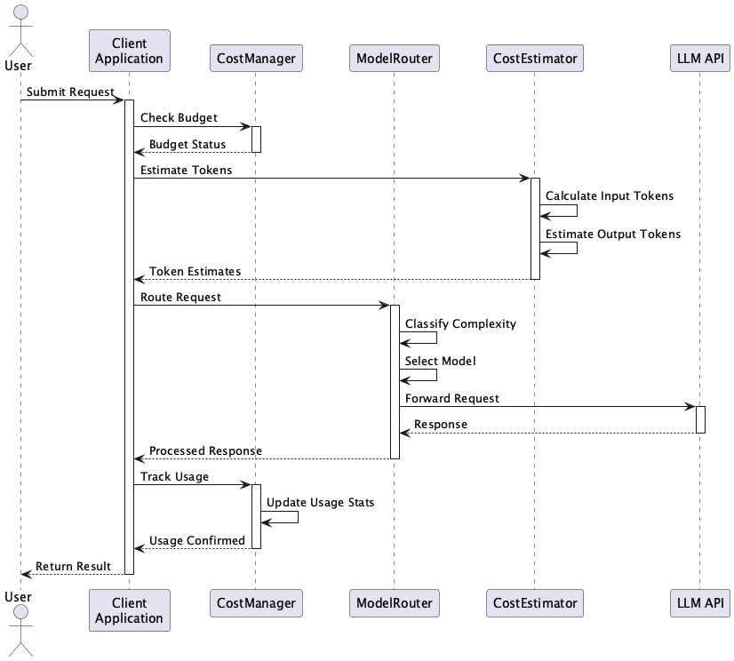

# Cost-Managed LLM Integration

## 概要

Cost-Managed LLM Integrationは、LLMのAPI利用におけるコスト最適化と予測可能性を実現するための包括的な設計手法です。このプラクティスは、リソース使用量の事前見積もりと、推論内容に応じた最適なモデル選択を組み合わせることで、効率的かつ制御可能なLLM活用を実現します。システム全体でのAPI使用量が増加する中で、コストと品質のバランスを最適化するための重要なアプローチとなります。

## 解決したい課題

LLMプロバイダーの提供するLLM APIの多くは入出力トークン数に基づく課金体系を採用しています。これにより、LLMの利用は非常に柔軟で強力ですが、同時にコスト管理が難しくなるという課題があります。特に、以下のような問題が発生することがあります。

1. **コストの予測困難性と予期せぬ請求**
   - 例：長文のプロンプトや複数ステップの連続呼び出しによって、想定を超える料金が発生する。
   - 例：バッチ処理で大量のリクエストを送信した際に、予期せぬ高額請求が発生する。

2. **不要に高性能モデルを使用することでコストが肥大化する**
   - 例：単純な文言置換や分類タスクにも関わらず、gpt-4-turboなどの高価なモデルが常に使用されている。
   - 例：内部ツールのログ要約と顧客向け回答生成で同じモデルを使用し、コストパフォーマンスが悪化する。

3. **リソース管理と制御の困難さ**
   - 例：特定ユーザーがLLMを多用し、全体の月間利用量を圧迫する。
   - 例：同時実行数の増加により、APIのレート制限に達してしまう。
   - 例：ユーザー数の増加に伴い、月間API費用が想定の数倍に膨れ上がる。

## 解決策

このプラクティスでは、以下の2つの主要なアプローチを組み合わせて問題に対処します。

### 1. リソース使用量の事前見積もり

1. **トークン数の事前計算**
   - モデルが使用するトークナイザーを用いて、入力プロンプトのトークン数を事前に計算
   - 予想される出力トークン数を上限値や過去実績から推定

2. **課金額の事前見積もり**
   - 使用するモデルの価格表を元に、見積もり金額を計算
   - ユーザーごとの利用制限や予算に基づいて、実行可否を判断

3. **応答時間やレイテンシの目安提示**
   - トークン数とモデル性能を元に応答遅延を概算
   - システムの負荷状況に応じて、実行タイミングを調整

### 2. コスト最適化のための推論ルーティング

1. **リクエストの分類**
   - 推論内容をルールまたはスコアリング関数で分類
   - 必要な推論レベルを判定（例：Low, Medium, High）

2. **モデルのレベル分け**
   - モデルを処理能力・コストに応じて複数レベルに分け
   - 使用目的に応じてマッピング

3. **ルーティング制御の実装**
   - 推論ルーター層を設け、入力に応じて適切なモデルへAPIリクエストを転送
   - フェイルオーバーと再ルーティングの仕組みを実装

## 適応するシーン

このプラクティスは以下のような場面で特に有効です。

- 複数ユーザーにLLM機能を提供しているSaaSサービス
- コストに対する社内統制や経理報告が必要な企業向けツール
- 予算制約が厳しいプロジェクトや研究開発
- 推論内容が多様であり、すべてに一律のモデルを適用できないアプリケーション
- バッチ実行や定期実行がある業務処理システム

## 利用するメリット

このプラクティスを採用することで、以下のメリットが得られます。

- コスト予測により予算超過のリスクを回避
- 不要な高性能モデル使用を回避し、APIコストを削減
- 推論内容の特性に応じて最適な処理が可能となり、性能とコストのバランスが取れる
- 利用制限（Rate Limit, Token Limit）に達する前に制御可能
- リソース使用量の可視化により、最適化の機会を発見
- 社内外の利用者への透明性提供が容易

## 注意点とトレードオフ

このプラクティスを導入する際には、以下の点に注意が必要です。

- 実際の出力トークン数は予測と乖離する可能性がある
- モデルごとの応答精度や挙動の差異を把握しておく必要がある
- ルーティング判定ロジックの設計やメンテナンスが複雑になる可能性がある
- トークン数の計算処理自体にコストとレイテンシがわずかに発生する
- 低性能モデルで処理されるケースが誤って高重要度タスクに適用されると、品質劣化を招く恐れがある

## 導入のヒント

このプラクティスを効果的に導入するためのポイントは以下の通りです。

1. **コスト見積もりの実装**
   - OpenAIなどのトークナイザーライブラリを利用して入力プロンプトを事前に分解
   - 応答長の推定には、過去の履歴データを用いた統計的手法を採用
   - 上限設定をソフトリミット（警告）とハードリミット（拒否）に分けて設計

2. **ルーティングシステムの構築**
   - 利用中のLLMをカテゴリ（低コスト・高性能）に分類し、選択肢を明示化
   - 推論要求ごとに、コスト/品質バランスを定義したスコアリング基準を設定
   - 重要度や複雑度に応じたルールを作成し、ルーティングテーブルとして構築
   - モデル選定の過程をログに残し、ルーティング精度の改善につなげる

3. **運用と改善**
   - 見積もり情報をユーザーに明示し、操作の判断材料とする
   - 定期的な利用状況の分析と制限値の調整を行う
   - モデルごとの性能とコストの関係を継続的に評価・最適化

## まとめ

Cost-Managed LLM Integrationは、LLM活用のコストを最適化しつつ、ユーザー体験やシステム品質を維持するための包括的な手法です。リソース使用量の予測と適切なモデル選択を組み合わせることで、費用対効果の高いシステム運用を実現できます。特に予算制約のある環境や、マルチモデル運用を行う企業にとっては重要なプラクティスとなります。ただし、予測の精度とシステムの柔軟性のバランスを考慮しながら、段階的に導入を進めることが重要です。 